# Token Vault Service — Software Architecture Specification
## Part 1 of 4: Vision, Domain Model, Encryption Model, Vault Design, Components, Workflows

Document status: Draft for architecture review
Service: Token Vault Service
Platform: Distributed Payment Gateway (Stripe/Razorpay-class, sandbox/portfolio implementation, PCI-DSS-aligned — not certified)

---

# 1. Executive Summary

The Token Vault Service is the single component on this platform
permitted to handle raw cardholder data (PAN, CVV), and it exists
specifically to shrink everything else on the platform out of PCI-DSS
cardholder-data-environment (CDE) scope. Every architectural document
produced so far — `SYSTEM_DESIGN.md`, `API-Gateway-Part-01.md`,
`Merchant-Service-Part-01.md` — has referenced this boundary as a fixed
constraint: the Browser SDK tokenizes directly against this service,
bypassing the API Gateway entirely; the Payment Orchestrator and every
other service only ever see an opaque vault token; and raw PAN lifetime
in memory is capped at 50ms system-wide. This document defines the
service that makes those constraints actually true.

The Vault's engineering discipline is different in kind from every
other service in this platform. The Payment Orchestrator is optimized
for throughput and consistency under partial failure; the Merchant
Service is optimized for auditable identity lifecycle; the Token Vault
is optimized for **minimizing the surface area over which cardholder
data can ever be exposed, while still being fast enough not to become
the platform's latency bottleneck at 10,000+ TPS.** Its two goals are in
constant tension — the entire architecture that follows is the resolution
of that tension: strong isolation and envelope encryption on one side,
aggressive caching of tokens (never PANs) and a narrow, purpose-built
hot path on the other.

This document (Part 1 of 4) covers the Vault's purpose, domain model,
token lifecycle, encryption model, internal architecture, and core
workflows. Parts 2–4 (API contracts, data/infrastructure design, and
operations) build on the foundation established here.

---

# 2. Service Purpose

## 2.1 Why the Token Vault Exists
Every other service on this platform needs to reference "the card used
for this payment" without ever needing to know what the card number
actually is. The Token Vault exists to make that possible: it accepts a
raw PAN exactly once per tokenization event, immediately replaces it
with an opaque, non-reversible-without-authorization token, and from
that point forward is the only component in the entire platform capable
of mapping that token back to the underlying PAN — and even it does so
only for a bounded, audited, sub-50ms window per detokenization request.

## 2.2 Role in the Overall Payment Gateway
Per `SYSTEM_DESIGN.md` §10 and §16, the Token Vault sits at a
deliberately unusual position in the request topology: the **Browser
SDK calls it directly**, without transiting the API Gateway, precisely
so that raw PAN data never touches a shared, multi-tenant routing
component. The Payment Orchestrator then calls the Vault internally
(over mTLS, service-to-service, never through the Gateway) to
detokenize a vault token immediately before calling the Acquiring
Adapter — and only for the duration of that single authorization call.

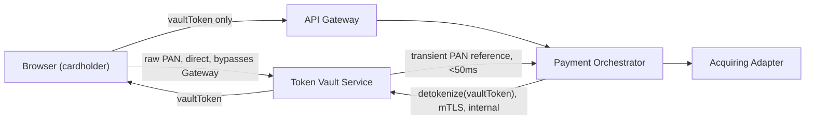

## 2.3 Why Payment Gateways Separate Vaults from Payment Processing
This separation is standard industry practice (used by Stripe, Adyen,
Razorpay, and every PCI-DSS-scoped processor) for three concrete
reasons this platform's architecture depends on:

1. **PCI scope reduction.** PCI-DSS's cardholder-data-environment
   requirements (network segmentation, restricted access, enhanced
   logging/monitoring, quarterly scans) apply to every system that
   stores, processes, or transmits cardholder data. By confining raw
   PAN handling to one small, purpose-built service, the Payment
   Orchestrator, Merchant Service, Webhook Service, Settlement Service,
   and API Gateway are all kept entirely out of CDE scope — this is a
   direct, load-bearing architectural decision, not an afterthought.
2. **Blast-radius containment.** A vulnerability in the Payment
   Orchestrator's business logic (a considerably larger, faster-moving
   codebase than the Vault) can never leak cardholder data, because
   that codebase never has cardholder data to leak — it only ever holds
   opaque tokens.
3. **Independent security hardening cadence.** The Vault can apply a
   far stricter change-management, access-control, and audit posture
   than the rest of the platform without slowing down feature velocity
   elsewhere — payment feature development iterates on tokens; only
   Vault-team changes require the heaviest security review.

---

# 3. Responsibilities

## 3.1 Tokenization
- Accept a raw PAN (and, transiently, CVV where applicable — CVV is
  **never persisted** at all, per PCI-DSS Requirement 3.2, and exists in
  memory only for the duration of the initial authorization data
  capture) directly from the Browser SDK over its own dedicated,
  publicly reachable TLS endpoint.
- Generate a cryptographically non-guessable, format-preserving-or-
  opaque token (a `vaultToken`) with no mathematical derivability back
  to the PAN.
- Persist only the encrypted PAN (via envelope encryption, §10) keyed
  by the token — never the PAN in any recoverable plaintext form at
  rest.
- Example: a cardholder enters `4111 1111 1111 1111` into the Browser
  SDK's hosted card field; the SDK posts it directly to the Vault; the
  Vault returns `vt_9f3a...` (a `vaultToken`), which is the only value
  the merchant's page, the API Gateway, and the Payment Orchestrator
  will ever see for this card, permanently.

## 3.2 Detokenization
- Accept a `vaultToken` from an explicitly authorized internal caller
  (the Payment Orchestrator, exclusively, for the authorization/capture
  workflow) over mTLS.
- Decrypt and return the underlying PAN reference for **in-memory use
  only**, for a strictly bounded duration (system-wide 50ms budget per
  `SYSTEM_DESIGN.md`), never written to any log, any Kafka event, any
  database row outside the Vault's own encrypted storage, or any
  response body reaching an external caller.
- Example: the Payment Orchestrator, immediately before calling the
  Acquiring Adapter to authorize a payment, calls
  `POST /internal/v1/tokens/{vaultToken}/detokenize`; the Vault returns
  a PAN reference scoped to that single call; the Orchestrator forwards
  it directly into the Acquiring Adapter call and discards it
  immediately after.

## 3.3 Vault Encryption & Key Lifecycle
- Own and enforce envelope encryption (§10) for all stored cardholder
  data: Data Encryption Keys (DEKs) wrapped by Key Encryption Keys
  (KEKs), which are themselves protected by a Master Key held in an
  HSM/KMS the Vault never has direct plaintext access to.
- Own key rotation scheduling, key versioning, and key retirement —
  ensuring old encrypted data remains decryptable against its
  originating key version while new data is always encrypted under the
  current key version.

## 3.4 Access Control & Auditability
- Enforce the platform's strictest internal-service allow-list: only
  the Payment Orchestrator may call the detokenize path; no other
  internal service (not even Merchant Service or Settlement Service) is
  ever permitted to reach it.
- Record an immutable audit entry for every tokenization,
  detokenization, key rotation, and access-denial event — this audit
  log is treated as equally critical infrastructure to the encryption
  itself, since PCI-DSS Requirement 10 mandates comprehensive,
  tamper-evident logging of all access to cardholder data.

## 3.5 Token Lifecycle Management
- Own token state (`ACTIVE`, `EXPIRED`, `REVOKED`) and the transitions
  between them (§11), independent of the Payment Orchestrator's own
  payment state machine — a token's lifecycle and a payment's lifecycle
  are related but distinct concepts, deliberately modeled separately.

## 3.6 High Availability & Low-Latency Operation
- Serve tokenization and detokenization requests with strict latency
  budgets (§7) since the Vault sits directly in the payment
  authorization critical path — a slow Vault directly becomes a slow
  payment platform, regardless of how fast the Payment Orchestrator or
  Acquiring Adapter are individually.

---

# 4. Non-Responsibilities

- **Never makes a payment authorization decision.** The Vault has no
  concept of amount, merchant, currency, or approval/decline — that is
  entirely the Payment Orchestrator's and Acquiring Adapter's domain.
  Conflating the two would reintroduce cardholder data into the
  Orchestrator's decision path, defeating the entire purpose of scope
  separation (§2.3).
- **Never persists CVV under any circumstance, for any duration beyond
  the single initial tokenization call.** This is a hard PCI-DSS
  Requirement 3.2 rule with zero exceptions — no "temporary" CVV
  storage, no CVV in any cache, no CVV in any audit log (even encrypted).
- **Never logs, caches, or transmits raw PAN in plaintext, anywhere,
  under any circumstance** — not in application logs, not in
  OpenTelemetry span attributes, not in Kafka event payloads, not in
  error messages returned to any caller. Every logging and observability
  standard defined in `SYSTEM_DESIGN.md` and the API Gateway/Merchant
  Service specs' logging sections applies here with zero exceptions and
  additional Vault-specific enforcement (§21).
- **Never exposes a detokenize capability to any external-facing route.**
  There is no path — direct, indirect, via the API Gateway, or otherwise
  — by which an external caller (a merchant, a browser, any non-
  Payment-Orchestrator internal service) can retrieve a raw PAN.
- **Never accepts tokenization requests routed through the API
  Gateway.** The Browser SDK's direct-to-Vault call is not a convenience
  optimization; it is a hard architectural boundary established in
  `SYSTEM_DESIGN.md` §10 and `API-Gateway-Part-01.md` §8, and this
  document does not revisit or weaken it.
- **Never stores merchant business data, payment amounts, ledger
  entries, or settlement data.** Those remain owned respectively by
  Merchant Service, Payment Orchestrator, and Settlement Service; the
  Vault's schema contains only token-to-encrypted-PAN mappings, key
  metadata, and its own audit trail.
- **Never participates as a SAGA orchestrator or compensating-action
  target.** Detokenization is a synchronous, read-only-in-effect
  operation with no compensatable side effect; the Vault has no
  "undo detokenize" concept, mirroring the Merchant Service's
  established non-participation in the payment SAGA
  (`Merchant-Service-Part-03.md` §70) for analogous reasons.

---

# 5. Business Goals

| Goal | Why it matters | How the Vault serves it |
|---|---|---|
| PCI compliance (aligned, not certified) | Confines the platform's certifiable CDE scope to one auditable service | Sole holder of cardholder data; every other service structurally cannot violate PCI-DSS cardholder-data rules because they never receive the data |
| Secure tokenization | The core value the Vault provides to the rest of the platform | Cryptographically strong, non-reversible-without-authorization token generation |
| Data protection | Cardholder data is the platform's highest-liability asset | Envelope encryption, HSM/KMS-backed key hierarchy, zero plaintext-at-rest |
| Scalability | Tokenization sits on the payment-initiation hot path at 10,000+ TPS | Stateless request handling above a horizontally-scalable encrypted store, aggressive token-side caching (never PAN-side) |
| Low latency | A slow Vault directly delays every payment on the platform | Sub-50ms raw-PAN-in-memory budget, sub-20ms p99 tokenize/detokenize service latency target |
| High availability | Vault downtime halts all new tokenization platform-wide | Multi-replica, multi-zone deployment; no single HSM/KMS instance as a single point of failure |
| Fault tolerance | Partial infrastructure failure must degrade, not corrupt | Circuit breakers on HSM/KMS calls, fail-closed (never fail-open to plaintext) on any encryption dependency failure |
| Auditability | PCI-DSS Requirement 10; forensic and compliance necessity | Immutable, tamper-evident audit log of every access to cardholder data, independent of business logs |

---

# 6. Functional Requirements

## FR-1 Tokenization
FR-1.1 The service shall accept a raw PAN (and transient CVV, if
present) via a dedicated public endpoint reachable directly by the
Browser SDK, independent of the API Gateway's route table.

FR-1.2 The service shall generate a `vaultToken` that has no
mathematical or structural derivability back to the original PAN.

FR-1.3 The service shall persist the PAN only in envelope-encrypted
form (§10), never in plaintext, and shall never persist CVV in any
form.

FR-1.4 The service shall return the `vaultToken` to the caller within
the tokenization latency budget (§7) and shall never return the raw PAN
back to the caller in the tokenization response beyond what is
structurally necessary for the caller's own display purposes (e.g. a
masked "•••• 1111" representation, never the full PAN).

## FR-2 Detokenization
FR-2.1 The service shall accept detokenization requests exclusively
from the Payment Orchestrator, authenticated via mTLS internal-service
identity, on the internal-only API surface.

FR-2.2 The service shall reject any detokenization request from any
caller identity other than the Payment Orchestrator's allow-listed
workload identity, regardless of any other credential presented.

FR-2.3 The service shall return the PAN reference for in-memory use
only, structurally preventing (via the internal API contract, detailed
in Part 2) accidental logging or persistence by the caller.

FR-2.4 The service shall enforce the platform-wide 50ms raw-PAN-
in-memory lifetime budget on its own side of the detokenization
operation, independent of what the calling service does after receipt.

## FR-3 Token Lifecycle
FR-3.1 The service shall support explicit token states: `ACTIVE`,
`EXPIRED`, `REVOKED` (§11).

FR-3.2 The service shall support token rotation — issuing a new token
for the same underlying PAN without requiring the cardholder to
re-enter card data — for cases such as periodic security rotation
policies or merchant-initiated re-tokenization.

FR-3.3 The service shall support token revocation, immediately and
permanently preventing further detokenization of a revoked token.

## FR-4 Key Management
FR-4.1 The service shall support Data Encryption Key (DEK) generation
per envelope-encryption operation, DEKs wrapped by a Key Encryption Key
(KEK) sourced from an HSM/KMS.

FR-4.2 The service shall support scheduled and on-demand KEK rotation
without requiring re-encryption of all existing DEK-wrapped data at
rotation time (§10.5).

FR-4.3 The service shall never expose a plaintext Master Key or KEK to
any application-layer code path — all Master Key/KEK operations occur
exclusively within the HSM/KMS boundary.

## FR-5 Audit
FR-5.1 The service shall record an immutable audit entry for every
tokenization, detokenization, key-rotation, and access-denial event,
including timestamp, caller identity, and outcome — never including the
raw PAN or CVV itself in the audit entry.

FR-5.2 The service shall make its audit trail queryable for compliance
and forensic purposes independent of its operational database, per the
isolation model in §13.

## FR-6 Health & Resilience
FR-6.1 The service shall expose liveness/readiness endpoints reflecting
both its own process health and its HSM/KMS dependency's reachability.

FR-6.2 The service shall fail closed (reject the operation) rather than
fail open (fall back to a less secure path) on any encryption-dependency
failure.

---

# 7. Non-Functional Requirements

## NFR-1 Performance & Latency
- Tokenization: p99 ≤ 30ms end-to-end (Browser SDK → Vault → response).
- Detokenization: p99 ≤ 20ms, since this call sits directly in the
  synchronous payment-authorization path and directly consumes budget
  from the platform-wide 50ms raw-PAN-lifetime constraint.
- These budgets are stricter than the API Gateway's own 5ms/15ms
  self-overhead budget (`API-Gateway-Part-01.md` NFR-1) precisely
  because the Vault's operations include actual cryptographic work, not
  just routing/policy decisions.

## NFR-2 Availability
- Target 99.95%, matching the API Gateway's tier (`API-Gateway-Part-01.md`
  NFR-2) — a Vault outage is exactly as platform-halting as a Gateway
  outage, since no tokenization can occur without it, and no payment can
  be authorized without a token to detokenize.

## NFR-3 Security
- All cardholder data encrypted at rest via envelope encryption, no
  exceptions, no legacy/compatibility carve-outs.
- All access authenticated via mTLS at minimum, with the detokenize
  path additionally gated by workload-identity allow-listing (FR-2.2).
- Zero plaintext key material ever resident in application memory
  beyond the unavoidable, HSM/KMS-internal cryptographic operation
  itself.

## NFR-4 Consistency
- Token-to-encrypted-PAN mapping writes are strongly consistent
  (synchronous, single-database-transaction) — there is no eventual-
  consistency tolerance for "does this token exist and map correctly,"
  since an inconsistent mapping here is a direct payment-processing or
  security failure, not a tolerable staleness window.

## NFR-5 Scalability
- Horizontally scalable stateless application tier; the persistence
  layer (§ Part 3) scales via read replicas for the (rare) lookup-by-
  token-metadata path and partitioning strategies appropriate to a
  write-heavy, point-lookup-dominant access pattern.

## NFR-6 Reliability
- Circuit breakers and bounded retries on every HSM/KMS call, consistent
  with the platform's Resilience4j standard (`SYSTEM_DESIGN.md`
  Mandatory Architecture Rules) — but tuned to **fail closed**: an open
  circuit against the HSM/KMS means tokenization/detokenization
  requests are rejected with a clear retryable error, never silently
  degraded to an insecure fallback.

## NFR-7 Maintainability
- Strict Clean Architecture layering (§14) specifically so that
  cryptographic/HSM implementation details can evolve (e.g. switching
  KMS providers) without touching domain or application logic — a
  higher-stakes version of the same principle applied more loosely
  elsewhere on the platform.

## NFR-8 Disaster Recovery
- Cross-region key material availability (via the HSM/KMS provider's
  own multi-region replication capability) is a hard requirement — a
  regional outage must not render previously tokenized data
  permanently undecryptable, since that would be equivalent to
  permanent data loss for every stored card on the platform.
- Full disaster-recovery specifics (RPO/RTO, backup strategy) are
  detailed in Part 4, but the architectural requirement — key
  material must never have a single-region single point of failure —
  is established here as a foundational constraint on HSM/KMS provider
  selection.

---

# 8. Service Boundaries

## 8.1 Inputs
- Raw PAN + transient CVV (Browser SDK → Vault, direct, public
  endpoint, tokenization only).
- `vaultToken` (Payment Orchestrator → Vault, internal, mTLS,
  detokenization/lifecycle operations only).
- Key-rotation triggers (internal scheduler or operator-initiated,
  §17 Key Rotation workflow).

## 8.2 Outputs
- `vaultToken` (returned to Browser SDK/merchant page at tokenization
  time).
- Masked PAN representation (e.g. "•••• 1111") for display purposes
  only — never the full PAN.
- Transient, in-memory-only PAN reference (returned to Payment
  Orchestrator at detokenization time, never persisted by either side
  beyond the 50ms budget).
- Domain events (`TokenCreated`, `TokenRevoked`, `TokenExpired`, `KeyRotated`
  — §16) published to Kafka, containing zero cardholder data.
- Audit log entries (§13, §5).

## 8.3 Dependencies
| Dependency | Type | Purpose |
|---|---|---|
| HSM/KMS provider | External, critical | Master Key custody, KEK operations |
| PostgreSQL (vault schema) | Internal, owned | Encrypted PAN storage, token metadata, key-version metadata |
| Redis | Internal, owned | Token-existence/status cache (never PAN-side caching) |
| Kafka | External, platform | `vault.events` publication only (no PAN-bearing payloads) |
| Audit Log Store | Internal, owned, isolated | Immutable, tamper-evident audit trail, physically/logically separated from the operational database (§13) |

## 8.4 External Systems
- HSM/KMS provider (e.g. a cloud KMS with HSM-backed key custody, or a
  dedicated on-prem HSM appliance — provider selection is an ADR-gated
  decision, not fixed by this document).

## 8.5 Internal Systems (Platform Services That Interact With the Vault)
| Service | Interaction | Trust Boundary |
|---|---|---|
| Browser SDK | Tokenization, direct | Public TLS endpoint, no prior authentication required (rate-limited, structurally validated) |
| Payment Orchestrator | Detokenization, token lifecycle queries | mTLS + workload-identity allow-list, the **only** service permitted on the detokenize path |
| API Gateway | None (structural non-interaction, §4) | N/A by design |
| Merchant Service, Webhook Service, Settlement Service | None | N/A by design — none of these services have any legitimate reason to reference cardholder data |

---

# 9. Domain-Driven Design

## 9.1 Ubiquitous Language
| Term | Meaning |
|---|---|
| PAN | Primary Account Number — the raw card number; the platform's single most sensitive data element |
| Vault Token | The opaque identifier issued in place of a PAN; the only card reference any other service ever holds |
| Envelope Encryption | A layered encryption scheme where data is encrypted by a DEK, and the DEK itself is encrypted by a KEK |
| DEK (Data Encryption Key) | A key used to directly encrypt/decrypt the stored PAN ciphertext |
| KEK (Key Encryption Key) | A key used to encrypt/decrypt DEKs; itself protected by the Master Key within the HSM/KMS |
| Master Key | The root key, custodied entirely within the HSM/KMS boundary, never exposed in plaintext to application code |
| Detokenization | The bounded, audited operation of resolving a vault token back to a usable PAN reference for a single authorization call |
| Key Rotation | The scheduled or triggered replacement of an active key version with a new one, without invalidating previously encrypted data |
| Token Lifecycle | The set of states (`ACTIVE`, `EXPIRED`, `REVOKED`) and transitions a vault token can undergo independent of any payment's own state |

## 9.2 Bounded Context
The Token Vault represents the **Cardholder Data Custody** bounded
context — the narrowest, most tightly access-controlled bounded context
on the entire platform.

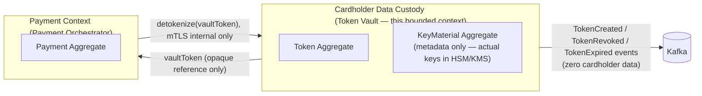

Context mapping relationship: **Conformist** from the Payment
Orchestrator's perspective — the Orchestrator has no influence over the
Vault's internal token format or encryption scheme and simply conforms
to whatever opaque contract the Vault exposes (a `vaultToken` string and
a detokenize call), reinforcing that the Vault's internals are
completely opaque to, and independent of, every consumer.

## 9.3 Domain Services
- `TokenizationService` — orchestrates PAN validation, DEK generation,
  encryption, and token issuance as one atomic domain operation.
- `DetokenizationService` — orchestrates token-state validation,
  authorization-identity check, decryption, and bounded-lifetime PAN
  reference issuance.
- `KeyRotationService` — orchestrates KEK rotation coordination with the
  HSM/KMS without requiring synchronous re-encryption of all existing
  DEKs (§10.5).

## 9.4 Factories
- `VaultTokenFactory` — the sole construction path for a new `Token`
  aggregate instance, ensuring a token's identifier is always generated
  via the platform's approved cryptographically-secure random-generation
  scheme (§11.1) and never constructed ad hoc elsewhere in the codebase.

## 9.5 Repositories
- `TokenRepository` — persists/retrieves `Token` aggregates (token
  identifier, encrypted PAN reference, key-version metadata, lifecycle
  state) — never exposes a query capability that returns decrypted PAN
  data; decryption is only ever performed by the `DetokenizationService`
  domain service, never by a repository directly.
- `KeyMaterialRepository` — persists/retrieves KEK **version metadata**
  (version identifier, creation timestamp, rotation status) only — it
  never persists actual key bytes, which remain exclusively within the
  HSM/KMS.

## 9.6 Specifications
- `TokenIsDetokenizableSpecification` — encapsulates the business rule
  "a token may be detokenized only if its state is `ACTIVE` and the
  requesting identity is the allow-listed Payment Orchestrator identity"
  as a single, testable, reusable predicate object, rather than scattered
  conditional logic across use cases.
- `KeyVersionIsActiveSpecification` — encapsulates "is this key version
  the current one to use for new encryption operations," used by the
  `TokenizationService` to always select the correct current KEK
  version.

## 9.7 Domain Events
Covered fully in §16; summarized here as part of the DDD building-block
inventory: `TokenCreated`, `TokenRevoked`, `TokenExpired`, `TokenRotated`,
`KeyRotationInitiated`, `KeyRotationCompleted`.

---

# 10. Domain Model

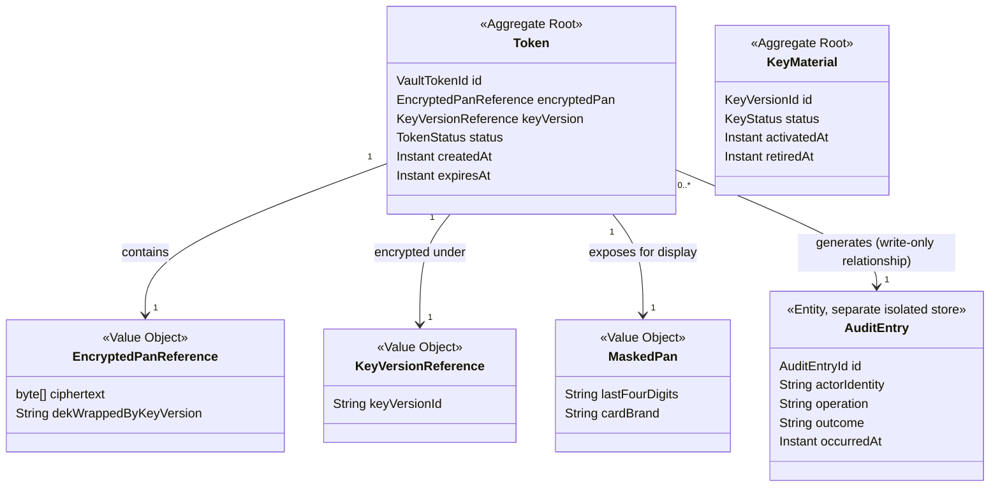

**Explanation of relationships and ownership:**
- `Token` is the aggregate root for cardholder-data custody — it is the
  only aggregate that ever references encrypted PAN material. No other
  aggregate on the platform holds a foreign key or reference into this
  aggregate's internals; every other service holds only the opaque
  `VaultTokenId` string.
- `KeyMaterial` is modeled as a **separate aggregate** from `Token`
  specifically because key lifecycle (rotation, retirement) must be
  independently manageable at a completely different cadence and by a
  completely different actor (a security/key-management process) than
  individual token issuance — coupling them would force every token
  operation to contend on key-aggregate locks, which is both a
  performance and a security-blast-radius problem.
- `EncryptedPanReference` and `KeyVersionReference` are value objects —
  neither has identity of its own; they are pure data, replaced wholesale
  whenever a token is rotated (a rotation produces a **new** `Token`
  aggregate instance with new `EncryptedPanReference`/`KeyVersionReference`
  values, never a mutation of the ciphertext bytes in place).
- `MaskedPan` is a value object computed once at tokenization time and
  stored alongside the token specifically so that display purposes
  (showing a merchant "•••• 1111") never require a decrypt operation —
  this is a deliberate performance and security optimization: the vast
  majority of "look at this card" needs are satisfied without ever
  touching the encrypted PAN or the HSM/KMS.
- `AuditEntry` is explicitly modeled as a write-only relationship from
  `Token` — the Vault's business logic only ever appends audit entries;
  it structurally has no code path that queries or reads its own audit
  trail back (that capability exists only via the isolated audit-store
  query surface, §13), preventing any tokenization/detokenization logic
  from ever being influenced by, or accidentally leaking, audit content.

---

# 11. Token Lifecycle

## 11.1 Token Generation
- Triggered exclusively by a successful tokenization request (§17.1).
- The `VaultTokenId` is generated using a cryptographically secure
  random-number source (never a sequential ID, never derived
  deterministically from the PAN itself — deterministic tokenization,
  while used by some vault designs for specific reconciliation use
  cases, is deliberately not used here, since it would allow an
  attacker who obtains the token-generation algorithm to narrow the
  PAN-guessing search space, which a purely random token does not
  permit).
- Format: opaque string, no embedded card-brand or PAN-derived
  structure (avoiding any information leakage through the token's shape
  itself).

## 11.2 Storage
- The `Token` aggregate, containing only the `EncryptedPanReference`
  (ciphertext) and `KeyVersionReference` metadata, is persisted in a
  single atomic transaction alongside the audit entry recording the
  tokenization event (§13 isolation model details how the audit store,
  while logically separate, is still written within the same logical
  operation's guarantees).

## 11.3 Activation
- A token is `ACTIVE` immediately upon successful storage — there is no
  separate "pending activation" state, since tokenization is a single,
  atomic, synchronous operation with no multi-step external dependency
  that would warrant an intermediate state (unlike, for example, the
  Merchant Service's `PENDING_VERIFICATION` state, which exists because
  KYC is inherently multi-step and asynchronous).

## 11.4 Usage (Detokenization)
- Every detokenization request checks `TokenIsDetokenizableSpecification`
  (§9.6) before any decryption is attempted — an `EXPIRED` or `REVOKED`
  token is rejected before the HSM/KMS is ever invoked, both for
  performance (avoiding an unnecessary cryptographic operation) and for
  security (a rejected-state check is cheaper to reason about and audit
  than a decrypt-then-discard pattern).

## 11.5 Rotation
- Rotation issues a **new** `Token` aggregate (new `VaultTokenId`, freshly
  encrypted under the current active `KeyVersionReference`) referencing
  the same underlying cardholder data, and marks the old token
  `REVOKED` — mirroring the grace-window-free-but-explicit-supersession
  pattern (a direct old→new cutover, since, unlike a merchant API
  credential, a card token rotation has no "grace window" business need
  — the caller simply receives and starts using the new token
  immediately).

## 11.6 Expiration
- Tokens may carry an optional `expiresAt` — used for cases such as a
  one-time-use tokenization flow (e.g. tokenizing a card solely for a
  single checkout session that must not be reusable afterward) as
  distinct from a stored, reusable token (e.g. a saved card for
  recurring billing). Expiration is a passive, time-based transition,
  enforced at the `TokenIsDetokenizableSpecification` check (§9.6)
  rather than requiring an active background sweep for correctness
  (though an operational cleanup job still exists, per §17, for storage
  hygiene, not for security enforcement).

## 11.7 Revocation
- Explicit, immediate, terminal — triggered by rotation (§11.5), by
  merchant-initiated card removal, or by a security/fraud-response
  action. Once `REVOKED`, a token can never be reactivated — a business
  need to "use this card again" always issues a fresh tokenization
  request, never a resurrection of a revoked token, keeping the audit
  trail unambiguous.

## 11.8 Deletion
- The `Token` aggregate row (and its `EncryptedPanReference`) may be
  hard-deleted from the operational store after a `REVOKED` token passes
  a configured retention window (subject to any regulatory data-retention
  requirement that might mandate a minimum retention period, layered in
  per jurisdiction as an operational configuration, not fixed by this
  document). The **audit entry** referencing that token's lifecycle,
  however, is never deleted — the audit trail's retention is independent
  of and outlives the underlying token data itself.

## 11.9 Recovery
- Recovery refers here to **key-material recovery** (restoring HSM/KMS
  access after an outage, §Part 4 Disaster Recovery) rather than
  token-level recovery — a deleted token is never "recovered" (that
  would imply the deleted encrypted PAN data still existed somewhere
  outside the intended deletion boundary, which is explicitly not the
  design). If a cardholder's saved card needs to be used again after
  their token was deleted per retention policy, this requires a fresh
  tokenization, not a recovery operation.

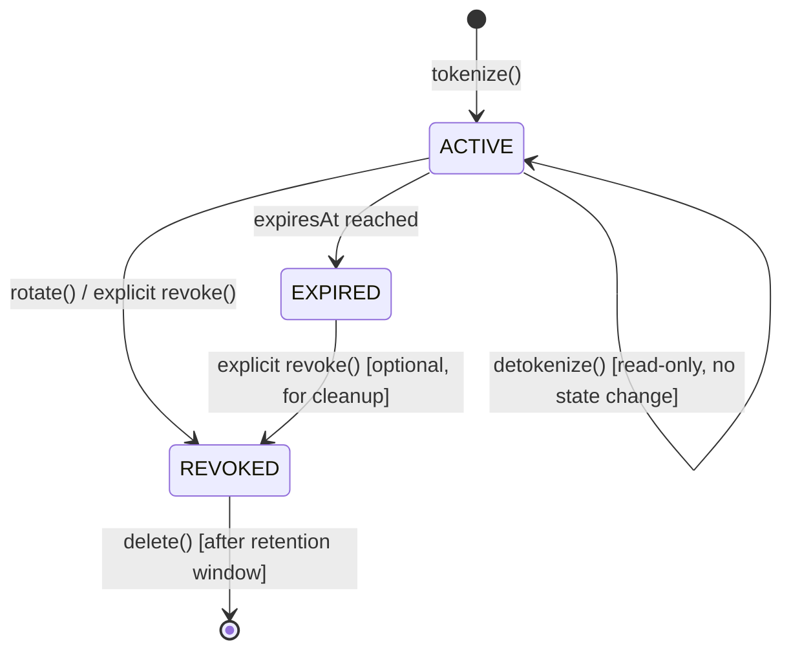

---

# 12. Encryption Model

## 12.1 Envelope Encryption
The Vault uses a two-layer (envelope) encryption scheme rather than
encrypting each PAN directly with the Master Key, for a standard,
well-justified reason: the Master Key never leaves the HSM/KMS boundary
and cannot be invoked at the volume/latency the payment hot path
requires. Envelope encryption solves this by using a fast, local
symmetric key (the DEK) for the actual data encryption, with only the
much smaller, much less frequent DEK-wrapping operation requiring an
HSM/KMS round-trip.

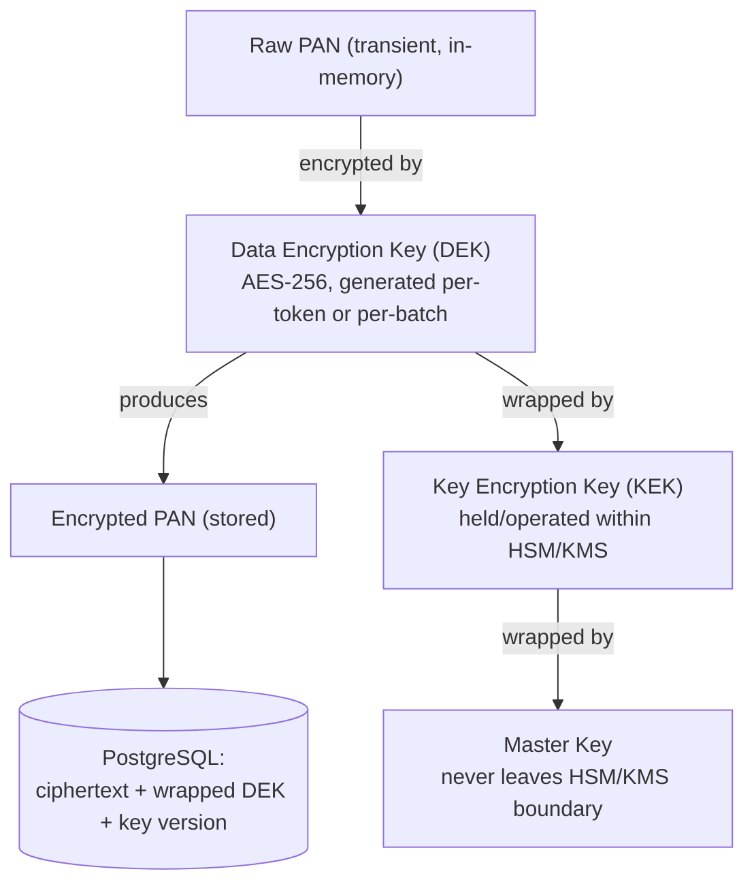

## 12.2 Key Hierarchy
| Layer | Key | Where It Lives | Rotates |
|---|---|---|---|
| 1 (root) | Master Key | Exclusively inside HSM/KMS, never exported | Rarely (HSM/KMS-provider-managed cadence) |
| 2 | KEK (Key Encryption Key) | Exists only as an HSM/KMS-operated key reference; application never sees plaintext KEK bytes | Scheduled (e.g. quarterly) or on-demand (§12.5) |
| 3 | DEK (Data Encryption Key) | Generated per tokenization operation (or per small batch), used briefly in application memory for the encrypt operation, then immediately wrapped by the current KEK and only the **wrapped (encrypted) DEK** is persisted — the plaintext DEK itself is never stored | Effectively per-operation; there is no "DEK rotation" concept distinct from issuing a new token |
| 4 | AES-256 ciphertext | The actual encrypted PAN bytes, stored in PostgreSQL alongside its wrapped DEK and KEK version reference | N/A — re-encrypted only if the underlying token itself is rotated (§11.5) |

## 12.3 AES-256 and RSA
- **AES-256** (symmetric): used for the DEK's actual PAN encryption
  operation — chosen for its combination of strong security margin and
  the performance the Vault's latency budget (§7) requires for
  high-frequency tokenization operations.
- **RSA** (asymmetric): used, where the specific HSM/KMS provider's key-
  wrapping scheme calls for it, for KEK-to-Master-Key or cross-boundary
  key-exchange operations rather than for bulk PAN encryption itself —
  RSA's computational cost makes it unsuitable for the high-frequency,
  large-payload PAN encryption path, which is exactly why the envelope
  scheme exists: expensive asymmetric operations are confined to the
  infrequent key-wrapping layer, never the per-request data-encryption
  layer.

## 12.4 KMS / HSM Integration
- The Vault's application code never calls "encrypt this PAN with the
  Master Key" directly — it always calls the HSM/KMS's key-wrapping API
  (wrap/unwrap a DEK) and performs the actual AES-256 PAN encryption
  itself, locally, using the unwrapped DEK held only transiently in
  memory for the duration of that single operation.
- This split (HSM/KMS wraps/unwraps DEKs; application does bulk AES
  encryption locally) is the standard, latency-appropriate integration
  pattern for a service under the Vault's throughput requirements — a
  design that instead sent every PAN byte-for-byte through the HSM/KMS
  directly would not meet the NFR-1 latency budget at 10,000+ TPS scale.

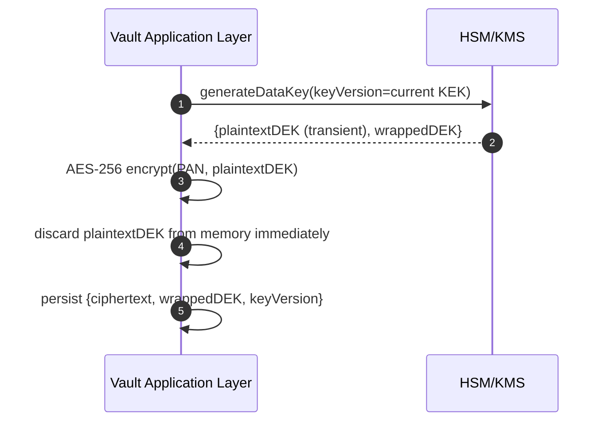

## 12.5 Key Rotation
- KEK rotation is initiated on a scheduled cadence (security policy-
  driven, e.g. quarterly) or on-demand (suspected compromise).
- Rotation does **not** require re-encrypting every existing DEK/PAN
  immediately — existing `wrappedDEK` values remain valid against their
  originating KEK version (the HSM/KMS retains the ability to unwrap
  against retired-but-not-destroyed key versions for a defined overlap
  period), while all **new** tokenization operations use the newly
  active KEK version going forward. This is the standard "rotate
  forward, re-wrap lazily or on next access" pattern that avoids a
  disruptive, latency-spiking mass re-encryption event.
- A background re-wrapping process (§Part 3) may optionally migrate
  older tokens' wrapped DEKs to the current KEK version over time,
  ahead of the old KEK version's eventual destruction (§12.7).

## 12.6 Key Expiration
- A KEK version transitions `ACTIVE` → `RETIRED` (no longer used for
  new operations, but still valid for unwrapping existing data) →
  eventually eligible for `DESTROYED` (§12.7), gated by ensuring zero
  remaining DEKs are wrapped under that version.

## 12.7 Key Archival & Destruction
- A retired KEK version is archived (kept available for unwrapping) for
  a defined period sufficient to allow the background re-wrapping
  process to migrate all referencing tokens forward.
- Destruction is only permitted once monitoring confirms zero active
  `Token` aggregates reference that key version — destroying a key
  version still in use would render the corresponding cardholder data
  permanently unrecoverable, which is treated as an unacceptable data-
  loss event; the destruction workflow therefore includes a hard,
  automated pre-check, not merely an operational precaution.

## 12.8 Threat Protection
- Plaintext DEKs exist in application memory only for the microseconds
  spanning a single encrypt/decrypt operation and are never logged,
  serialized, or written to any store.
- The Master Key is never retrievable by any application-layer
  credential under any circumstance — even a fully compromised Vault
  application process cannot exfiltrate the Master Key, since it never
  possesses it; this is the core threat-model property envelope
  encryption via HSM/KMS is chosen to guarantee.
- Key-wrapping operations are themselves access-controlled and audited
  by the HSM/KMS provider independently of the Vault's own audit log,
  providing a second, independent audit trail outside the Vault
  application's own control (relevant if the Vault application itself
  were ever compromised).

---

# 13. Vault Design

## 13.1 Logical Architecture

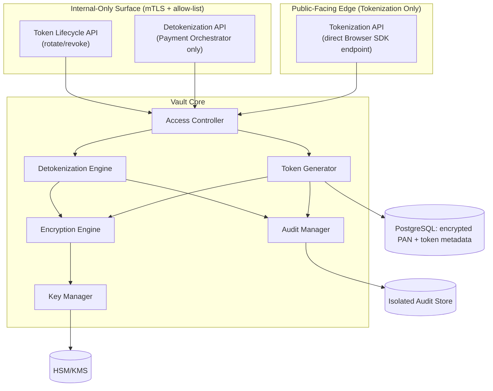

## 13.2 Physical / Deployment-Level Architecture
- The Vault's public tokenization endpoint and internal detokenization
  endpoint are deployed as logically distinct network listeners (even
  within the same service process/container) with separate ingress
  paths — the public listener is reachable from the internet (TLS,
  rate-limited, structurally validated only), while the internal
  listener is reachable exclusively from within the platform's private
  network segment, over mTLS, with network-policy-level enforcement
  (Kubernetes `NetworkPolicy` or equivalent) as an additional layer
  beyond application-level identity checks.
- This dual-listener separation is a deliberate reinforcement of FR-2.2
  — even if an application-level authorization check were somehow
  bypassed, network-layer segmentation independently prevents any
  non-Orchestrator caller from ever reaching the detokenize path at all.

## 13.3 Secure Storage & Encryption Boundaries
- PostgreSQL stores only: `vaultTokenId`, `ciphertext` (AES-256 encrypted
  PAN), `wrappedDek`, `keyVersion`, `status`, `maskedPan`,
  `createdAt`/`expiresAt` — never plaintext PAN, never CVV in any form,
  never a plaintext or unwrapped DEK.
- The encryption boundary is drawn at the application layer's
  `EncryptionEngine` component (§15) — everything on the far side of
  that boundary (the database, backups, replication streams) sees only
  ciphertext.

## 13.4 Token Lookup vs PAN Lookup
- **Token lookup** (does this `vaultToken` exist, what is its status,
  what is its masked-PAN display value) is a frequent, cache-friendly,
  low-sensitivity operation — served via the Redis cache (§Part 3) with
  no cryptographic operation required.
- **PAN lookup** (the actual decrypt-to-plaintext operation) is a rare,
  strictly-gated, always-audited, always-fresh (never cached) operation
  — there is no PAN-side cache anywhere in this architecture, under any
  circumstance, since caching decrypted cardholder data would directly
  violate the entire premise of bounding raw-PAN lifetime to a single
  request.

## 13.5 Isolation
- The audit store is logically and access-control-isolated from the
  operational vault database — a compromise of operational database
  credentials does not, by itself, grant read or write access to the
  audit trail, and vice versa, ensuring the audit log retains integrity
  as an independent forensic source even in a partial-compromise
  scenario.
- The Vault's own application containers run with no outbound network
  access to any destination other than its own database, Redis, Kafka,
  and the HSM/KMS endpoint — no general internet egress, further
  shrinking the exfiltration surface for any cardholder data that might
  transiently exist in memory.

## 13.6 Access Layers
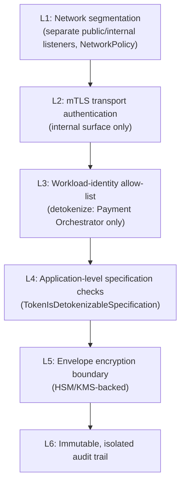

## 13.7 Internal APIs & Trust Boundaries
- The only two trust boundaries the Vault ever crosses are: (1) Browser
  SDK → Vault (untrusted-caller-identity, public, rate-limited,
  structurally validated, tokenize-only), and (2) Payment Orchestrator →
  Vault (fully trusted, mTLS + workload-identity, detokenize/lifecycle
  operations). No third trust boundary exists in this design — this
  minimalism is itself a security property, since every additional
  trust boundary is an additional attack surface to reason about.

## 13.8 Data Flow (End-to-End Summary)
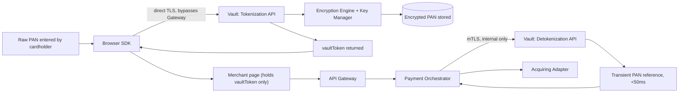

---

# 14. Clean Architecture

## 14.1 Layers
**Domain Layer (innermost):** `Token`, `KeyMaterial` aggregates, value
objects (`EncryptedPanReference`, `MaskedPan`, `KeyVersionReference`),
domain services (`TokenizationService`, `DetokenizationService`,
`KeyRotationService`), specifications (§9.6). Pure Java 21, zero
dependency on Spring, HSM/KMS SDKs, or persistence frameworks — this is
the layer where "a token can only be detokenized if `ACTIVE`" lives,
completely independent of which database or which HSM vendor is behind
it.

**Application Layer:** Use cases (`TokenizePanUseCase`,
`DetokenizeTokenUseCase`, `RotateTokenUseCase`, `RevokeTokenUseCase`,
`InitiateKeyRotationUseCase`) orchestrating domain services and calling
out to ports for anything external (HSM/KMS, persistence, audit
writing, event publishing).

**Adapter Layer:** `HsmKmsClientAdapter` (implements the
`KeyWrappingPort`), `TokenRepositoryAdapter` (Postgres-backed),
`AuditWriterAdapter` (writes to the isolated audit store),
`OutboxWriterAdapter`, `RedisTokenCacheAdapter`.

**Framework/Infrastructure Layer (outermost):** Spring Boot controllers
for the public tokenization endpoint and the internal detokenization/
lifecycle endpoints, Spring Security/mTLS configuration, Flyway
migrations, Actuator health endpoints.

## 14.2 Dependency Rule
Dependencies point strictly inward: the Framework layer depends on
Application, which depends on Domain; Domain depends on nothing outside
itself. Critically, **the domain layer has no knowledge of AES-256,
RSA, or any specific HSM/KMS vendor API** — those are adapter-layer
concerns behind the `KeyWrappingPort`/`EncryptionPort` interfaces,
meaning a future HSM/KMS provider migration touches only the adapter
layer, never the domain logic that enforces token-lifecycle and
detokenization-eligibility rules.

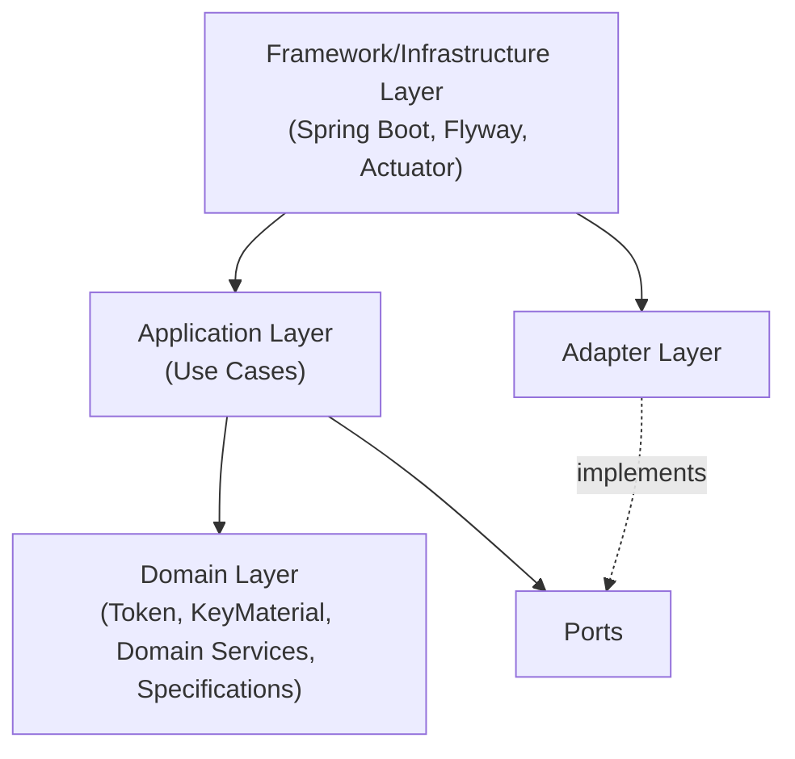

## 14.3 Package Structure

```
token-vault-service/
└── src/main/java/.../vault/
    ├── config/
    │   ├── SecurityConfig.java
    │   ├── MtlsAllowListConfig.java
    │   └── EncryptionConfig.java
    ├── controller/
    │   ├── public_/
    │   │   └── TokenizationController.java
    │   └── internal/
    │       ├── DetokenizationController.java
    │       └── TokenLifecycleController.java
    ├── application/
    │   ├── TokenizePanUseCase.java
    │   ├── DetokenizeTokenUseCase.java
    │   ├── RotateTokenUseCase.java
    │   ├── RevokeTokenUseCase.java
    │   └── InitiateKeyRotationUseCase.java
    ├── domain/
    │   ├── token/
    │   │   ├── Token.java
    │   │   ├── TokenStatus.java             # sealed
    │   │   └── VaultTokenFactory.java
    │   ├── key/
    │   │   ├── KeyMaterial.java
    │   │   └── KeyStatus.java               # sealed
    │   ├── service/
    │   │   ├── TokenizationService.java
    │   │   ├── DetokenizationService.java
    │   │   └── KeyRotationService.java
    │   ├── specification/
    │   │   ├── TokenIsDetokenizableSpecification.java
    │   │   └── KeyVersionIsActiveSpecification.java
    │   ├── event/
    │   │   ├── TokenCreated.java
    │   │   ├── TokenRevoked.java
    │   │   ├── TokenExpired.java
    │   │   ├── TokenRotated.java
    │   │   ├── KeyRotationInitiated.java
    │   │   └── KeyRotationCompleted.java
    │   └── vo/
    │       ├── VaultTokenId.java
    │       ├── EncryptedPanReference.java
    │       ├── MaskedPan.java
    │       └── KeyVersionReference.java
    ├── port/
    │   ├── KeyWrappingPort.java
    │   ├── TokenRepositoryPort.java
    │   ├── KeyMaterialRepositoryPort.java
    │   ├── AuditWriterPort.java
    │   └── OutboxWriterPort.java
    ├── adapter/
    │   ├── hsmkms/
    │   │   └── HsmKmsClientAdapter.java
    │   ├── persistence/
    │   │   ├── TokenRepositoryAdapter.java
    │   │   └── KeyMaterialRepositoryAdapter.java
    │   ├── audit/
    │   │   └── AuditWriterAdapter.java
    │   ├── cache/
    │   │   └── RedisTokenCacheAdapter.java
    │   └── outbox/
    │       └── OutboxWriterAdapter.java
    ├── entity/            # persistence entities, distinct from domain aggregates
    ├── dto/
    │   ├── request/
    │   └── response/
    ├── mapper/
    ├── exception/
    ├── security/
    ├── validation/
    ├── event/
    │   └── producer/
    ├── scheduler/          # key-rotation scheduling, token-expiry cleanup
    ├── client/
    └── constant/
```

Note the split `controller/public_/` vs `controller/internal/` packages
— mirroring the dual-listener architectural boundary (§13.2) directly in
the code structure, so the physical trust-boundary separation is
visually and structurally obvious to any engineer reading the codebase,
not merely enforced by configuration alone.

---

# 15. Components

## 15.1 Token Generator
- **Purpose:** Produce cryptographically secure, non-derivable
  `VaultTokenId` values.
- **Responsibilities:** Random ID generation using a CSPRNG; format
  validation (opaque, no embedded structure).
- **Inputs:** Tokenization request trigger.
- **Outputs:** A new `VaultTokenId`.
- **Dependencies:** Platform CSPRNG facility.
- **Failure scenarios:** Entropy source unavailable — fails closed,
  rejecting the tokenization request rather than falling back to a
  weaker generation method.

## 15.2 Vault Manager
- **Purpose:** Coordinates the overall tokenization/detokenization use
  case flow across the other components.
- **Responsibilities:** Sequencing calls to Token Generator, Encryption
  Engine, Audit Manager, and the repository ports within a single
  transactional boundary.
- **Inputs:** Use-case-level requests (tokenize, detokenize, rotate,
  revoke).
- **Outputs:** Completed domain operation results, raised domain events.
- **Dependencies:** All other core components.
- **Failure scenarios:** Any downstream component failure causes the
  Vault Manager to abort the entire operation atomically — there is no
  partial-completion state (e.g. a token is never persisted without its
  corresponding audit entry).

## 15.3 Encryption Engine
- **Purpose:** Perform the actual AES-256 encrypt/decrypt operations
  using an unwrapped DEK.
- **Responsibilities:** Local symmetric encryption/decryption; immediate
  in-memory discard of plaintext DEKs and plaintext PAN after use.
- **Inputs:** Plaintext PAN + DEK (tokenize) or ciphertext + DEK
  (detokenize).
- **Outputs:** Ciphertext (tokenize) or plaintext PAN reference,
  bounded-lifetime (detokenize).
- **Dependencies:** Key Manager (for DEK wrap/unwrap coordination).
- **Failure scenarios:** Cryptographic operation failure (e.g.
  corrupted ciphertext) surfaces as a rejected operation with an audit
  entry recorded — never a silent fallback to an unencrypted path.

## 15.4 Key Manager
- **Purpose:** Coordinate with the HSM/KMS for DEK generation/wrapping/
  unwrapping and KEK rotation lifecycle.
- **Responsibilities:** Maintains current active `KeyVersionReference`;
  requests new DEKs per tokenization operation; requests unwrap
  operations per detokenization operation; orchestrates rotation
  scheduling.
- **Inputs:** Encryption Engine requests; scheduled/on-demand rotation
  triggers.
- **Outputs:** Wrapped DEKs, unwrapped (transient) DEKs, key-version
  metadata.
- **Dependencies:** HSM/KMS provider (external).
- **Failure scenarios:** HSM/KMS unreachable — circuit breaker opens,
  all tokenize/detokenize operations fail closed with a retryable error
  (NFR-6).

## 15.5 Detokenization Engine
- **Purpose:** The single, narrow code path capable of producing a
  usable PAN reference from a token.
- **Responsibilities:** Enforces `TokenIsDetokenizableSpecification`
  before invoking the Encryption Engine; enforces the 50ms in-memory
  lifetime budget; ensures the returned reference is structurally
  incapable of being logged by the calling convention used.
- **Inputs:** `vaultToken`, caller identity.
- **Outputs:** Transient PAN reference.
- **Dependencies:** Encryption Engine, Access Controller, Audit Manager.
- **Failure scenarios:** Specification check fails (expired/revoked
  token, or unauthorized caller) — rejected immediately, audited as a
  denial, never attempted against the Encryption Engine.

## 15.6 Audit Manager
- **Purpose:** Write immutable audit entries for every cardholder-data-
  adjacent operation.
- **Responsibilities:** Constructs `AuditEntry` records containing actor
  identity, operation type, outcome, and timestamp — explicitly
  excluding PAN/CVV content by construction (the audit entry's own type
  signature has no field capable of holding such data, making this a
  structural, not just a procedural, guarantee).
- **Inputs:** Every tokenize/detokenize/rotate/revoke/access-denial
  event from Vault Manager.
- **Outputs:** Persisted audit records in the isolated audit store.
- **Dependencies:** Isolated Audit Store (§13.5).
- **Failure scenarios:** Audit write failure **aborts the entire
  originating operation** — a tokenization or detokenization is never
  considered successful if its corresponding audit entry could not be
  written, since an un-audited cardholder-data access is treated as
  equivalent in severity to an unauthorized one.

## 15.7 Access Controller
- **Purpose:** Enforce caller-identity and route-level access rules
  before any core operation proceeds.
- **Responsibilities:** Validates mTLS identity + workload allow-list
  for internal routes (FR-2.2); applies public-route rate limiting and
  structural validation for the tokenization endpoint.
- **Inputs:** Inbound request + transport-layer identity.
- **Outputs:** Allow/deny decision.
- **Dependencies:** mTLS certificate validation infrastructure, allow-
  list configuration.
- **Failure scenarios:** Any ambiguity in identity resolution (e.g. a
  certificate that doesn't cleanly map to an allow-listed workload)
  resolves to **deny**, never to a permissive default.

## 15.8 Policy Engine
- **Purpose:** Centralize configurable security policy decisions (key
  rotation cadence, token expiration defaults, retention windows)
  separate from hardcoded business logic.
- **Responsibilities:** Supplies policy values to domain services
  (`KeyRotationService` reads rotation cadence from here rather than a
  hardcoded constant).
- **Inputs:** Externalized configuration.
- **Outputs:** Policy decisions/values.
- **Dependencies:** Configuration source (§Part 4).
- **Failure scenarios:** Missing/invalid policy configuration at
  startup fails the service's readiness check rather than silently
  falling back to an undocumented default.

## 15.9 Metadata Manager
- **Purpose:** Manage non-sensitive token metadata (masked PAN, card
  brand, creation timestamp) independent of the encrypted-PAN path.
- **Responsibilities:** Serves the fast, cache-friendly token-lookup
  path (§13.4) without ever touching the Encryption Engine.
- **Inputs:** Token metadata queries.
- **Outputs:** `MaskedPan` and related display-safe metadata.
- **Dependencies:** Redis cache, PostgreSQL (metadata columns only).
- **Failure scenarios:** Cache miss falls through to PostgreSQL; a
  PostgreSQL read failure here (metadata-only) is treated as a lower-
  severity failure than an Encryption Engine failure, since no
  cardholder-data-sensitive operation is at risk.

## 15.10 Health Monitor
- **Purpose:** Continuously assess the health of the Vault's own
  process and its critical dependencies (HSM/KMS reachability,
  database reachability).
- **Responsibilities:** Feeds the liveness/readiness endpoints (FR-6.1).
- **Inputs:** Periodic dependency health probes.
- **Outputs:** Health status consumed by Kubernetes.
- **Dependencies:** HSM/KMS, PostgreSQL, Redis.
- **Failure scenarios:** HSM/KMS unreachable → readiness fails
  (tokenize/detokenize cannot function without it, unlike the Merchant
  Service's Redis, which is a non-critical accelerator there — here the
  equivalent external dependency is on the critical path).

## 15.11 Metrics Collector
- **Purpose:** Emit Micrometer/Prometheus metrics for latency,
  throughput, and error rates per operation type.
- **Responsibilities:** Records tokenize/detokenize latency histograms,
  key-rotation event counters, access-denial counters — never records
  any cardholder-data-derived value as a metric label or value.
- **Inputs:** Every core-component operation outcome.
- **Outputs:** Metrics exposed to Prometheus (§Part 3/4 observability
  sections).
- **Dependencies:** Micrometer registry.
- **Failure scenarios:** Metrics emission failure never blocks the
  underlying business operation — this is a strictly best-effort,
  fire-and-forget concern, unlike the Audit Manager, which is
  intentionally blocking.

## 15.12 Event Publisher
- **Purpose:** Publish domain events (`TokenCreated`, `TokenRevoked`,
  etc.) via the platform's standard Transactional Outbox pattern.
- **Responsibilities:** Writes the outbox row within the same local
  transaction as the aggregate state change; the platform's Outbox
  Relay (per `SYSTEM_DESIGN.md` §7) handles actual Kafka publication.
- **Inputs:** Domain events raised by Vault Manager/domain services.
- **Outputs:** Outbox rows, eventually published to `vault.events`.
- **Dependencies:** PostgreSQL (outbox table), platform Outbox Relay.
- **Failure scenarios:** Identical guarantee to every other service on
  the platform — event publication failure never loses the underlying
  state change (Outbox guarantees eventual publish), and conversely, no
  event is ever published for a state change that didn't actually
  commit.

---

# 16. Domain Events

| Event | Published When | Consumed By | Contains Cardholder Data? |
|---|---|---|---|
| `TokenCreated` | New token successfully issued | Internal audit/analytics only (no other service has a legitimate reason to consume raw token-creation events) | No — contains only `vaultTokenId`, `maskedPan`, `keyVersion`, timestamps |
| `TokenRevoked` | Token explicitly revoked or superseded by rotation | Internal audit; potentially Payment Orchestrator if it needs to know a stored/saved card reference is no longer usable | No |
| `TokenExpired` | Token's `expiresAt` passed | Internal cleanup scheduler | No |
| `TokenRotated` | Rotation completes (old revoked, new created) | Internal audit | No |
| `KeyRotationInitiated` | KEK rotation begins | Internal audit, security monitoring | No |
| `KeyRotationCompleted` | KEK rotation fully propagated | Internal audit, security monitoring | No |

All events follow the platform-standard envelope from `SYSTEM_DESIGN.md`
§5. Every payload in this table is independently verified, by design and
by the `AuditEntry`/event type-signature construction described in
§15.6, to structurally exclude any PAN, CVV, or other cardholder-data
field — this is enforced at the type level (the event classes simply
have no such fields available to populate), not merely by convention or
code review.

---

# 17. Workflows

## 17.1 PAN Tokenization

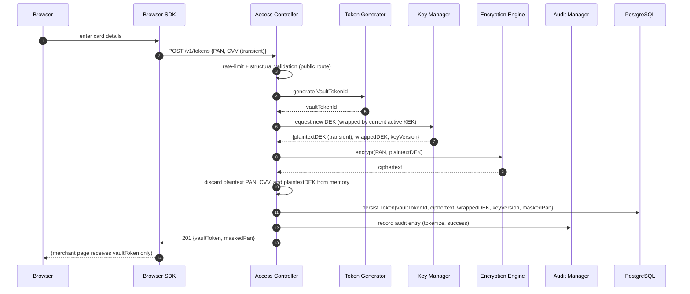

## 17.2 Token Retrieval (Metadata Only)

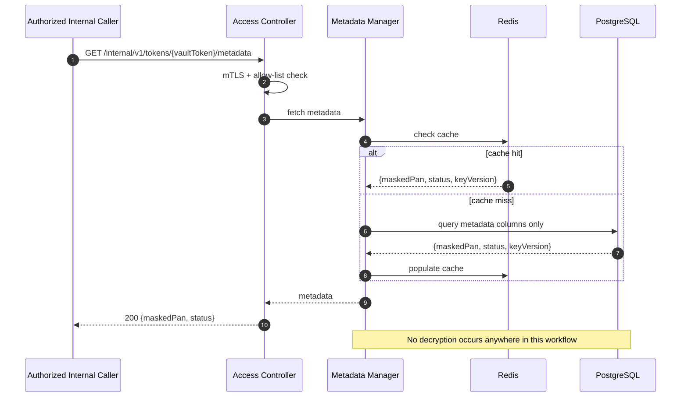

## 17.3 Detokenization

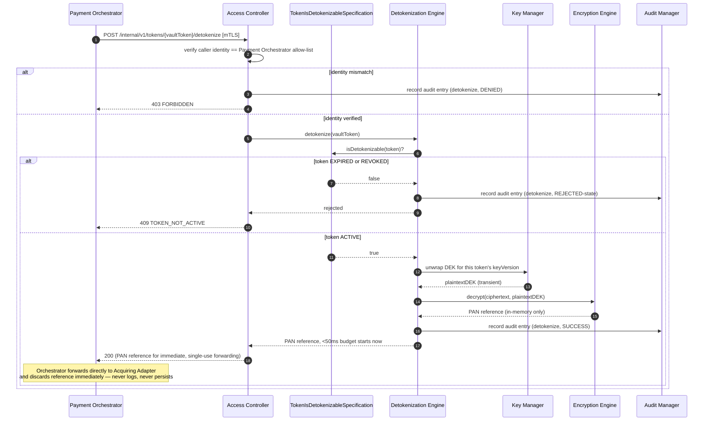

## 17.4 Key Rotation

```mermaid
sequenceDiagram
    autonumber
    participant Scheduler
    participant KRS as KeyRotationService
    participant KM as Key Manager
    participant KMS as HSM/KMS
    participant AM as Audit Manager
    participant Kafka

    Scheduler->>KRS: initiate scheduled rotation
    KRS->>KMS: request new KEK version activation
    KMS-->>KRS: new keyVersionId (ACTIVE)
    KRS->>KRS: mark previous keyVersion RETIRED (still valid for unwrap)
    KRS->>AM: record audit entry (KeyRotationInitiated)
    KRS->>Kafka: outbox → KeyRotationInitiated
    Note over KRS: All NEW tokenization operations now use the new KEK version.<br/>Existing tokens remain valid; optional background re-wrap process<br/>may migrate them over time (Part 3).
    KRS->>AM: record audit entry (KeyRotationCompleted) [once propagation verified]
    KRS->>Kafka: outbox → KeyRotationCompleted
```

## 17.5 Vault Initialization

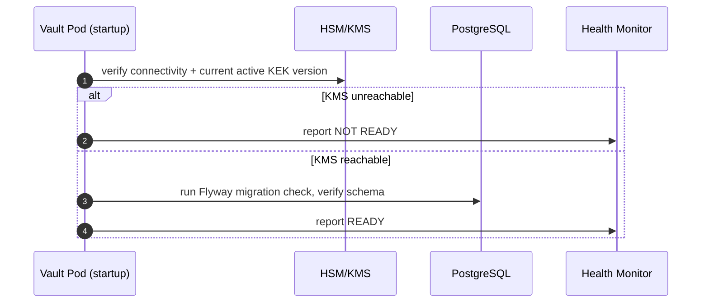

## 17.6 Vault Recovery

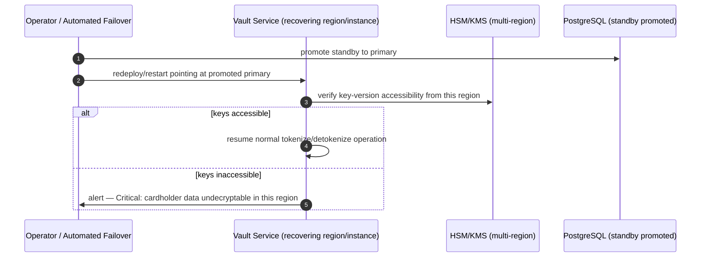

## 17.7 Audit Logging

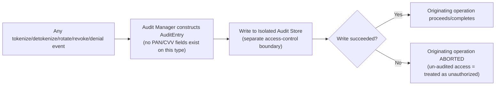

## 17.8 Unauthorized Access Attempt

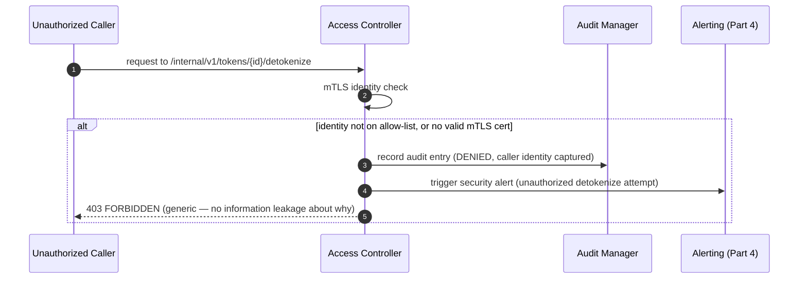

## 17.9 Token Expiration (Passive Enforcement + Cleanup Sweep)

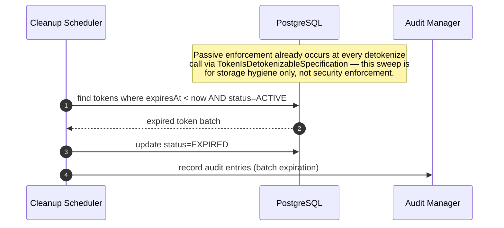

## 17.10 Service Startup

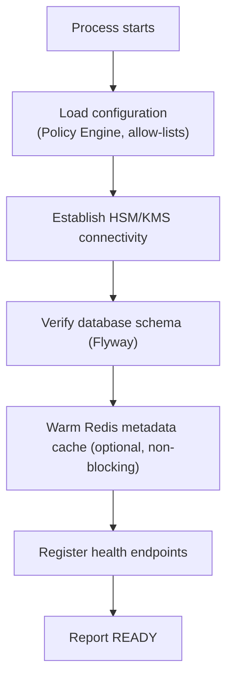

## 17.11 Service Shutdown

```mermaid
flowchart TB
    A["SIGTERM received"] --> B["Readiness → false immediately"]
    B --> C["Stop accepting new tokenize/detokenize requests"]
    C --> D["Drain in-flight requests<br/>(bounded grace period)"]
    D --> E["Ensure no plaintext PAN/DEK remains in any buffer<br/>(explicit memory-clearing step)"]
    E --> F["Close HSM/KMS, DB, Redis, Kafka connections"]
    F --> G["Process exits"]
```

Note the explicit memory-clearing step in shutdown (§17.11) — this is a
deliberate addition beyond the generic graceful-shutdown pattern used by
the API Gateway and Merchant Service, reflecting the Vault's unique
requirement that no residual plaintext cardholder-data-adjacent material
survive even a routine, planned process termination.

# Token Vault Service — Software Architecture Specification
## Part 2 of 4: API Specification, AuthN/AuthZ, Token Operations, PCI-DSS, Cryptography

---

# 18. REST API Specification

## 18.1 API Design Principles
- **Two structurally separate surfaces, never one unified API**: a
  public tokenization surface (`/v1/tokens`) reachable directly by the
  Browser SDK, and an internal-only surface (`/internal/v1/**`)
  reachable exclusively by the Payment Orchestrator over mTLS — this is
  not a convention but a network- and application-layer enforced split,
  per Part 1 §13.2/§13.7.
- **No endpoint ever returns a raw PAN.** This is the single
  non-negotiable design constraint governing every response model in
  this section; every response schema below is written with this
  constraint already applied, not as an afterthought filter.
- **Consistency with platform-wide API standards** established in
  `API-Gateway-Part-02.md` — the standard error envelope, header set,
  and idempotency semantics are reused verbatim wherever they apply,
  with Vault-specific extensions layered on top only where the Vault's
  unique constraints (bounded PAN lifetime, audit-mandatory operations)
  require it.

## 18.2 API Versioning Strategy
- URI-based versioning (`/v1/...`, `/internal/v1/...`), identical
  strategy to the API Gateway and Merchant Service specs, for platform-
  wide consistency.
- The public tokenization contract (`/v1/tokens`) is versioned with the
  same 180-day minimum deprecation window discipline as the Merchant
  Service's external surface (`Merchant-Service-Part-02.md` §33),
  since Browser SDK versions in the field cannot be force-upgraded
  instantly.
- The internal surface (`/internal/v1/**`) is versioned independently
  and may evolve on a faster cadence, since its only consumer (Payment
  Orchestrator) is deployed by the same platform organization and can
  coordinate version changes directly — mirroring the Merchant
  Service's internal-vs-external versioning-cadence split
  (`Merchant-Service-Part-02.md` §33).

## 18.3 URI Naming Conventions
```
POST   /v1/tokens                                  (tokenize)
GET    /v1/tokens/{vaultToken}                     (masked metadata, public-safe)

POST   /internal/v1/tokens/{vaultToken}/detokenize
GET    /internal/v1/tokens/{vaultToken}/metadata
POST   /internal/v1/tokens/{vaultToken}/rotate
POST   /internal/v1/tokens/{vaultToken}/revoke

POST   /internal/v1/keys/rotate
GET    /internal/v1/keys/current-version
```
- No verbs in the public surface's primary resource path (`/v1/tokens`
  follows the platform's noun-based convention); `detokenize`,
  `rotate`, `revoke` are modeled as resource-state-transition endpoints,
  identical pattern to the Payment Orchestrator's `capture`/`refund` and
  the Merchant Service's `suspend`/`deactivate` transition endpoints,
  for platform-wide URI consistency.
- `{vaultToken}` path parameters are always the opaque token string
  itself — never an internal database identifier — ensuring no
  endpoint leaks an internal primary key that could aid enumeration.

## 18.4 HTTP Methods
| Method | Usage Here | Idempotent |
|---|---|---|
| POST | Tokenize, detokenize, rotate, revoke, key rotation trigger | No (Idempotency-Key required on tokenize; detokenize is inherently non-cacheable/non-idempotent by nature of audit-per-call, §21.4) |
| GET | Masked metadata retrieval only | Yes |

No `PUT`, `PATCH`, or `DELETE` verbs are exposed anywhere on this
service — there is no concept of "editing" a token or a stored PAN in
place (Part 1 §11 lifecycle is entirely transition-based), and hard
deletion is an internal, policy-driven, scheduled operation, never a
direct API-triggered `DELETE` call, closing off an entire class of
accidental-destructive-call risk.

## 18.5 Resource Hierarchy
```
/tokens
  /{vaultToken}
    /detokenize      (internal only)
    /rotate          (internal only)
    /revoke          (internal only)
    /metadata        (internal only)
/keys
  /rotate            (internal only)
  /current-version   (internal only)
```
Flat hierarchy under `tokens` — a vault token has no meaningful
sub-resource nesting beyond its own lifecycle transitions, unlike the
Merchant Service's deeper `merchant → credential/webhook-config`
nesting, reflecting the Vault's intentionally narrow domain surface.

## 18.6 Request Lifecycle
```mermaid
flowchart LR
    A["Inbound request"] --> B{"Public or Internal listener?"}
    B -->|Public| C["Rate limit (IP-based)<br/>+ structural validation"]
    B -->|Internal| D["mTLS identity check<br/>+ workload allow-list"]
    C --> E["Access Controller: route-level policy"]
    D --> E
    E --> F["Application Use Case"]
    F --> G["Domain Service + Specification checks"]
    G --> H["Audit Manager write (blocking)"]
    H --> I["Response mapping<br/>(never includes raw PAN)"]
```

## 18.7 Response Standards
- Reuses the platform-standard success/error envelope conventions;
  every response includes `correlationId` and `timestamp`.
- Successful tokenize/metadata responses include `maskedPan` (last four
  digits + card brand) — never more.
- Detokenize responses are the sole exception to "a response body is
  safe to log": the internal detokenize response contract is defined
  (§20) such that the PAN reference is delivered through a mechanism
  structurally distinct from a normal JSON body field a generic
  logging interceptor would capture (§20.5).

## 18.8 Error Handling Strategy
Reuses the platform-standard error model from `API-Gateway-Part-02.md`
§17.5, with Vault-specific error codes (§18.11). Errors never include
any cardholder-data fragment, and detokenize-path errors are
intentionally generic toward any caller that fails the identity check
(§23.5), to avoid information leakage about why a request was denied.

## 18.9 Pagination
- Not applicable to the public surface (no list endpoints exist —
  tokens are only ever looked up by their exact `vaultToken`, never
  enumerated).
- The internal key-version history query (used operationally, §Part 3)
  supports cursor-based pagination, consistent with the platform's
  general preference for cursor over offset pagination on any
  growing, audit-adjacent dataset.

## 18.10 Filtering & Sorting
- Not applicable to token resources (no list/search capability exists
  by design — this is a deliberate absence, not an oversight, since a
  searchable token index would itself be an information-leakage risk
  surface).
- Key-version metadata queries support filtering by `status`
  (`ACTIVE`/`RETIRED`/`DESTROYED`) and sorting by `activatedAt`.

## 18.11 Endpoint Catalogue

### `POST /v1/tokens` — Tokenize a PAN
| Aspect | Detail |
|---|---|
| Purpose | Accept a raw PAN (+ transient CVV) directly from the Browser SDK and return an opaque `vaultToken` |
| Security | Public TLS 1.2+ endpoint; no prior authentication required, but IP-based rate limiting (§18.13) and structural validation applied before any cryptographic work occurs |
| Idempotency | `Idempotency-Key` header required (platform standard); duplicate key within the TTL window returns the original `vaultToken`, never re-tokenizes |
| Request fields | `pan` (required, Luhn-valid numeric string), `cvv` (optional per method, never persisted), `expiryMonth`, `expiryYear` |
| Response fields | `vaultToken`, `maskedPan`, `cardBrand`, `createdAt` |
| Status codes | `201 Created` (success), `400` (structural/Luhn-validation failure), `409` (idempotency conflict with a differing payload), `429` (rate limit), `503` (HSM/KMS circuit open) |
| Error codes | `INVALID_PAN_FORMAT`, `PAN_FAILED_LUHN_CHECK`, `MISSING_IDEMPOTENCY_KEY`, `ENCRYPTION_SERVICE_UNAVAILABLE` |

### `GET /v1/tokens/{vaultToken}` — Retrieve Masked Metadata
| Aspect | Detail |
|---|---|
| Purpose | Retrieve display-safe metadata for a previously issued token |
| Security | Public TLS endpoint; requires the caller to present the exact `vaultToken` (possession-based access — no separate credential, since the token itself is the capability, per the merchant page's own session context) |
| Response fields | `maskedPan`, `cardBrand`, `status`, `createdAt` |
| Status codes | `200 OK`, `404 TOKEN_NOT_FOUND` |

### `POST /internal/v1/tokens/{vaultToken}/detokenize` — Detokenize
| Aspect | Detail |
|---|---|
| Purpose | Resolve a token to a transient, in-memory PAN reference for a single authorization call |
| Security | mTLS + workload-identity allow-list restricted to the Payment Orchestrator exclusively (Part 1 FR-2.2); no other identity, however otherwise trusted, is permitted |
| Idempotency | Not applicable — every call is independently audited and independently bounded to its own 50ms lifetime; there is no meaningful "duplicate" semantics to protect against here since no state changes |
| Request fields | none beyond the path parameter and standard headers (`X-Correlation-Id`, internal service identity via mTLS) |
| Response | PAN reference delivered via the mechanism defined in §20.5; standard envelope otherwise |
| Status codes | `200 OK`, `403 FORBIDDEN` (identity not allow-listed), `409 TOKEN_NOT_ACTIVE` (expired/revoked), `404 TOKEN_NOT_FOUND`, `503` (HSM/KMS circuit open) |
| Error codes | `UNAUTHORIZED_CALLER`, `TOKEN_NOT_ACTIVE`, `TOKEN_NOT_FOUND`, `DECRYPTION_SERVICE_UNAVAILABLE` |

### `GET /internal/v1/tokens/{vaultToken}/metadata` — Internal Metadata
| Aspect | Detail |
|---|---|
| Purpose | Internal-surface equivalent of §18.11's public metadata GET, used by Payment Orchestrator without incurring the public listener's rate-limit path |
| Security | mTLS + internal allow-list (broader than detokenize's Orchestrator-only list — Webhook/Settlement Services have no legitimate need for this, so the allow-list remains Orchestrator-only here too, consistent with Part 1 §8.5) |
| Response fields | Identical to §18.11's public GET |
| Status codes | `200 OK`, `404 TOKEN_NOT_FOUND` |

### `POST /internal/v1/tokens/{vaultToken}/rotate` — Rotate Token
| Aspect | Detail |
|---|---|
| Purpose | Issue a new token for the same underlying PAN, revoking the old one (Part 1 §11.5) |
| Security | mTLS + Payment Orchestrator allow-list (rotation is initiated on behalf of a merchant/cardholder action relayed through the Orchestrator, never called directly by any other party) |
| Idempotency | `Idempotency-Key` required, identical semantics to tokenize |
| Response fields | `newVaultToken`, `maskedPan`, `previousTokenStatus: REVOKED` |
| Status codes | `201 Created`, `404 TOKEN_NOT_FOUND`, `409 TOKEN_ALREADY_REVOKED` |

### `POST /internal/v1/tokens/{vaultToken}/revoke` — Revoke Token
| Aspect | Detail |
|---|---|
| Purpose | Immediately and permanently invalidate a token (Part 1 §11.7) |
| Security | mTLS + Payment Orchestrator allow-list |
| Request fields | `reason` (enum: `MERCHANT_REQUESTED`, `SECURITY_ACTION`, `SUPERSEDED_BY_ROTATION`) |
| Status codes | `200 OK`, `409 TOKEN_ALREADY_REVOKED`, `404 TOKEN_NOT_FOUND` |

### `POST /internal/v1/keys/rotate` — Initiate Key Rotation
| Aspect | Detail |
|---|---|
| Purpose | Trigger KEK rotation (scheduled or on-demand/emergency) |
| Security | mTLS + restricted to an internal security/operations workload identity, distinct from and narrower than the Payment Orchestrator allow-list — the Orchestrator has no legitimate reason to trigger key rotation |
| Status codes | `202 Accepted` (rotation is asynchronous, §26), `403 FORBIDDEN` |

### `GET /internal/v1/keys/current-version` — Current Key Version
| Aspect | Detail |
|---|---|
| Purpose | Operational/diagnostic visibility into the currently active KEK version identifier (never key material itself) |
| Security | mTLS + internal operations identity |
| Status codes | `200 OK` |

## 18.12 Validation Rules (API-Layer, Structural)
| Field | Rule |
|---|---|
| `pan` | Numeric string, 12–19 digits, passes Luhn checksum |
| `cvv` | 3–4 numeric digits if present; never echoed in any response or log |
| `expiryMonth`/`expiryYear` | Valid calendar values; not already expired relative to current date |
| `Idempotency-Key` | UUID format, required on all state-creating POSTs |
| `vaultToken` (path param) | Matches the platform's opaque token format regex; malformed values rejected with `400` before any database lookup is attempted |

## 18.13 Rate Limiting Behavior
- Public tokenize endpoint: strict IP-based rate limit, materially
  tighter than typical Gateway-fronted merchant traffic limits, since
  this endpoint is reachable pre-authentication and is the platform's
  highest-value target for automated card-testing/carding attacks.
- Public metadata GET: moderate IP-based limit, since it is possession-
  based (requires knowing the exact token) but still worth bounding
  against enumeration attempts.
- Internal endpoints are not rate-limited by IP (trusted, mTLS-
  authenticated, allow-listed callers only) but are subject to the
  same circuit-breaker/bulkhead protection the Payment Orchestrator
  applies to its own outbound calls, per `SYSTEM_DESIGN.md`'s
  Resilience4j mandate.

## 18.14 Correlation IDs, Idempotency Headers, Request Tracing, Retry Behavior
- `X-Correlation-Id`: generated if absent, propagated if present,
  identical semantics to the platform standard (`API-Gateway-Part-03.md`
  §26).
- `Idempotency-Key`: required on tokenize/rotate; deduplication is
  enforced via a unique constraint plus a short-TTL idempotency record,
  identical pattern to `SYSTEM_DESIGN.md`'s platform-wide idempotency
  design.
- `traceparent`/`tracestate`: W3C Trace Context propagated per the
  platform's OpenTelemetry strategy, with the Vault-specific constraint
  that span attributes never include PAN/CVV/token-secret-adjacent
  values (§Part 3 observability details).
- Retry behavior: the Vault itself never automatically retries a
  tokenize/detokenize request on the caller's behalf (mirroring the API
  Gateway's own "never retry a financial mutation" rule,
  `API-Gateway-Part-02.md` §24) — retries are the calling service's
  responsibility, governed by its own Idempotency-Key usage.

---

# 19. Authentication

## 19.1 OAuth2
- The Vault does not itself issue or validate merchant-facing OAuth2
  tokens (that remains entirely the API Gateway's and Merchant
  Service's domain, per their respective specs) — OAuth2 is out of
  scope for the Vault's own trust model, since **no external merchant
  credential is ever accepted by this service at all**. This is a
  deliberate, load-bearing omission: the Vault's public tokenize
  endpoint is intentionally reachable without any merchant
  authentication, because the Browser SDK call happens before a
  merchant-authenticated session context is necessarily available on
  that specific page, and the security model instead relies on rate
  limiting, structural validation, and the fact that a successful
  tokenize call only ever yields an opaque, single-purpose token — never
  a capability to detokenize anything.

## 19.2 JWT
- Not used on the public tokenize surface (see §19.1 rationale).
- Used only in the narrow sense that internal service identity may be
  carried via a short-lived internal service JWT **in addition to**
  mTLS on the internal surface, mirroring the Merchant Service's
  internal-API authentication approach (`Merchant-Service-Part-02.md`
  §40.2) — but mTLS remains the primary, non-bypassable authentication
  layer; a JWT alone, without a valid mTLS handshake, is never
  sufficient to reach any internal Vault endpoint.

## 19.3 Mutual TLS (mTLS)
- Mandatory for every internal-surface call, with zero exceptions —
  this is the single most important authentication mechanism in this
  entire service's design, because it is the mechanism that makes
  FR-2.2 (only the Payment Orchestrator may detokenize) enforceable at
  the transport layer, not merely at an application-code check that a
  future refactor could accidentally weaken.
- Certificates are short-lived, automatically rotated via the
  platform's Secret Manager/service-mesh identity system, identical
  approach to the API Gateway's mTLS strategy (`API-Gateway-Part-02.md`
  §25.4).

## 19.4 Service-to-Service Authentication
- The only legitimate service-to-service caller on the detokenize path
  is the Payment Orchestrator; the only legitimate caller on the
  token-lifecycle (rotate/revoke) path is also the Payment Orchestrator
  (acting on behalf of a merchant/cardholder request it has already
  authenticated and authorized upstream); the only legitimate caller on
  the key-rotation path is a distinct internal security/operations
  workload identity (§18.11).
- No service is ever authenticated by a shared secret or static
  bearer token for service-to-service calls — workload identity (mTLS
  certificate subject, e.g. SPIFFE ID) is the sole mechanism, since
  static secrets are a categorically weaker and more leak-prone
  authentication factor than a short-lived, mesh-managed certificate.

## 19.5 Internal Authentication (Summary Table)
| Caller | Endpoint Class | Auth Mechanism |
|---|---|---|
| Browser SDK | Public tokenize/metadata | None (rate limit + structural validation only) |
| Payment Orchestrator | Detokenize, rotate, revoke, internal metadata | mTLS + workload-identity allow-list |
| Internal Security/Ops workload | Key rotation | mTLS + separate, narrower workload-identity allow-list |
| Any other service | Any Vault endpoint | Always rejected — no allow-list entry exists for any other identity |

## 19.6 API Gateway Authentication Flow (Non-Interaction, Restated)
- Consistent with Part 1 §4 and `API-Gateway-Part-01.md` §8: the API
  Gateway has **no route** to any Vault endpoint in its route table.
  There is no "Gateway authenticates then forwards to Vault" flow to
  document, because that flow does not exist by design — this section
  exists only to explicitly confirm the absence, since its absence is
  itself a security-critical architectural decision worth stating
  plainly rather than leaving implicit.

## 19.7 Token Validation
- "Token validation" in this service's context refers to `vaultToken`
  format/existence validation (§18.12), not authentication-token
  (JWT/OAuth2) validation — this terminology distinction is called out
  explicitly to avoid ambiguity between "vault token" (a card
  reference) and "auth token" (a JWT/access token), two entirely
  different concepts that happen to share vocabulary elsewhere in the
  platform.

## 19.8 Certificate Validation
- Full chain validation against the platform's internal Certificate
  Authority on every internal-surface request; certificate revocation
  status checked (via OCSP stapling or an equivalent mechanism
  supported by the service mesh) so a compromised-and-revoked
  Orchestrator instance certificate cannot continue reaching the
  detokenize path until its replacement certificate propagates.

## 19.9 Identity Propagation
- Unlike the API Gateway → downstream-service pattern (where the
  Gateway attaches a signed `X-Merchant-Id` header representing an
  *external* principal, per `API-Gateway-Part-02.md` §19), the Vault's
  internal surface never needs to know *which merchant* a detokenize
  call is for — it only needs to know *which service* is calling. The
  mTLS certificate's workload identity **is** the propagated identity in
  its entirety; there is no secondary application-level identity header
  to trust or validate, minimizing the number of places a
  identity-spoofing vulnerability could hide.

## 19.10 Trust Relationships
```mermaid
flowchart TB
    ORCH["Payment Orchestrator<br/>(workload identity: spiffe://.../payment-orchestrator)"]
    OPS["Internal Security/Ops workload<br/>(workload identity: spiffe://.../vault-key-admin)"]
    VAULT["Token Vault Service"]
    OTHER["Any other platform service"]

    ORCH -->|"trusted: detokenize, rotate, revoke, metadata"| VAULT
    OPS -->|"trusted: key rotation only"| VAULT
    OTHER -.->|"never trusted for any internal endpoint"| VAULT
```

## 19.11 Authentication Failure Handling
- Any mTLS handshake failure is rejected at the transport layer before
  the application layer is even reached (network-policy + mesh-level
  enforcement, Part 1 §13.2).
- Any application-layer identity check failure (valid mTLS cert, but
  not on the specific endpoint's allow-list) results in a generic `403
  FORBIDDEN`, an audit entry (§17.8, Part 1), and a security alert
  (§Part 4) — never a descriptive error that would help an attacker
  understand *why* they were denied or *which* identity would have
  succeeded.

---

# 20. Authorization

## 20.1 RBAC (Role-Based Access Control)
- Applied at the coarse, service-identity level: `PAYMENT_ORCHESTRATOR`
  role → {detokenize, rotate, revoke, metadata}; `VAULT_KEY_ADMIN` role
  → {key rotation}; no other role exists in this service's authorization
  model, deliberately kept minimal.

## 20.2 ABAC (Attribute-Based Access Control)
- Layered on top of RBAC for the token-lifecycle operations
  specifically: a rotate/revoke request's authorization additionally
  considers the **token's current status attribute** (Part 1 §11) —
  e.g. `revoke` on an already-`REVOKED` token is authorized at the RBAC
  level (the caller has the right role) but rejected at the ABAC/domain-
  invariant level (the resource's state doesn't permit the transition),
  mirroring the same RBAC+state-machine-gated pattern used in the
  Merchant Service (`Merchant-Service-Part-01.md` §12.1).

## 20.3 Service Roles
| Role | Granted To | Permitted Operations |
|---|---|---|
| `PAYMENT_ORCHESTRATOR` | Payment Orchestrator workload identity only | detokenize, rotate, revoke, internal metadata read |
| `VAULT_KEY_ADMIN` | Internal security/ops workload identity only | key rotation trigger, key-version status read |
| *(no role)* | Every other identity, including Merchant Service, Webhook Service, Settlement Service, API Gateway | No internal-surface access whatsoever |

## 20.4 Least Privilege Principle
- The Payment Orchestrator's role does **not** include key-rotation
  permission, and the key-admin role does **not** include
  detokenize permission — even though both are "internal, trusted"
  identities, each is scoped to exactly the operations its function
  requires and no more, so a compromise of one workload identity does
  not automatically grant the other's capabilities.
- The public tokenize endpoint grants no role at all — it is
  capability-based (possession of the resulting token is itself the
  only "permission" needed for the metadata-read use case), never
  identity-based, since no durable identity exists for an anonymous
  cardholder browser session.

## 20.5 Internal Service Permissions
Detailed in §20.3; restated here as the authoritative decision surface
each Access Controller check (Part 1 §15.7) evaluates against before
any domain-service or Encryption Engine call is made.

## 20.6 Merchant Permissions
- Merchants have **no direct permission model** against this service at
  all — a merchant's card-tokenization actions occur through the
  Browser SDK (no merchant identity involved) and a merchant never
  directly calls any Vault endpoint, internal or public, in their own
  authenticated capacity. This is a deliberate absence: merchant-level
  authorization for "can this merchant use this card" is a Payment
  Orchestrator/business-logic concern entirely outside this service's
  boundary (Part 1 §4).

## 20.7 Administrator Permissions
- A human administrator/operator never has a standing, always-on
  permission to detokenize or access key material directly — any
  operator-driven action (e.g. an emergency key rotation, §26.5) is
  performed through the `VAULT_KEY_ADMIN` **service** role via an
  authenticated operational tooling layer, itself mTLS-authenticated
  against the Vault, rather than a human credential being independently
  recognized by the Vault's own authorization model. This avoids the
  Vault needing to maintain a separate human-identity authorization
  system alongside its service-identity one.

## 20.8 Vault Access Policies (Consolidated)
```mermaid
flowchart TD
    A["Request arrives on internal surface"] --> B{"mTLS identity resolves to a known workload?"}
    B -->|No| DENY1["DENY — 403, audited, alerted"]
    B -->|Yes| C{"Role includes this endpoint's required permission?"}
    C -->|No| DENY2["DENY — 403, audited, alerted"]
    C -->|Yes| D{"Resource-state (ABAC) permits this operation?"}
    D -->|No| DENY3["DENY — 409, audited (not alerted — this is an expected business-state rejection, not a security event)"]
    D -->|Yes| ALLOW["ALLOW — proceed to domain service"]
```

## 20.9 Fine-Grained Access Control
- Fine-grained control in this service is expressed almost entirely
  through the ABAC/resource-state layer (§20.2/§20.8's step D) rather
  than through a complex permission-matrix, since the Vault's identity
  space is intentionally small (two roles) — the complexity that would
  otherwise live in a permission matrix instead lives in the domain
  aggregate's own state-machine invariants (Part 1 §9.6
  `TokenIsDetokenizableSpecification`), keeping authorization logic
  colocated with the business rules it enforces rather than duplicated
  in a separate policy layer.

## 20.10 Access Decision Flow
Depicted fully in §20.8; the notable design choice is that a
**security-relevant** denial (unknown identity, wrong role) always
triggers an alert, while a **business-state** denial (already-revoked
token) is audited but does not itself trigger a security alert — this
distinction prevents alert fatigue from ordinary, expected business
rejections while still ensuring every genuine unauthorized-access
attempt is surfaced immediately.

## 20.11 Authorization Failure Handling
- Identical generic-403 discipline as authentication failures (§19.11)
  — the response body never distinguishes "wrong identity" from "right
  identity, wrong permission" from an external observer's perspective,
  even though internally the audit log records the precise reason for
  forensic purposes.

---

# 21. Token Generation

## 21.1 PAN Validation
- Structural: numeric, 12–19 digits, Luhn-checksum valid — performed
  before any cryptographic work begins, since rejecting an obviously
  malformed PAN early avoids wasting an HSM/KMS round-trip on a request
  that could never succeed.
- No card-brand-specific BIN-range validation is performed as a
  blocking step at the Vault layer (that validation, where needed for
  business routing purposes, belongs to the Acquiring Adapter/Payment
  Orchestrator, which know the relevant business rules) — the Vault's
  validation is intentionally limited to what is needed to safely
  accept and encrypt the value, not to make a business judgment about
  it.

## 21.2 Secure Random Token Generation
- `VaultTokenId` generated via a CSPRNG (platform-approved, per Part 1
  §11.1), sufficient bit-length to make brute-force enumeration
  computationally infeasible at any realistic attack budget.
- Deliberately **not** derived from the PAN in any way (no hashing of
  the PAN into the token, no format-preserving transformation) — this
  is a specific defense against a known class of tokenization-scheme
  weakness where a derived token leaks statistical information about
  the underlying PAN (Part 1 §11.1 rationale restated here as it
  applies directly to this generation step).

## 21.3 Token Format
- Opaque string, fixed length, no embedded metadata (no card-brand
  prefix, no length hint correlated to PAN length) — a token's shape
  reveals nothing about the underlying card.

## 21.4 Token Uniqueness & Collision Prevention
- Uniqueness enforced by a database-level unique constraint on
  `vaultTokenId` as the ultimate guarantee, with the CSPRNG's bit-length
  making a collision probabilistically negligible in the first place;
  on the vanishingly rare constraint-violation event, the generation
  step is simply retried with a freshly generated ID — never silently
  overwriting an existing token.

## 21.5 Metadata Association
- `maskedPan` (last four digits + detected card brand) is computed once
  at generation time and stored alongside the token specifically so
  that all future metadata reads (§18.11) never require touching the
  encrypted PAN or the HSM/KMS, per Part 1 §10's `MaskedPan` value
  object rationale.

## 21.6 Token Persistence
- The `Token` aggregate (ciphertext, wrapped DEK, key version, masked
  PAN, status) is persisted in one atomic local transaction alongside
  the Outbox event row and the audit entry write coordination — the
  Vault Manager (Part 1 §15.2) aborts the entire operation if any part
  of this atomic write fails.

## 21.7 Encryption Workflow
Fully detailed in Part 1 §12.4; restated here only as the step
sequence within the generation flow (§21.9).

## 21.8 Audit Logging
- Every successful tokenization writes an audit entry containing actor
  identity (in this case, "public tokenize endpoint," since no deeper
  caller identity exists), operation type, outcome, and timestamp —
  never the PAN itself, consistent with the structural guarantee
  described in Part 1 §15.6.

## 21.9 Response Generation
- The response is constructed strictly from the `MaskedPan` value
  object and the newly generated `VaultTokenId` — the response-mapping
  code path has no reference to the plaintext PAN variable at all by
  the time the response DTO is constructed, since that variable is
  already out of scope/discarded per the Encryption Engine's immediate-
  discard behavior (Part 1 §15.3).

```mermaid
sequenceDiagram
    autonumber
    participant SDK as Browser SDK
    participant AC as Access Controller
    participant Val as PAN Validator
    participant TG as Token Generator
    participant KM as Key Manager
    participant EE as Encryption Engine
    participant AM as Audit Manager
    participant DB as PostgreSQL
    participant Outbox

    SDK->>AC: POST /v1/tokens {pan, cvv, expiry}
    AC->>AC: rate limit check
    AC->>Val: validate structure + Luhn
    alt invalid
        Val-->>AC: rejected
        AC-->>SDK: 400 INVALID_PAN_FORMAT
    else valid
        Val-->>AC: accepted
        AC->>TG: generate VaultTokenId
        TG->>DB: uniqueness check (constraint-backed)
        TG-->>AC: vaultTokenId
        AC->>KM: request DEK wrapped by current KEK
        KM-->>AC: {plaintextDEK, wrappedDEK, keyVersion}
        AC->>EE: encrypt(pan, plaintextDEK)
        EE-->>AC: ciphertext
        AC->>AC: discard plaintext pan/cvv/DEK from memory
        AC->>DB: persist Token + Outbox event (single tx)
        AC->>AM: write audit entry (blocking)
        alt audit write fails
            AM-->>AC: failure
            AC-->>SDK: 503 — entire operation aborted, rolled back
        else audit write succeeds
            AM-->>AC: success
            AC-->>SDK: 201 {vaultToken, maskedPan, cardBrand}
        end
    end
```

---

# 22. Detokenization

## 22.1 Authorization Checks
- Two-stage: (1) RBAC — is the caller's workload identity
  `PAYMENT_ORCHESTRATOR`; (2) ABAC — is the token's current status
  `ACTIVE` (§20.2/§20.8).

## 22.2 Authentication Verification
- mTLS handshake must succeed and present a certificate whose subject
  matches the allow-listed Payment Orchestrator workload identity
  exactly — no partial or wildcard identity matching is permitted.

## 22.3 Policy Validation
- `TokenIsDetokenizableSpecification` (Part 1 §9.6) is the single
  authoritative policy check; it is evaluated fresh on every call (no
  caching of "is this token detokenizable" decisions, since token
  status can change between calls and a stale positive decision here
  would be a direct security defect).

## 22.4 Secure Retrieval & Decryption Workflow
- The ciphertext and wrapped DEK are read from PostgreSQL, the wrapped
  DEK is unwrapped via the HSM/KMS (Key Manager), and the AES-256
  decrypt operation occurs locally in the Encryption Engine — identical
  sequence to Part 1 §12.4's diagram, run in reverse.

## 22.5 Response Generation
- The decrypted PAN reference is delivered to the calling Payment
  Orchestrator through a response mechanism deliberately designed to
  discourage accidental persistence: it is returned as a distinctly
  named, short-lived field the platform's internal client library
  (used exclusively by the Payment Orchestrator) is documented and
  code-reviewed to immediately forward into the next outbound call and
  discard, never assign to a variable that survives beyond the single
  synchronous call stack frame handling the authorization request.
  (The precise transport encoding — e.g. a dedicated response field
  name distinct from any general-purpose "data" field — is finalized in
  Part 3's data-contract detail; the architectural requirement
  established here is that it must never resemble a cacheable,
  loggable, generically-named payload field.)

## 22.6 Audit Logging
- Every detokenize attempt — success, business-rule rejection
  (`TOKEN_NOT_ACTIVE`), and authorization denial — writes an audit
  entry; this is the single most heavily audited operation in the
  entire platform, consistent with PCI-DSS Requirement 10's emphasis on
  cardholder-data-access logging.

## 22.7 Error Handling & Failure Scenarios
| Scenario | Response | Audit Behavior |
|---|---|---|
| Caller identity not allow-listed | `403 FORBIDDEN` (generic) | Audited + security alert |
| Token status `EXPIRED`/`REVOKED` | `409 TOKEN_NOT_ACTIVE` | Audited, no alert (expected business state) |
| Token does not exist | `404 TOKEN_NOT_FOUND` | Audited, no alert |
| HSM/KMS unreachable | `503 DECRYPTION_SERVICE_UNAVAILABLE` | Audited as a system-failure event, distinct category from access-denial events |
| Ciphertext/DEK corruption detected | `500` (unexpected internal error) | Audited, alerted as Critical — this indicates possible data-integrity compromise |

## 22.8 Abuse Prevention
- Because the detokenize path is reachable only by one allow-listed
  internal identity, "abuse prevention" here is less about external
  rate-limiting (as on the public tokenize path) and more about
  **anomaly detection on call volume/pattern** — e.g. a sudden spike in
  detokenize calls for a single token, or detokenize calls at a rate
  inconsistent with actual payment-authorization volume, are monitored
  metrics (§Part 3/4) that would indicate a compromised Orchestrator
  instance rather than an external attacker, since an external attacker
  structurally cannot reach this endpoint at all.

## 22.9 When Detokenization Is Allowed vs Rejected
**Allowed** only when all of: caller is the allow-listed Payment
Orchestrator identity over valid mTLS, AND the token exists, AND the
token's status is `ACTIVE`.

**Rejected** in every other case, including: unknown/wrong caller
identity (security rejection), non-existent token (not-found
rejection), and `EXPIRED`/`REVOKED` token status (business-state
rejection) — each producing a distinct status code and error code
(§22.7) but an identically generic external-facing message where the
rejection reason itself could be security-sensitive (§19.11/§20.11).

```mermaid
sequenceDiagram
    autonumber
    participant POS as Payment Orchestrator
    participant AC as Access Controller
    participant Spec as TokenIsDetokenizableSpecification
    participant KM as Key Manager
    participant EE as Encryption Engine
    participant AM as Audit Manager

    POS->>AC: POST /internal/v1/tokens/{id}/detokenize [mTLS]
    AC->>AC: verify mTLS identity == PAYMENT_ORCHESTRATOR role
    alt identity check fails
        AC->>AM: audit(DENIED, reason=UNAUTHORIZED_CALLER)
        AC-->>POS: 403 FORBIDDEN
    else identity check passes
        AC->>Spec: evaluate(token)
        alt token not found
            Spec-->>AC: NOT_FOUND
            AC->>AM: audit(REJECTED, reason=NOT_FOUND)
            AC-->>POS: 404 TOKEN_NOT_FOUND
        else token EXPIRED or REVOKED
            Spec-->>AC: false
            AC->>AM: audit(REJECTED, reason=TOKEN_NOT_ACTIVE)
            AC-->>POS: 409 TOKEN_NOT_ACTIVE
        else token ACTIVE
            Spec-->>AC: true
            AC->>KM: unwrap DEK
            KM-->>AC: plaintextDEK (transient)
            AC->>EE: decrypt(ciphertext, plaintextDEK)
            EE-->>AC: PAN reference
            AC->>AM: audit(SUCCESS)
            AC-->>POS: 200 {PAN reference, <50ms budget begins}
        end
    end
```

---

# 23. PCI DSS Compliance

## 23.1 PCI DSS Scope
- This service is the platform's entire Cardholder Data Environment
  (CDE) — by design, every other platform service (API Gateway,
  Merchant Service, Payment Orchestrator, Acquiring Adapter, Webhook
  Service, Settlement Service) is architected to remain **out of CDE
  scope** because none of them store, process, or transmit unencrypted
  cardholder data, consistent with `SYSTEM_DESIGN.md`'s foundational
  design principle.

## 23.2 Cardholder Data Environment (CDE)
- Bounded precisely to: the Vault's application containers, its
  PostgreSQL database, its Redis cache (metadata only, never PAN), its
  isolated audit store, and its network path to the HSM/KMS — nothing
  else on the platform is in this boundary.

## 23.3 PAN Protection
- Encrypted at rest via envelope encryption (Part 1 §12); encrypted in
  transit via TLS (public surface) and mTLS (internal surface,
  though the internal surface never actually transmits a raw PAN at
  all — only tokens and, transiently, a bounded PAN reference during
  detokenize); never logged (§21.8, §22.6); never cached in decrypted
  form (Part 1 §13.4).

## 23.4 Data Masking
- `MaskedPan` (last four digits + brand) is the only PAN-derived value
  ever exposed outside the Encryption Engine/Detokenization Engine
  boundary, satisfying PCI-DSS Requirement 3.3's masking-on-display
  principle by construction rather than by a display-layer formatting
  convention elsewhere that could be bypassed.

## 23.5 Data Retention
- Governed by an explicit, configurable retention policy (Part 1 §11.8)
  — tokens (and their encrypted PAN) are retained only as long as
  business/regulatory need requires, never indefinitely by default.
  CVV is retained for **zero duration beyond the single tokenization
  call**, satisfying PCI-DSS Requirement 3.2 (no storage of sensitive
  authentication data after authorization) as an absolute rule.

## 23.6 Secure Deletion
- Hard deletion (Part 1 §11.8) removes the ciphertext and wrapped DEK
  from the operational store; because the DEK is destroyed along with
  the row (or becomes permanently unwrappable if the corresponding KEK
  version is later destroyed per §12.7), the data is rendered
  cryptographically unrecoverable even if a raw storage-media-level
  remnant were somehow later recovered — "crypto-shredding" as a
  secure-deletion strategy, standard practice for HSM/KMS-backed
  systems at this scale.

## 23.7 Audit Requirements
- Satisfies PCI-DSS Requirement 10 via the isolated, immutable audit
  store (Part 1 §13.5) recording every access to cardholder data,
  independent of and more strictly retained than the platform's general
  application logs.

## 23.8 Access Control
- Satisfies PCI-DSS Requirement 7/8 (restrict access by business need-
  to-know, unique identity per accessing entity) via the mTLS-
  workload-identity model (§19–20) — every accessing entity (the
  Payment Orchestrator, the key-admin workload) is uniquely, cryptographically
  identified, never a shared credential.

## 23.9 Network Segmentation
- Satisfies PCI-DSS Requirement 1 via the dual-listener + Kubernetes
  `NetworkPolicy` architecture (Part 1 §13.2) — the CDE network segment
  is enforced at the infrastructure layer, not merely by application
  logic.

## 23.10 Logging, Monitoring, Vulnerability Management, Security Testing
- Logging/monitoring: §21–22's audit behavior plus the platform-wide
  OpenTelemetry/Prometheus stack (§Part 3).
- Vulnerability management and security testing (PCI-DSS Requirements 6
  and 11): scheduled dependency scanning, and a penetration-testing
  cadence at least as strict as the API Gateway's own
  (`API-Gateway-Part-04.md` §42.7), applied here with additional focus
  specifically on the cryptographic implementation and HSM/KMS
  integration boundary.

## 23.11 Compliance Boundaries & Responsibilities
- This document describes PCI-DSS-**aligned** architecture. It supports
  — but does not itself constitute — certification, which requires a
  formal QSA (Qualified Security Assessor) audit outside this
  document's scope, consistent with the platform-wide honesty
  convention already established across every prior specification
  (`SYSTEM_DESIGN.md`, `API-Gateway-Part-01.md` §7, `Merchant-Service-
  Part-02.md` §53).
- Responsibility split: this service's architecture is responsible for
  the technical controls (encryption, access control, audit,
  segmentation); organizational responsibilities (policy documentation,
  personnel security, physical security of any on-prem HSM, formal risk
  assessments) sit outside this document's scope entirely and are
  explicitly not claimed to be satisfied by this architecture alone.

## 23.12 Risk Mitigation
- The layered defense-in-depth model (Part 1 §13.6) is this service's
  primary risk-mitigation strategy: no single control failure (a bug in
  the Access Controller, a leaked internal certificate, a database
  breach) is sufficient on its own to expose cardholder data, because
  each layer's protection is independent of the others' correctness.

---

# 24. KMS / HSM Integration

## 24.1 Why HSM Is Required
- An HSM (Hardware Security Module) provides tamper-resistant,
  physically-isolated key custody such that even an attacker with full
  root access to the Vault's application servers cannot extract the
  Master Key — a property no software-only key-storage mechanism can
  provide, which is precisely why PCI-DSS-aligned cardholder-data
  systems universally rely on HSM-backed (or HSM-equivalent cloud KMS)
  key custody rather than storing even a heavily-protected key file on
  the application server's own disk.

## 24.2 Why KMS Is Required
- A KMS (Key Management Service) provides the operational layer around
  the HSM — key lifecycle orchestration (generation, versioning,
  rotation scheduling, access policy enforcement, audit logging of key
  operations themselves) — that a bare HSM device alone does not
  provide as a convenient, API-driven capability at the request volume
  this platform requires. The Vault integrates with a KMS that is
  itself backed by HSM-grade key custody, combining both properties.

## 24.3 Key Hierarchy (Restated and Extended)
```mermaid
flowchart TB
    ROOT["Root/Master Key<br/>(HSM hardware boundary, never exported, provider-managed)"]
    KEK["Key Encryption Key (KEK)<br/>(HSM/KMS-operated, versioned, rotatable)"]
    DEK["Data Encryption Key (DEK)<br/>(generated per tokenization operation,<br/>plaintext exists only transiently in app memory)"]
    PAN_CIPHER["AES-256 Encrypted PAN<br/>(stored in PostgreSQL)"]

    ROOT --> KEK
    KEK --> DEK
    DEK --> PAN_CIPHER
```
Identical hierarchy to Part 1 §12.2, restated here as the anchor for
the operational lifecycle detail this section adds.

## 24.4 Key Generation
- Master Key: generated once, within the HSM's hardware boundary, at
  KMS-provider provisioning time — the Vault application never
  participates in or witnesses this generation event at all.
- KEK: generated via a KMS API call requesting a new key version;
  the Vault's Key Manager component requests this but never receives
  the KEK's plaintext bytes — only a reference/version identifier.
- DEK: generated per tokenization operation via the KMS's
  `generateDataKey`-equivalent API, which returns both a plaintext DEK
  (for immediate, transient local use) and the DEK already wrapped by
  the current KEK (for persistence) — this dual-return pattern is what
  makes the envelope-encryption performance model work at scale (Part 1
  §12.4).

## 24.5 Key Storage
- Master Key and KEK: exist only within the HSM/KMS boundary; the
  Vault's own database stores only KEK **version identifiers** (opaque
  strings), never key bytes.
- DEK: stored only in its wrapped (KEK-encrypted) form, alongside the
  PAN ciphertext it protects; the plaintext DEK is never persisted
  anywhere, under any circumstance.

## 24.6 Key Usage
- Every tokenization operation requests a fresh DEK; every
  detokenization operation requests an unwrap of that token's specific
  stored wrapped DEK — the Vault never reuses a single DEK across
  multiple distinct PANs, limiting the blast radius of any single DEK's
  hypothetical future compromise to exactly one token's worth of
  cardholder data.

## 24.7 Key Retrieval
- "Retrieval" here always means retrieving a **wrapped** DEK from
  PostgreSQL and then requesting the KMS to unwrap it — there is no
  code path, anywhere in this service, that retrieves a plaintext key
  of any kind (DEK, KEK, or Master Key) from persistent storage
  directly, since none is ever persisted in plaintext form.

## 24.8 Key Protection
- Access to KMS key-operations (wrap/unwrap/rotate) is itself
  access-controlled by the KMS provider's own IAM/policy layer, scoped
  narrowly to the Vault application's specific workload identity —
  even if an attacker fully compromised a different platform service's
  credentials, those credentials would carry no KMS permission
  whatsoever.

## 24.9 Key Archival
- Retired KEK versions remain archived (unwrap-capable) within the
  KMS for a defined overlap period (Part 1 §12.7) to support the
  background re-wrapping process and any delayed decrypt operations
  against not-yet-migrated tokens.

## 24.10 Key Destruction
- Gated by an automated, monitored pre-check confirming zero remaining
  `Token` aggregates reference the KEK version being destroyed (Part 1
  §12.7) — destruction is irreversible by design (that is the entire
  point of "destruction" as distinct from "archival"), so this
  pre-check is treated as a hard, non-bypassable gate, not an
  operational suggestion.

## 24.11 Disaster Recovery, High Availability, Failover
- Multi-region key-material availability is a hard requirement on KMS
  provider selection (Part 1 NFR-8) — the chosen KMS must support
  cross-region key replication or an equivalent guarantee, so that a
  regional outage does not render previously tokenized cardholder data
  permanently undecryptable.
- Failover: the Vault's Key Manager component is configured with the
  KMS provider's regional endpoint list and automatically fails over to
  a healthy region's endpoint on detected unavailability, consistent
  with the platform's Resilience4j-based circuit-breaker/failover
  philosophy applied specifically to this dependency (Part 1 NFR-6).

```mermaid
flowchart LR
    APP["Vault Application"] -->|"primary region"| KMS1["KMS Region A"]
    APP -.->|"failover on Region A unavailability"| KMS2["KMS Region B<br/>(replicated key material)"]
```

## 24.12 Vendor-Neutral Architecture
- The `KeyWrappingPort` interface (Part 1 §14.1/§14.3) is the sole
  contact point between the Vault's domain/application logic and any
  specific KMS provider's SDK — this is a direct architectural
  consequence of the Clean Architecture dependency rule (Part 1 §14.2),
  ensuring a future KMS provider migration (e.g. switching cloud
  providers, or moving from a cloud KMS to an on-prem HSM) requires
  changes only to the `HsmKmsClientAdapter` implementation, never to
  any domain aggregate, specification, or use case.

---

# 25. Cryptographic Standards

## 25.1 AES-256
- Selected for all bulk PAN encryption (the DEK-level operation).
  Justification: AES-256 is the current industry- and PCI-DSS-aligned
  standard for symmetric encryption of cardholder data, offering a
  security margin considered sufficient against known and
  foreseeable cryptanalytic attacks, while remaining fast enough in
  hardware-accelerated (AES-NI) execution to meet this service's strict
  latency budget (Part 1 NFR-1) at 10,000+ TPS-adjacent tokenization
  volume.
- Mode: authenticated encryption (AES-GCM) is used rather than an
  unauthenticated mode (e.g. plain CBC) — GCM provides both
  confidentiality and integrity/authenticity in a single operation,
  meaning any tampering with stored ciphertext is detected at decrypt
  time rather than silently producing corrupted plaintext, a critical
  property for cardholder data.

## 25.2 RSA
- Used only where the specific KMS provider's key-wrapping/exchange
  scheme requires an asymmetric operation at the KEK-to-Master-Key
  boundary (Part 1 §12.3) — never for bulk PAN encryption, since RSA's
  computational cost and ciphertext-size overhead make it unsuitable
  for high-frequency, per-request data encryption at this service's
  required throughput.

## 25.3 ECC (Elliptic Curve Cryptography)
- Preferred over RSA where the KMS provider offers a choice, for
  equivalent security margin at meaningfully smaller key sizes and
  faster operations — relevant specifically to any asymmetric
  signing/verification the Vault performs for internal service-identity
  tokens (§19.2) or for any digital-signature-based integrity check on
  audit-log entries (§25.6), rather than for the core PAN-encryption
  path, which remains AES-256/GCM regardless of the KMS provider's
  asymmetric-algorithm choice.

## 25.4 SHA-256 / SHA-512
- SHA-256: used for general-purpose integrity hashing where a hash
  (not a full HMAC) is sufficient — e.g. computing a non-secret
  checksum of an audit-entry payload for tamper-evidence chaining
  (§25.7).
- SHA-512: used where a longer hash output is specifically warranted
  (e.g. certain KMS-provider-mandated key-derivation constructions) —
  selected per the specific cryptographic construction's own
  requirement, not used interchangeably with SHA-256 for the same
  purpose.

## 25.5 HMAC
- Used for the platform-wide webhook-signing scheme referenced across
  prior documents (`SYSTEM_DESIGN.md`, `Merchant-Service-Part-02.md`
  §43) — the Vault itself does not sign webhooks (that remains the
  Webhook Service's function entirely, using a secret the Merchant
  Service generates), but HMAC-SHA256 is also the mechanism used
  internally within this service for any internal-service-identity
  token integrity check layered atop mTLS (§19.2), for consistency with
  the platform's established HMAC usage pattern rather than introducing
  a second, redundant integrity mechanism.

## 25.6 Digital Signatures
- Where the audit store's tamper-evidence design (Part 1 §13.5)
  requires cryptographic proof that entries have not been altered
  post-write, a hash-chaining scheme (each entry's hash incorporates
  the previous entry's hash, similar in spirit to a lightweight
  append-only ledger) is used rather than a full digital-signature-
  per-entry scheme, balancing tamper-evidence strength against the
  operational overhead of per-entry asymmetric signing at this
  service's audit-write volume (§Part 3 details the specific
  implementation approach).

## 25.7 Secure Random Number Generation
- Every cryptographic value this service generates — `VaultTokenId`
  (§21.2), DEKs (delegated to the KMS's own CSPRNG), any nonce/IV
  (§25.10) — is sourced from a CSPRNG, never a standard
  (non-cryptographic) pseudo-random generator, consistent with the
  platform's engineering standards baseline extended here with
  cryptography-specific rigor.

## 25.8 Key Length Selection
- AES-256 (256-bit symmetric keys) chosen over AES-128 despite AES-128
  remaining broadly considered secure, specifically because cardholder
  data's exceptionally high sensitivity and long-lived liability
  profile justify the marginal additional computational cost of the
  larger key size — this is a deliberate "pay the small performance
  cost for the strongest broadly-deployed standard" decision, distinct
  from lower-sensitivity data elsewhere on the platform where AES-128
  might be an acceptable choice.

## 25.9 Encryption Modes
- AES-GCM (authenticated) for PAN ciphertext, as established in §25.1 —
  never AES-ECB (which leaks plaintext patterns) and never an
  unauthenticated mode where tamper-detection matters, which is always
  the case for cardholder data.

## 25.10 Hashing Strategy, Salting, Nonces, Initialization Vectors
- Every AES-GCM encryption operation uses a freshly generated,
  cryptographically random nonce/IV, **never reused across encryption
  operations even for the same underlying PAN** (a rotation, per Part 1
  §11.5, always produces a new ciphertext with a new nonce under a new
  DEK) — nonce reuse under GCM is a well-known catastrophic failure
  mode that fully breaks the mode's confidentiality guarantee, so
  nonce-uniqueness enforcement is treated as a hard architectural
  invariant, not merely a best practice.
- Salting applies specifically to non-Vault, non-PAN secrets elsewhere
  on the platform (e.g. the Merchant Service's credential-secret
  hashing, `Merchant-Service-Part-02.md` §40.3) — the Vault itself does
  not hash the PAN at all (it encrypts, never hashes, since the PAN
  must be recoverable, unlike a password), so salting in the
  password-hashing sense is not applicable to this service's core
  cardholder-data path.

## 25.11 Cryptographic Best Practices (Summary)
- Never implement custom cryptographic primitives — only vetted,
  standard library/KMS-provided implementations of AES-GCM, RSA/ECC,
  and SHA-2 family algorithms are used anywhere in this service.
- Never allow an algorithm or mode downgrade — the service's
  configuration has no "legacy compatibility" mode that would permit a
  weaker cipher or an unauthenticated encryption mode under any
  circumstance.
- Cryptographic agility is preserved at the architecture level (the
  `EncryptionPort`/`KeyWrappingPort` abstraction, Part 1 §14) so that a
  future algorithm-strength upgrade (e.g. a future migration path
  should NIST guidance evolve) can be implemented behind the existing
  port interfaces without touching domain logic.

---

# 26. Key Rotation

## 26.1 Key Creation
- A new KEK version is created via a KMS API call; this is
  provider-orchestrated key generation, not a Vault-application-
  computed key (§24.4).

## 26.2 Key Activation
- The newly created KEK version becomes the "current active" version
  used for all **new** DEK-wrapping operations going forward, the
  moment the `KeyRotationService` (Part 1 §9.3) confirms successful
  creation — existing tokens are entirely unaffected at this instant
  (Part 1 §12.5).

## 26.3 Key Usage (During Rotation)
- Both the newly active KEK version and the previous (now-retired but
  still-archived) version remain simultaneously usable — new
  operations use the new version; unwrap operations against
  not-yet-migrated tokens continue succeeding against the old version
  — this overlap window is what makes rotation zero-downtime (§26.9).

## 26.4 Scheduled Rotation
- Triggered by the Policy Engine (Part 1 §15.8) on a configured cadence
  (e.g. quarterly, per security policy) via the internal scheduler
  (`scheduler/` package, Part 1 §14.3).

## 26.5 Emergency Rotation
- Triggered on-demand via `POST /internal/v1/keys/rotate` (§18.11) by
  the `VAULT_KEY_ADMIN` role, used in a suspected-KEK-compromise
  scenario — functionally identical rotation mechanics to scheduled
  rotation, differing only in trigger source and typically a
  compressed timeline for the subsequent background re-wrapping
  process (§26.8) to reduce the exposure window of the potentially
  compromised prior key version.

## 26.6 Key Retirement
- The previous KEK version transitions `ACTIVE` → `RETIRED` the moment
  the new version activates (§26.2) — retirement is immediate and
  automatic, not a separate manually-triggered step.

## 26.7 Key Archival
- A `RETIRED` version remains archived (unwrap-capable within the
  KMS) for a defined overlap period, per Part 1 §12.7.

## 26.8 Key Migration (Background Re-Wrapping)
- An optional, throttled background process re-wraps existing tokens'
  DEKs under the newly active KEK version over time, reducing the
  population of tokens still dependent on a retired key version ahead
  of its eventual destruction — throttled specifically so this
  background workload never competes meaningfully with the foreground
  tokenize/detokenize latency budget (Part 1 NFR-1).

## 26.9 Zero-Downtime Rotation
- Achieved entirely through the overlap-window design (§26.3) — at no
  point during a rotation event does any tokenize or detokenize
  operation need to pause, block, or fail; the "rotation" is, from the
  perspective of the foreground request path, simply a change in which
  key version new operations reference, with old operations continuing
  to succeed unaffected.

## 26.10 Rotation Verification
- After a rotation, the `KeyRotationService` verifies successful
  propagation (confirming the KMS reports the new version as active and
  reachable from all Vault application regions/replicas) before
  recording `KeyRotationCompleted` (Part 1 §16) — a rotation that
  activated in the KMS but is not yet confirmed reachable from every
  Vault replica is not considered "completed" for audit purposes,
  preventing a false sense of rotation-completion during a partial
  propagation state.

## 26.11 Rollback Strategy
- Because the previous KEK version remains archived (not destroyed)
  immediately after rotation (§26.7), "rollback" in the practical sense
  means simply reverting the "current active version for new
  operations" pointer back to the previous version — no data is ever at
  risk during this rollback, since nothing was re-encrypted or migrated
  yet at the moment a rollback decision would typically be made (e.g.
  discovering an issue immediately after activation, before the
  background re-wrap process has touched any existing data).

## 26.12 Disaster Scenarios
- **KMS unreachable during rotation:** rotation attempt fails cleanly;
  the previously active KEK version remains in use; no partial-rotation
  state is ever persisted (the `KeyRotationService` treats rotation as
  an all-or-nothing operation from the Vault's perspective, even though
  the underlying KMS call itself is external).
- **Background re-wrap process fails mid-migration:** unaffected tokens
  simply remain on their prior (still-archived, still-valid) key
  version; the migration resumes on next scheduled run — this is
  never a data-availability risk, only a (bounded, monitored) delay in
  full key-version consolidation.

```mermaid
sequenceDiagram
    autonumber
    participant Trigger as Scheduler / VAULT_KEY_ADMIN
    participant KRS as KeyRotationService
    participant KMS as HSM/KMS
    participant Verify as Rotation Verification
    participant AM as Audit Manager
    participant Kafka
    participant Migrate as Background Re-Wrap (throttled)

    Trigger->>KRS: initiate rotation
    KRS->>KMS: create + activate new KEK version
    KMS-->>KRS: newKeyVersionId
    KRS->>KRS: mark previous version RETIRED (archived, still valid)
    KRS->>AM: audit(KeyRotationInitiated)
    KRS->>Kafka: outbox → KeyRotationInitiated
    KRS->>Verify: confirm reachability from all replicas
    alt verification fails
        Verify-->>KRS: not yet propagated
        KRS->>KRS: retry verification (bounded)
    else verification succeeds
        Verify-->>KRS: confirmed
        KRS->>AM: audit(KeyRotationCompleted)
        KRS->>Kafka: outbox → KeyRotationCompleted
        loop throttled background process
            Migrate->>Migrate: re-wrap eligible tokens under new KEK version
        end
    end
```

---

# 27. Validation Strategy

Following the layered validation discipline established in the
Merchant Service spec (`Merchant-Service-Part-02.md` §39), applied here
with Vault-specific ordering that prioritizes rejecting invalid input
**before** any cryptographic operation is attempted:

## 27.1 Validation Order
1. **Header validation** — required headers present and well-formed
   (`Idempotency-Key` format, correlation ID format) — cheapest check,
   run first.
2. **Certificate validation** (internal surface only) — mTLS handshake
   and certificate-chain validity, run at the transport layer before
   the application layer is reached at all.
3. **Input/Payload/PAN validation** — structural correctness, Luhn
   checksum (§21.1) — rejects malformed input before any database or
   HSM/KMS call.
4. **Authentication validation** — workload identity resolution
   (internal surface).
5. **Authorization validation** — RBAC role check (§20.3).
6. **Token validation** — does the referenced `vaultToken` exist.
7. **Metadata validation** — is any provided metadata (e.g. expiry
   date) internally consistent.
8. **Business rule / ABAC validation** — token/key-version state
   permits the requested operation (§20.2).
9. **Merchant validation** — not applicable at this service (§20.6) —
   explicitly listed here as a non-step, since its absence is a
   deliberate design decision worth confirming rather than an
   oversight in this validation-order enumeration.

## 27.2 Failure Handling
- Each validation step fails fast and independently — a failure at
  step 3 never proceeds to attempt step 4, and the returned error
  always corresponds to the **first** failing check, never a
  composite/aggregated validation-error list (unlike some platform
  DTO-validation conventions elsewhere that do return multiple field
  errors at once) — this is a deliberate choice for the Vault
  specifically, since returning detailed multi-field validation
  feedback on, e.g., a malformed PAN could be marginally informative to
  an automated card-testing attack script, whereas a single generic
  rejection is not.

---

# 28. Sequence Diagrams

## 28.1 Token Generation
See §21.9.

## 28.2 Token Retrieval
```mermaid
sequenceDiagram
    autonumber
    participant Caller
    participant AC as Access Controller
    participant MM as Metadata Manager
    participant Redis
    participant DB as PostgreSQL

    Caller->>AC: GET /v1/tokens/{vaultToken} or /internal/v1/.../metadata
    AC->>AC: rate limit (public) or mTLS+allow-list (internal)
    AC->>MM: fetch metadata
    MM->>Redis: cache lookup
    alt hit
        Redis-->>MM: metadata
    else miss
        MM->>DB: query metadata columns
        DB-->>MM: metadata
        MM->>Redis: populate cache
    end
    MM-->>AC: {maskedPan, cardBrand, status}
    AC-->>Caller: 200 OK
```

## 28.3 Detokenization
See §22.9.

## 28.4 Authentication Flow
```mermaid
sequenceDiagram
    autonumber
    participant Caller
    participant Mesh as Service Mesh (mTLS termination)
    participant AC as Access Controller

    Caller->>Mesh: TLS/mTLS handshake
    alt handshake fails / cert invalid or revoked
        Mesh-->>Caller: connection rejected (transport-level)
    else handshake succeeds
        Mesh->>AC: forward request + verified workload identity
        AC->>AC: map identity to known role (§20.3)
        alt unknown identity
            AC-->>Caller: 403 FORBIDDEN
        else known identity
            AC->>AC: proceed to authorization check
        end
    end
```

## 28.5 Authorization Flow
See §20.8.

## 28.6 KMS Interaction
```mermaid
sequenceDiagram
    autonumber
    participant KM as Key Manager
    participant KMS as HSM/KMS

    KM->>KMS: generateDataKey(keyVersion=current)
    KMS-->>KM: {plaintextDEK, wrappedDEK}
    Note over KM: plaintextDEK used immediately, then discarded
    KM->>KMS: (later, detokenize) unwrap(wrappedDEK, keyVersion)
    KMS-->>KM: plaintextDEK (transient)
```

## 28.7 HSM Interaction
- Architecturally, the Vault's Key Manager never calls the HSM
  directly — all HSM interaction is mediated through the KMS's API
  (§24.2), which itself is backed by HSM-grade key custody. This
  section intentionally has no separate "direct HSM call" diagram,
  since no such direct call exists in this architecture — stated
  explicitly here to avoid any ambiguity given the section heading
  requested in the source outline.

## 28.8 Key Rotation
See §26 diagram.

## 28.9 Audit Logging
See Part 1 §17.7.

## 28.10 Error Handling
```mermaid
flowchart TD
    A["Any operation failure"] --> B{"Failure category?"}
    B -->|"Validation (structural)"| C["4xx, no audit-alert, no HSM call attempted"]
    B -->|"Authentication/Authorization"| D["403, audited + security alert"]
    B -->|"Business-state (ABAC)"| E["409, audited, no alert"]
    B -->|"Dependency (HSM/KMS/DB) unavailable"| F["503, audited as system-failure, circuit breaker engaged"]
    B -->|"Data-integrity anomaly"| G["500, audited, Critical alert"]
```

## 28.11 Unauthorized Access Attempt
See Part 1 §17.8.

## 28.12 Service-to-Service Communication
```mermaid
sequenceDiagram
    autonumber
    participant POS as Payment Orchestrator
    participant Mesh as Service Mesh
    participant Vault as Token Vault

    POS->>Mesh: initiate mTLS connection to Vault
    Mesh->>Mesh: mutual certificate verification
    Mesh->>Vault: establish authenticated channel
    POS->>Vault: application request (over established channel)
    Vault->>Vault: workload-identity-based authorization
    Vault-->>POS: response
```

## 28.13 API Gateway to Token Vault Flow
```mermaid
flowchart LR
    GW["API Gateway"] -.->|"NO ROUTE EXISTS<br/>(by design, Part 1 §4 / §19.6)"| VAULT["Token Vault Service"]
```
There is no request flow to document here beyond confirming its
structural absence — the API Gateway's route table contains no entry
for any Vault endpoint, public or internal, and this is treated as a
permanent architectural constraint rather than a current-state
observation subject to future change without a formal ADR revisiting
the platform's entire PCI-scope-reduction strategy.

# Token Vault Service — Software Architecture Specification
## Part 3 of 4: Data, Messaging, Performance, Observability, Disaster Recovery

---

# 29. Database Architecture

## 29.1 Database Responsibilities
The Vault's PostgreSQL database is responsible for exactly four
categories of data, and nothing beyond them: encrypted PAN ciphertext
and its token mapping, key-version metadata (never key bytes), the
Outbox table (platform-standard), and idempotency records. Everything
audit-related is deliberately excluded from this same database (§29.2)
— this is the single most consequential database-architecture decision
in this service, and every other decision in this section follows from
it.

## 29.2 Logical Database Architecture
Two logically and access-control-separated PostgreSQL databases (or,
at minimum, two separately-credentialed schemas within the same
cluster if a fully separate cluster is not operationally justified at
current scale — the architectural requirement is access-control
isolation, not necessarily physical cluster separation):

```mermaid
flowchart TB
    subgraph OP["Operational Database<br/>(vault_operational)"]
        TOK["token"]
        KEYMETA["key_version_metadata"]
        OUTBOX["outbox_event"]
        IDEM["idempotency_record"]
    end

    subgraph AUD["Isolated Audit Database<br/>(vault_audit)"]
        AUDIT["audit_entry"]
    end

    APP["Vault Application"] -->|"read/write, application credential"| OP
    APP -->|"write-only, separate credential"| AUD
    COMPLIANCE["Compliance/Forensic Tooling"] -->|"read-only, distinct credential"| AUD
```

This split directly implements Part 1 §13.5's isolation requirement:
an application-database credential compromise does not, by itself,
grant read or tamper access to the audit trail, and the audit
database's write-only application credential cannot itself be used to
query or alter historical entries — only the separate compliance
read-only credential can read audit history, and no credential can
update or delete from it (§29.9).

## 29.3 Physical Database Architecture
```mermaid
flowchart TB
    subgraph "Primary Region"
        PGP["PostgreSQL Primary<br/>(vault_operational)"]
        PGP_STANDBY["Synchronous Standby<br/>(same region, different AZ)"]
        AUDP["PostgreSQL Primary<br/>(vault_audit)"]
    end
    subgraph "Secondary Region (DR)"
        PGS["PostgreSQL Standby<br/>(async replication)"]
        AUDS["Audit DB Standby<br/>(async replication)"]
    end
    PGP -->|"synchronous replication"| PGP_STANDBY
    PGP -->|"asynchronous replication"| PGS
    AUDP -->|"asynchronous replication"| AUDS
```

## 29.4 Entity Relationships
```mermaid
erDiagram
    TOKEN ||--o| KEY_VERSION_METADATA : "encrypted under"
    KEY_VERSION_METADATA ||--o{ TOKEN : "wraps DEKs for"
    TOKEN ||--o{ OUTBOX_EVENT : "produces"
    TOKEN ||--o{ AUDIT_ENTRY : "generates (separate database)"
    KEY_VERSION_METADATA ||--o{ AUDIT_ENTRY : "generates (separate database)"

    TOKEN {
        uuid vault_token_id PK
        bytea ciphertext
        bytea wrapped_dek
        string key_version_id FK
        string status
        string masked_pan
        string card_brand
        timestamptz created_at
        timestamptz expires_at
        bigint version
    }
    KEY_VERSION_METADATA {
        string key_version_id PK
        string status
        timestamptz activated_at
        timestamptz retired_at
        timestamptz destroyed_at
    }
    OUTBOX_EVENT {
        uuid id PK
        string event_type
        uuid aggregate_id
        jsonb payload
        boolean published
        timestamptz created_at
    }
    IDEMPOTENCY_RECORD {
        uuid id PK
        string idempotency_key
        string endpoint
        uuid result_token_id
        timestamptz created_at
    }
    AUDIT_ENTRY {
        uuid id PK
        string actor_identity
        string operation
        string outcome
        string entry_hash
        string previous_entry_hash
        timestamptz occurred_at
    }
```

## 29.5 Normalization Strategy
- The operational schema is kept in third normal form for
  `key_version_metadata` (small, rarely-changing reference data) but
  the `token` table is deliberately **denormalized** to include
  `masked_pan` and `card_brand` directly, rather than normalizing them
  into a separate lookup — this is a conscious trade-off: normalizing
  masked-display data into a joined table would add a join to the
  highest-frequency read path (metadata lookups, §18.11) for a field
  that never needs independent update outside of a token's own
  lifecycle, so the denormalization costs nothing in data-integrity
  terms while saving a join on the hot path.
- The audit database is fully normalized around a single append-only
  `audit_entry` table with no joined reference tables at all — an audit
  entry is self-contained by design, so a future schema change to
  `token` can never retroactively alter the meaning of a historical
  audit record.

## 29.6 Data Ownership
Identical database-per-service principle as `SYSTEM_DESIGN.md` §11:
the Vault's operational and audit databases are owned exclusively by
this service; no other platform service is ever granted a database
credential to either, and the Vault never queries another service's
database directly.

## 29.7 Data Lifecycle
Directly reflects Part 1 §11 (Token Lifecycle): `token` rows transition
`ACTIVE → EXPIRED/REVOKED → (hard-deleted after retention window)`;
`key_version_metadata` rows transition `ACTIVE → RETIRED → DESTROYED`
(destroyed rows are retained as metadata-only tombstones — the
destruction event itself is never deleted, only the underlying key
material becomes permanently unusable, per Part 1 §12.7/§24.10);
`audit_entry` rows are **never** deleted or updated by any application
code path — their lifecycle is retention-policy-driven archival only
(§29.16), never deletion via the application's own logic.

## 29.8 Storage Strategy
- `ciphertext` and `wrapped_dek` stored as `bytea` — binary, not
  base64-encoded text — minimizing storage overhead and avoiding any
  accidental treatment of encrypted bytes as displayable/loggable text
  by a naive tooling integration.
- The audit database's storage is provisioned with a longer expected
  retention horizon in mind (§29.16) and is never subject to the same
  hard-deletion lifecycle as the operational database.

## 29.9 Transaction Boundaries & ACID Guarantees
- Every tokenize/rotate/revoke operation writes `token` + `outbox_event`
  (+ `idempotency_record`, where applicable) within a **single local
  ACID transaction** — full atomicity, consistency, isolation, and
  durability guaranteed by PostgreSQL, consistent with the platform's
  Outbox pattern (`SYSTEM_DESIGN.md` §7).
- The audit write occurs in a **separate transaction against the
  separate audit database** — this means true cross-database atomicity
  is not possible via a single ACID transaction. This is resolved
  architecturally, not by weakening the guarantee: the Vault Manager
  (Part 1 §15.2/§15.6) performs the operational-database write **only
  after** confirming the audit write succeeded, and if the audit write
  fails, the operational transaction is never committed (or is
  compensated via a corrective transaction if a narrow ordering
  constraint makes audit-first infeasible for a specific operation) —
  the net effect enforced at the application layer is that no
  operational state change is ever considered complete without a
  corresponding, already-durable audit entry, even though the two
  databases are not joined by a technical distributed transaction.
- Optimistic locking (`version` column on `token`) prevents lost
  updates on concurrent rotate/revoke attempts against the same token,
  identical mechanism to the Merchant Service's aggregate concurrency
  control (`Merchant-Service-Part-03.md` §63).

## 29.10 High Availability
- Synchronous standby within the primary region (§29.3) ensures zero
  data loss (RPO near-zero) for any committed operational transaction
  even on a single-node failure — a commit is not acknowledged to the
  application until the synchronous standby confirms receipt.
- Automatic failover to the synchronous standby on primary failure,
  orchestrated by the platform's standard PostgreSQL HA tooling
  (e.g. Patroni-class failover management), consistent with an
  enterprise-grade HA posture appropriate to this service's NFR-2
  99.95% availability target (Part 1 §7).

## 29.11 Read/Write Patterns
- Write-heavy relative to a typical read-heavy service: every
  tokenization is a write; every detokenization is a read of
  `ciphertext`/`wrapped_dek` (never cached, Part 1 §13.4) but a
  comparatively rare operation relative to metadata reads.
- Metadata reads (`masked_pan`, `status`) are the dominant read pattern
  and are the ones satisfied primarily through Redis (§31), not direct
  database reads, on the common path.

## 29.12 Replication Strategy
- Synchronous, same-region standby for zero-RPO local failover (§29.10).
- Asynchronous, cross-region standby for disaster recovery (§40),
  accepting a small, bounded RPO in the cross-region-failover case only
  — this asymmetry (zero RPO locally, small-but-bounded RPO
  cross-region) is a standard, deliberate trade-off balancing
  synchronous replication's latency cost (which cross-region distance
  would make prohibitive for the foreground tokenize/detokenize latency
  budget) against disaster-recovery completeness.

## 29.13 Read Replicas
- One or more read-only replicas serve the (comparatively rare)
  operational/diagnostic queries (e.g. key-version-history listing,
  §18.11's `GET /internal/v1/keys/current-version` and any broader
  audit-adjacent reporting query) — the foreground tokenize/detokenize
  path never reads from a replica, since any replication lag would risk
  a stale token-status read on the security-critical detokenize
  decision path; that path always reads from the primary.

## 29.14 Partitioning
- `outbox_event`: range-partitioned by month, identical rationale to
  the Merchant Service's outbox partitioning
  (`Merchant-Service-Part-03.md` §64) — unbounded growth, partial
  index on `published = false` for the Relay's poll query.
- `token`: **not** partitioned by default at current projected scale
  (merchant/cardholder tokenization volume, while higher-frequency than
  Merchant Service's own write volume, is still well within a single
  well-indexed table's comfortable operating range) — partitioning is
  revisited via ADR if projected volume materially changes, rather than
  pre-emptively partitioning a table that doesn't yet need it (avoiding
  unnecessary operational complexity, per the platform's "avoid
  overengineering" engineering standard, `02_ENGINEERING_STANDARDS.md`).

## 29.15 Sharding Considerations
- Not implemented at the current target scale (10,000+ TPS is a
  platform-aggregate figure; the Vault's own write volume, being
  tokenization-event-driven rather than every-request-driven, is a
  fraction of that aggregate). Sharding by a `vaultTokenId` hash prefix
  is the documented future path (§39 Future Enhancements-equivalent,
  Part 4) should projected volume exceed a single well-tuned primary's
  comfortable write capacity — this document establishes the option
  without prematurely implementing it, consistent with the same
  avoid-overengineering principle as §29.14.

## 29.16 Archival Strategy
- `token` rows past their retention window (§29.7) are hard-deleted,
  not archived — per §23.6's crypto-shredding rationale, retaining an
  "archived" copy of encrypted PAN data indefinitely would itself be a
  PCI-DSS data-retention violation regardless of encryption.
- `audit_entry` rows are archived (moved to cheaper, still-queryable
  cold storage) rather than deleted, on a schedule reflecting the
  platform's compliance-driven audit-retention policy (a materially
  longer horizon than the token-data retention window itself, since
  audit history must outlive the underlying data it describes, per
  Part 1 §11.8).

## 29.17 Backup & Recovery Strategy
Detailed fully in §40 (Disaster Recovery); summarized here as a
database-architecture cross-reference: continuous WAL archiving for
point-in-time recovery on both the operational and audit databases,
with the audit database's backups additionally subject to
tamper-evidence verification on restore (confirming the hash-chain
integrity, §25.6, is unbroken) as a database-specific recovery-validation
step beyond a standard restore-and-verify-connectivity check.

---

# 30. Database Schema Design

## 30.1 Token Records (`token`)
- **Purpose:** The aggregate-root persistence record for a single
  tokenized PAN — the core data asset this entire service exists to
  protect and manage.
- **Relationships:** References exactly one `key_version_metadata` row
  (the KEK version its DEK is wrapped under); referenced by
  `outbox_event` rows via `aggregate_id`; referenced by `audit_entry`
  rows in the separate audit database via a non-foreign-key
  (cross-database) identifier reference.
- **Ownership:** Exclusively owned and mutated by the Token aggregate's
  domain logic (Part 1 §12.1) — no direct SQL mutation path exists
  outside the application's repository adapter.
- **Constraints:** Unique on `vault_token_id`; `status` constrained to
  the fixed enum (`ACTIVE`, `EXPIRED`, `REVOKED`); `ciphertext` and
  `wrapped_dek` both `NOT NULL` (a token row is never created in a
  partially-encrypted state — the encryption step and the persistence
  step are part of the same atomic use case, Part 1 §15.2).
- **Lifecycle:** Created once at tokenization; status-transitioned at
  rotation/revocation/expiration; hard-deleted after retention window
  (§29.7, §29.16).

## 30.2 Vault Metadata (`token`'s Display-Safe Columns)
- **Purpose:** The `masked_pan`, `card_brand`, `created_at` columns
  within the `token` table serve as the "vault metadata" the metadata-
  read path (§18.11, §28.2) exclusively relies on.
- **Relationships:** Colocated with, not separated from, the
  `token` row itself (§29.5 denormalization rationale).
- **Ownership/Constraints/Lifecycle:** Identical to §30.1 — this is not
  a separate table, and this sub-section exists specifically to
  confirm that explicitly, since the requested outline lists "vault
  metadata" as a distinct conceptual entity even though this
  architecture deliberately does not separate it into its own table.

## 30.3 Encryption Metadata (`wrapped_dek`, `key_version_id` columns)
- **Purpose:** Everything needed to reverse the encryption for a given
  token — the wrapped DEK and the identifier of the KEK version that
  wraps it — without which the ciphertext is permanently opaque.
- **Relationships:** `key_version_id` is a foreign key into
  `key_version_metadata`.
- **Ownership:** Written once at tokenization, replaced wholesale only
  if a background re-wrap (§26.8) migrates the token to a new key
  version (a targeted `UPDATE` of exactly these two columns, not a new
  row — unlike a token *rotation*, §11.5, which does create a new row;
  re-wrapping and rotation are distinct operations with different
  data-lifecycle implications, worth distinguishing precisely here).
- **Constraints:** `NOT NULL`; `key_version_id` must reference an
  existing (not necessarily still-`ACTIVE`) `key_version_metadata` row.
- **Lifecycle:** Persists for the life of the `token` row.

## 30.4 Key Metadata (`key_version_metadata`)
- **Purpose:** Tracks KEK version identifiers and their lifecycle
  state — never key bytes (§24.5).
- **Relationships:** Referenced by every `token` row that was encrypted
  under that version.
- **Ownership:** Written by `KeyRotationService` exclusively.
- **Constraints:** Unique on `key_version_id`; `status` constrained to
  `ACTIVE`/`RETIRED`/`DESTROYED`; a `DESTROYED` transition is only
  permitted (application-enforced, backed by the automated pre-check,
  Part 1 §12.7) when zero referencing `token` rows remain on that
  version.
- **Lifecycle:** `ACTIVE` (exactly one row at a time) → `RETIRED`
  (archived, still unwrap-capable) → `DESTROYED` (terminal tombstone,
  key material irrecoverable).

## 30.5 Audit Records (`audit_entry`, isolated database)
- **Purpose:** The immutable, tamper-evident record of every access to
  or operation on cardholder data, satisfying PCI-DSS Requirement 10
  (§23.7).
- **Relationships:** References `token`/`key_version_metadata`
  identifiers by value (not a database foreign key, since it lives in a
  physically/logically separate database, §29.2) — this is a
  deliberate consequence of the isolation requirement, not an
  oversight; referential integrity between the two databases is
  enforced at the application layer, not the database layer.
- **Ownership:** Append-only; written exclusively by the Audit Manager
  (Part 1 §15.6) via a database credential that has `INSERT`
  permission only — no `UPDATE` or `DELETE` grant exists for the
  application's own credential against this table, enforced at the
  database-permission level as a second, independent guarantee beyond
  the application code simply "choosing" never to update/delete.
- **Constraints:** `entry_hash` and `previous_entry_hash` implement the
  tamper-evidence hash chain (§25.6) — each new entry's hash
  incorporates the prior entry's hash, so any retroactive alteration of
  a historical row would break the chain for every subsequent entry, an
  independently and cheaply verifiable property.
- **Lifecycle:** Never updated or deleted by the application; archived
  (not deleted) per the compliance retention schedule (§29.16).

## 30.6 Access History
- Represented as a queryable **view** over `audit_entry` filtered to
  detokenization-category operations specifically — not a separate
  physical table, since it would otherwise duplicate `audit_entry`'s
  data with the attendant risk of the two falling out of sync; a view
  (or an equivalent read-projection maintained by the compliance
  read-only credential's tooling layer) keeps a single physical source
  of truth.

## 30.7 Rotation History
- Similarly represented as a filtered view over `audit_entry`
  (`KeyRotationInitiated`/`KeyRotationCompleted`-category entries) and
  `key_version_metadata`'s own status-transition timestamps
  (`activated_at`, `retired_at`, `destroyed_at`) — no separate
  "rotation history" table exists, for the same single-source-of-truth
  reasoning as §30.6.

## 30.8 Service Configuration
- Represented as externalized configuration (ConfigMap/config-server),
  **not** a database table — consistent with the platform-wide pattern
  established in the API Gateway and Merchant Service specs
  (`API-Gateway-Part-03.md` §33, `Merchant-Service-Part-04.md` §91).
  The Vault's Policy Engine (Part 1 §15.8) reads rotation cadence,
  retention-window durations, and rate-limit thresholds from this
  externalized source, not from a database row, so a policy change
  never requires a schema migration.

## 30.9 System Metadata
- Limited to Flyway's own schema-version tracking table (platform
  standard, `02_ENGINEERING_STANDARDS.md`) and the current-KEK-version
  pointer (a single-row convenience table or a well-known key within
  `key_version_metadata` queryable via the `KeyVersionIsActiveSpecification`,
  Part 1 §9.6) — no additional bespoke "system metadata" table exists
  beyond these.

---

# 31. Indexing Strategy

## 31.1 Primary Indexes
- `token(vault_token_id)` — unique primary key; this is the single most
  frequently hit index on the entire service, backing both the public
  metadata GET and the internal detokenize path.
- `key_version_metadata(key_version_id)` — unique primary key.
- `audit_entry(id)` — unique primary key; audit entries are never
  looked up by this key on the hot path (only for point forensic
  investigation), so this index exists for integrity/uniqueness more
  than for query-performance reasons.

## 31.2 Secondary Indexes
- `token(status)` — supports the background expiration-sweep query
  (Part 1 §17.9) and operational dashboards (§35).
- `token(key_version_id)` — supports the background re-wrap process's
  (§26.8) query for "all tokens still on a given retired key version,"
  and supports the key-destruction pre-check (§24.10) confirming zero
  remaining references.
- `key_version_metadata(status)` — supports "find the current `ACTIVE`
  version" lookup, a very hot path (every tokenization needs it) —
  candidate for a partial unique index enforcing at most one `ACTIVE`
  row at the database level as an additional invariant guard beyond
  application logic.
- `audit_entry(occurred_at)` — supports time-range compliance queries
  and archival-cutoff selection (§29.16).
- `audit_entry(actor_identity, occurred_at)` — composite, supports "all
  operations by this workload identity in this window," the dominant
  forensic-investigation query shape (e.g. §98.4-equivalent incident
  response, cross-referencing the Merchant Service's own analogous
  runbook pattern).

## 31.3 Composite Indexes
- `token(key_version_id, status)` — composite, specifically optimizes
  the key-destruction pre-check query (§24.10/§31.2) to a single index
  scan rather than a filter-after-scan.
- `idempotency_record(idempotency_key, endpoint)` — unique composite,
  identical enforcement pattern to the Merchant Service's own
  idempotency table (`Merchant-Service-Part-03.md` §62).

## 31.4 Lookup Optimization
- The single most latency-sensitive index in the entire schema is
  `token(vault_token_id)`, since it sits directly on the detokenize
  critical path contributing to the platform-wide 50ms PAN-in-memory
  budget (Part 1 §22.4) — this index is monitored explicitly for bloat
  and fragmentation as a first-class operational concern, more strictly
  than any other index in this schema.

## 31.5 Read Optimization
- Metadata-only columns (`masked_pan`, `card_brand`, `status`,
  `created_at`) are colocated in the same row as the encrypted columns
  (§29.5) specifically so a metadata read never requires a join, even
  though it means the encrypted columns are technically present (but
  unread) in that same row fetch — PostgreSQL's row-level storage makes
  this an acceptable trade-off given the columns' modest size relative
  to typical page sizes.

## 31.6 Write Optimization
- No index exists purely for a write-optimization reason at the expense
  of read correctness — every index in this schema directly serves an
  identified query pattern (§31.1–31.3); an unindexed write-heavy table
  is not a goal in itself when every one of this schema's tables also
  has meaningful read patterns that justify their indexes.
- The `outbox_event(published, created_at)` partial index
  (`Merchant-Service-Part-03.md` §62-equivalent pattern, applied
  identically here) keeps the Outbox Relay's poll query cheap
  regardless of total historical outbox volume, which indirectly
  protects write throughput by keeping the Relay's read load off the
  hot insert path.

## 31.7 Index Maintenance
- Routine `VACUUM`/`ANALYZE` scheduling tuned more aggressively on
  `token` than a typical low-churn reference table, given its
  comparatively higher `UPDATE` rate (status transitions, re-wrap
  migrations) relative to the Merchant Service's own aggregate tables —
  index bloat directly threatens the detokenize-path latency budget in
  a way it would not threaten a less latency-critical service.

## 31.8 Trade-offs
- Every additional secondary index accepted here is weighed against its
  write-amplification cost on the `token` table specifically, since
  that table sits on the platform's tightest latency budget — this is
  why, for example, no index exists on `masked_pan` or `card_brand`
  individually (no query pattern requires searching *by* masked PAN or
  brand across all tokens — such a capability would itself be an
  information-leakage/enumeration risk, consistent with Part 1 §18.10's
  deliberate absence of any list/search capability).

---

# 32. Redis Architecture

## 32.1 Cache Responsibilities
Strictly limited to non-cardholder-data acceleration, identical
philosophy to the Merchant Service's narrow Redis usage
(`Merchant-Service-Part-03.md` §65) but applied with even stricter
discipline here given the data sensitivity involved: Redis **never**
holds ciphertext, wrapped DEKs, key-version material, or any
PAN-derived value beyond the already-display-safe `masked_pan`.

## 32.2 Token Metadata Cache
- `vault:token:metadata:{vaultTokenId}` → `{maskedPan, cardBrand,
  status}` — TTL-bound, populated on cache-miss from PostgreSQL,
  serving the metadata-read path (§18.11, §28.2).

## 32.3 Configuration Cache
- `vault:config:currentKeyVersion` → the currently active
  `key_version_id` — cached with a short TTL and additionally
  invalidated explicitly the instant a rotation completes (§26.10), so
  that the Vault never risks encrypting new tokens under a
  just-retired version due to cache staleness.

## 32.4 Session Cache
- Not applicable — the Vault has no concept of a user/browser session
  of its own; the Browser SDK's tokenization call is stateless from the
  Vault's perspective (Part 1 §19.1).

## 32.5 Distributed Locks
- Used narrowly for the key-rotation coordination path — a distributed
  lock (Redis-based, e.g. Redlock-equivalent pattern) ensures only one
  `KeyRotationService` instance across the replica set actually
  executes a given rotation-trigger event, preventing a race where
  concurrent replicas each attempt to activate a new KEK version
  simultaneously.

## 32.6 Rate Limiting Support
- The public tokenize/metadata endpoints' IP-based rate limiting
  (§18.13) uses the identical Redis sliding-window-counter pattern
  established in the API Gateway spec (`API-Gateway-Part-02.md` §22),
  reused here rather than reinvented, for consistency and to benefit
  from the same, already-reasoned-through atomicity guarantees (Lua
  script check-and-increment).

## 32.7 Temporary Data
- Idempotency-key short-lived markers may additionally be cached in
  Redis as a fast-path check ahead of the database's own unique-
  constraint enforcement (§29.1) — Redis here is an accelerator, with
  PostgreSQL's constraint remaining the ultimate correctness guarantee,
  identical "cache accelerates, database guarantees" pattern used
  throughout this document.

## 32.8 TTL Strategy
| Key Pattern | TTL | Rationale |
|---|---|---|
| `vault:token:metadata:{id}` | 5 min | Balances cache-hit benefit against acceptable staleness for a rarely-changing display value |
| `vault:config:currentKeyVersion` | 60s, plus explicit invalidation on rotation | Short default TTL as a safety net; explicit invalidation as the primary correctness mechanism (§32.3) |
| Rate-limit counters | Window length + small buffer | Matches the platform-standard sliding-window pattern |
| Idempotency fast-path markers | Matches the platform-standard idempotency TTL | Consistency with `SYSTEM_DESIGN.md`'s idempotency design |

## 32.9 Cache Consistency & Invalidation
- Event-driven invalidation is preferred over TTL-only staleness
  wherever a correctness-sensitive value is involved (`currentKeyVersion`,
  §32.3); purely display-oriented values (`masked_pan`) rely on TTL
  alone, since a few minutes of staleness on a masked-PAN display value
  has no security or correctness consequence.

## 32.10 Cache Warming
- On service startup (Part 1 §17.10), the currently active
  `key_version_id` is proactively loaded into Redis as part of the
  readiness-check sequence, rather than waiting for the first
  tokenization request to populate it — this avoids a cold-start
  latency spike on the very first request after a deployment.

## 32.11 Cache Eviction
- Standard LRU/TTL-based eviction at the Redis level; no
  cardholder-data-sensitive value is ever a candidate for eviction
  policy concern, since none is ever stored, per §32.1.

## 32.12 High Availability: Redis Cluster / Sentinel
```mermaid
flowchart TB
    subgraph "Redis Cluster (or Sentinel-managed HA pair)"
        R1["Primary"]
        R2["Replica"]
        R3["Replica"]
    end
    R1 -->|"replication"| R2
    R1 -->|"replication"| R3
    APP["Vault Application"] --> R1
    APP -.->|"read fallback (metadata reads tolerate slight staleness)"| R2
```
- Redis Sentinel (or a managed Redis Cluster offering, depending on the
  platform's chosen infrastructure) provides automatic primary failover
  — acceptable here specifically because every value Redis holds is
  either re-derivable from PostgreSQL (metadata, config) or transient
  and safely regenerable (rate-limit counters, locks), so a brief
  Redis-failover blip never risks a correctness or security defect,
  only a latency/throughput dip.

## 32.13 Failure Handling
- Identical philosophy to the Merchant Service's Redis dependency
  treatment (`Merchant-Service-Part-03.md` §79): Redis unavailability
  degrades gracefully (fall through to PostgreSQL for metadata, fall
  back to a conservative local rate limit) and **never** gates
  readiness — this is a deliberate, explicit divergence from the API
  Gateway's own Redis-dependency treatment (where Redis unavailability
  *does* gate readiness, since the Gateway's rate limiting is its
  primary defense layer), because the Vault has PostgreSQL as an always-
  available correctness fallback for everything Redis here accelerates.

---

# 33. Kafka Architecture

## 33.1 Why Kafka Is Required
Identical platform-wide rationale as `SYSTEM_DESIGN.md` §6: reliable,
ordered, replayable event propagation without direct service-to-service
coupling. For the Vault specifically, Kafka is used exclusively for
**non-cardholder-data lifecycle and security-signal events** — never
for any payload containing PAN, CVV, or key material.

## 33.2 Event-Driven Communication
- The Vault publishes; it does not meaningfully consume any other
  service's topic (mirroring the Merchant Service's producer-heavy
  asymmetry, `Merchant-Service-Part-03.md` §68, though for a different
  underlying reason here — the Vault has no data dependency on any
  other service's domain state at all, not even its own, since it has
  no internal CQRS read-model to rebuild the way the Merchant Service
  does).

## 33.3 Topic Design & Naming Standards
- Single topic `vault.events`, following the platform's established
  `{service}.events` naming convention (`SYSTEM_DESIGN.md` §5,
  `Merchant-Service-Part-03.md` §66's `merchant.events` precedent).
- A single topic (rather than per-event-type topics) is chosen for the
  same ordering-guarantee reason as the Merchant Service's decision
  (`Merchant-Service-Part-03.md` §66): a `KeyRotationInitiated` must
  never be processed out of order relative to a subsequent
  `KeyRotationCompleted` for the same key version.

## 33.4 Partitions
- Partitioned by `aggregateId` (either `vaultTokenId` for
  token-lifecycle events or `keyVersionId` for key-lifecycle events) —
  ensuring per-entity ordering while allowing horizontal consumer
  scaling across unrelated entities' events.

## 33.5 Replication Factor
- Standard platform-wide Kafka replication factor (consistent with
  whatever value `SYSTEM_DESIGN.md`'s broader Kafka cluster
  configuration establishes) — no Vault-specific override, since
  `vault.events` carries no data whose loss-tolerance profile differs
  from the platform's other event topics (it contains zero cardholder
  data, so its durability requirement is "as reliable as any other
  business event," not "as reliable as the PAN ciphertext itself,"
  which lives only in PostgreSQL).

## 33.6 Consumer Groups
- No consumer group is defined **within the Vault itself** (§33.2) —
  consumer groups for `vault.events` belong to whichever downstream
  services choose to subscribe (audit/analytics tooling, security
  monitoring); this is a departure from the Merchant Service's
  self-consumption pattern, reflecting the Vault's simpler,
  no-internal-read-model architecture (Part 1 §14.2's CQRS section did
  not apply the same way here, since the Vault has no equivalent
  Gateway-facing hot read path requiring its own denormalized
  projection built from its own events).

## 33.7 Producer Strategy
- Exclusively via the platform-standard Transactional Outbox (Part 1
  §15.12) — the Vault's application code never calls the Kafka
  producer client directly from within a request-handling code path;
  all publication is mediated by the Outbox Relay, guaranteeing the
  same at-least-once, never-lost delivery semantics as every other
  platform service.

## 33.8 Ordering Guarantees
- Strict per-`aggregateId` ordering via partition-key assignment
  (§33.4) — no ordering guarantee is claimed or needed across different
  aggregates' events.

## 33.9 Delivery Guarantees, Idempotent Producers, Exactly-Once Semantics
- At-least-once delivery, identical platform-standard guarantee
  (`SYSTEM_DESIGN.md` §7) — consumers are expected to implement their
  own Inbox-pattern deduplication (platform standard), not the Vault's
  responsibility to guarantee exactly-once on their behalf.
- The underlying Kafka producer (used by the shared Outbox Relay
  infrastructure, not the Vault's own bespoke code) is configured for
  idempotent production (`enable.idempotence`-equivalent) to prevent
  broker-level duplicate writes from network retries at the transport
  layer — this is a platform-wide Outbox Relay configuration concern,
  not a Vault-specific one, restated here only for this document's
  completeness.

## 33.10 Retry Topics & Dead Letter Queues
- The Vault has no internal consumer of its own events (§33.6), so it
  has no DLQ of its own on the consume side, unlike the Merchant
  Service's self-consumer DLQ (`Merchant-Service-Part-03.md` §73). Any
  downstream consumer's retry/DLQ handling for `vault.events` is that
  consumer's own architectural concern, documented in its own
  specification.

## 33.11 Message Retention & Replay Strategy
- Standard platform-wide topic retention (per `SYSTEM_DESIGN.md`'s
  Kafka cluster configuration) — sufficient for security/audit
  tooling to replay a window of key-rotation and token-lifecycle events
  for forensic reconstruction without needing to query the Vault's own
  audit database directly, providing a second, independent
  reconstruction path for security-relevant history.

```mermaid
flowchart LR
    UC["Use Case commits<br/>token/key state + outbox_event"] --> RELAY["Outbox Relay"]
    RELAY --> KAFKA[("vault.events<br/>partitioned by aggregateId")]
    KAFKA --> SEC["Security Monitoring Consumer"]
    KAFKA --> ANALYTICS["Compliance/Analytics Consumer"]
```

---

# 34. Events

## 34.1 Event Catalog

| Event | Producer | Consumers | Trigger | Ordering Requirement | Reliability Requirement |
|---|---|---|---|---|---|
| `TokenCreated` | Token Vault | Security monitoring, analytics | Successful tokenization | Ordered per `vaultTokenId` | At-least-once, never lost |
| `TokenRetrieved` | Token Vault | Security monitoring (anomaly detection, §22.8) | Successful detokenization | Ordered per `vaultTokenId` | At-least-once |
| `TokenRotated` | Token Vault | Security monitoring, analytics | Rotation completes (Part 1 §11.5) | Ordered per `vaultTokenId` (both old and new token IDs referenced in payload) | At-least-once |
| `TokenExpired` | Token Vault | Analytics, cleanup-metrics dashboards | Passive expiry or cleanup sweep (Part 1 §17.9) | Ordered per `vaultTokenId` | At-least-once |
| `TokenRevoked` | Token Vault | Security monitoring, analytics | Explicit revocation | Ordered per `vaultTokenId` | At-least-once |
| `VaultInitialized` | Token Vault | Operational monitoring | Successful startup sequence (Part 1 §17.10) | N/A (singleton per instance startup) | Best-effort (operational signal, not security-critical) |
| `VaultRecovered` | Token Vault | Operational monitoring, incident response tooling | Successful recovery workflow (Part 1 §17.6) | N/A | At-least-once — this is incident-relevant and must not be silently dropped |
| `KeyCreated` | Token Vault | Security monitoring | New KEK version generated (§24.4) | Ordered per `keyVersionId` | At-least-once |
| `KeyRotated` | Token Vault | Security monitoring | Alias for the `KeyRotationInitiated`/`KeyRotationCompleted` pair (Part 1 §16); listed here per the requested catalog naming for completeness | Ordered per `keyVersionId` | At-least-once |
| `KeyExpired` | Token Vault | Security monitoring | KEK version transitions to `RETIRED` past its archival window without full migration completion (an operational alerting signal, §35) | Ordered per `keyVersionId` | At-least-once |
| `UnauthorizedAccessDetected` | Token Vault | Security monitoring (real-time alerting, §Part 4) | Any authentication or authorization denial on the internal surface (§19.11/§20.11) | Not order-sensitive across different denial events, but must never be dropped | Guaranteed delivery — this event class is treated with the same non-negotiable reliability as the audit write itself, given its direct security-incident relevance |
| `AuditEventGenerated` | Token Vault | Compliance/analytics tooling wanting a Kafka-based mirror of audit activity, independent of direct audit-database query access | Every audit-entry write (§30.5) | Ordered per originating aggregate | At-least-once — this is a convenience mirror; the audit database itself remains the authoritative record regardless of this event's delivery outcome |

## 34.2 Payload Description (General Shape)
Every event uses the platform-standard envelope (`SYSTEM_DESIGN.md`
§5): Event ID, Event Type, Aggregate ID, Version, Correlation ID,
Causation ID, Timestamp, Payload. Every payload in this catalog is
independently constructed to structurally exclude PAN, CVV, or key
material — e.g. `TokenCreated`'s payload contains `vaultTokenId`,
`maskedPan`, `cardBrand`, `keyVersionId`, `createdAt`, and nothing else;
there is no payload field capable of holding ciphertext or plaintext
card data at the type level (Part 1 §16's structural-exclusion
guarantee, restated and extended to the full catalog here).

## 34.3 Trigger Conditions
Documented per-row in §34.1's "Trigger" column; no event in this
catalog is ever published speculatively or as a batch summary — each
is a direct, one-to-one reflection of a single domain-state transition
or security-relevant occurrence.

## 34.4 Ordering & Reliability Requirements
Documented per-row in §34.1; the two events warranting the strongest
reliability guarantee (`UnauthorizedAccessDetected`, and by extension
`VaultRecovered` for incident-response continuity) are treated as
equivalent in criticality to the synchronous audit-log write itself —
their Outbox-guaranteed eventual delivery is considered a
security-monitoring requirement, not merely an operational nicety.

---

# 35. Performance Architecture

## 35.1 Performance Goals & Targets
Restating and building on Part 1 §7's NFR-1 budgets as the section's
anchor: tokenize p99 ≤ 30ms, detokenize p99 ≤ 20ms, sustaining the
platform's 10,000+ TPS aggregate target — the Vault's own share of that
aggregate is bounded specifically by tokenization-event frequency
(every new-card entry) plus detokenization frequency (every
authorization attempt using a stored/tokenized card), which in a
mature payment platform is typically a meaningful fraction, though not
the full volume, of total platform request traffic.

## 35.2 Bottleneck Analysis
The three candidate bottlenecks, in order of expected impact:
1. **HSM/KMS round-trip latency** (DEK wrap/unwrap) — the single
   highest-latency-contributing external dependency in the entire
   tokenize/detokenize path, and the primary reason the encryption-
   engine/key-manager split (Part 1 §12.4) exists — minimizing HSM/KMS
   round-trips per operation (exactly one wrap, one unwrap) rather than
   multiple round-trips is the core mitigation.
2. **Database write latency** for the atomic token+outbox transaction,
   particularly under the synchronous-standby replication requirement
   (§29.10) — mitigated by keeping the transaction's row footprint
   small and the standby within the same region (low replication
   latency).
3. **Audit-write latency**, given its blocking nature (§30.5,
   Part 1 §15.6) — mitigated by the audit database being a
   dedicated, appropriately-provisioned instance whose sole workload is
   append-only inserts, a workload PostgreSQL handles very efficiently.

## 35.3 Database Optimization
- Connection pooling sized specifically to avoid pool exhaustion under
  burst tokenization load (e.g. a promotional-event-driven card-entry
  spike) — separate, isolated pools for the operational database, the
  audit database, and the read-replica path (§36), consistent with the
  bulkhead-isolation principle applied platform-wide
  (`API-Gateway-Part-03.md` §36).

## 35.4 Cache Optimization
- Redis cache-hit ratio for the metadata path (§32.2) is a first-class
  performance metric (§37) precisely because every cache miss on this
  path adds a full PostgreSQL round-trip to what should otherwise be a
  sub-millisecond lookup.

## 35.5 Thread Utilization & Async Processing
- Consistent with the platform's reactive-first philosophy
  (`SYSTEM_DESIGN.md` Mandatory Architecture Rules — "WebFlux remains
  non-blocking"), the Vault's request-handling layer uses non-blocking
  I/O throughout, with the notable, explicitly-justified exception of
  the audit write (§29.9): even though it is synchronous/blocking in
  effect (the operation cannot complete without it), it is implemented
  as a non-blocking reactive call to the audit database, not a
  thread-blocking JDBC call — "synchronous in business-logic sequencing"
  and "blocking at the I/O-thread level" are kept as distinct concepts
  throughout this service's implementation.

## 35.6 Connection Pooling
- Detailed in §35.3; the HSM/KMS client connection pool specifically is
  sized and monitored independently, since HSM/KMS providers frequently
  impose their own connection/request-rate quotas that differ
  materially from a typical database connection pool's sizing
  considerations.

## 35.7 Memory & CPU Optimization
- Plaintext PAN and DEK buffers are sized minimally and explicitly
  zeroed/discarded immediately post-use (Part 1 §15.3, §17.11) —
  memory-optimization here is inseparable from the security requirement
  of minimizing plaintext-cardholder-data residency, so this
  optimization is never traded away for a marginal throughput gain.
- AES-NI hardware acceleration (§25.1) is a CPU-optimization
  prerequisite assumed of the deployment environment — the Vault's
  latency budget (§35.1) is calibrated against hardware-accelerated
  AES-GCM performance, not software-only AES implementation
  performance.

## 35.8 Network Optimization
- The public tokenization listener and internal detokenize listener
  (Part 1 §13.2) are network-path-optimized independently — the public
  path is optimized for TLS handshake efficiency (session resumption)
  given its higher connection-churn profile (many distinct
  cardholder browser sessions), while the internal path benefits from
  long-lived, pooled mTLS connections from the comparatively small,
  stable set of Payment Orchestrator replicas.

## 35.9 Serialization Optimization
- Internal service-to-service payloads (detokenize request/response)
  use a compact, schema-defined serialization (consistent with
  whatever the platform's broader internal-API serialization standard
  is — e.g. Protobuf or a tightly-specified JSON schema) rather than a
  loosely-typed generic JSON map, minimizing both serialization CPU cost
  and the risk of an extraneous field accidentally carrying sensitive
  data into a log-adjacent serialization path.

## 35.10 Encryption Performance
- The envelope-encryption design (Part 1 §12) is itself the primary
  encryption-performance optimization: bulk AES-256/GCM operations
  happen entirely in local application memory (fast, hardware-
  accelerated), while the comparatively slow HSM/KMS round-trip is
  incurred only once per operation for the DEK wrap/unwrap step, never
  for the PAN bytes themselves.

## 35.11 Benchmark Strategy
- Load-tested independently for the tokenize path and the detokenize
  path (they have different bottleneck profiles, §35.2), using the same
  Gatling/k6-class tooling and rigor established in the API Gateway
  spec's performance-testing section (`API-Gateway-Part-04.md` §42.4) —
  every published latency/throughput figure for this service traces to
  a committed load-test report, never an assumed number, identical
  discipline to every other service in this platform.

---

# 36. Scaling Strategy

## 36.1 Horizontal Scaling
- The Vault's application tier is fully stateless (all state in
  PostgreSQL/Redis/HSM-KMS) and scales horizontally as the primary
  scaling dimension, identical philosophy to every other service in
  this platform (`API-Gateway-Part-03.md` §34, `Merchant-Service-
  Part-03.md` §76).

## 36.2 Vertical Scaling
- Considered only for the PostgreSQL primary itself (a single-writer
  constraint inherent to the chosen database technology, §29.15) —
  vertical scaling of the database tier is the interim lever before
  sharding (§29.15) becomes necessary.

## 36.3 Stateless Service Design
- Every request-handling replica is fully interchangeable; no
  in-memory session, no sticky routing requirement — a tokenize request
  can land on any healthy replica with identical behavior.

## 36.4 Kubernetes Auto-Scaling
- HPA driven primarily by request-rate and CPU utilization (the latter
  meaningfully elevated here relative to the API Gateway's own HPA
  signal choice, `API-Gateway-Part-03.md` §34, because the Vault's
  workload includes genuine cryptographic CPU cost, not just I/O-bound
  routing work — CPU utilization is consequently a more reliable
  Vault-specific scaling signal than it is for the Gateway).

## 36.5 Load Balancing & Service Discovery
- Public tokenize endpoint: standard external load balancer/CDN in
  front, identical pattern to any public-facing platform endpoint.
- Internal detokenize endpoint: client-side load balancing at the
  Payment Orchestrator's outbound mTLS client, informed by Kubernetes
  service discovery — identical mechanism to the platform-standard
  internal service-to-service call pattern (`API-Gateway-Part-02.md`
  §18.3, applied here from the Orchestrator's side rather than the
  Gateway's).

## 36.6 Traffic Distribution
- No merchant-specific or token-specific routing affinity exists —
  every replica handles every token uniformly, since token data itself
  is not sharded/partitioned at the application-routing level (only
  potentially at the database level in a future sharding scenario,
  §29.15, which would be transparent to the routing layer via the
  repository adapter).

## 36.7 Multi-Instance Deployment
```mermaid
flowchart TB
    ELB["External LB (public tokenize)"] --> P1["Vault Pod 1"]
    ELB --> P2["Vault Pod 2"]
    ELB --> P3["Vault Pod N"]
    MESH["Service Mesh (internal detokenize, mTLS)"] --> P1
    MESH --> P2
    MESH --> P3
    P1 & P2 & P3 --> PG[("PostgreSQL Primary + Standby")]
    P1 & P2 & P3 --> REDIS[("Redis Cluster")]
    P1 & P2 & P3 --> KMS[("HSM/KMS")]
```

## 36.8 Capacity Planning
- Planned against tokenization-event frequency and detokenization
  frequency independently (§35.1), not against the platform's raw
  10,000+ TPS figure directly, since the Vault's actual share of that
  aggregate is a derived, measured fraction — capacity planning here
  follows the same "measure the real bottleneck before committing to a
  number" discipline established across every prior spec's Capacity
  Planning section.

## 36.9 Scaling Bottlenecks
- The HSM/KMS provider's own request-rate quota (§35.6) is the most
  likely hard ceiling on this service's horizontal scalability — unlike
  every other resource in this architecture (application replicas,
  database connections, Redis), the HSM/KMS is an external, third-
  party-governed dependency whose throughput ceiling the Vault cannot
  unilaterally scale past; this is documented explicitly as a capacity-
  planning input to HSM/KMS provider contract negotiation, not treated
  as an internal architecture problem to solve away.

## 36.10 Cloud-Native Scaling & Multi-Region Readiness
- The stateless application tier is inherently multi-region-deployable;
  the binding constraint on true active-active multi-region operation
  is the PostgreSQL primary's single-writer nature (§29.3) and the
  HSM/KMS's own multi-region replication capability (Part 1 NFR-8,
  §24.11) — this document establishes multi-region **disaster
  recovery** readiness (§40) as the current target, with full
  active-active multi-region write capability noted as a future
  enhancement contingent on the database layer's own multi-region
  write-scaling strategy, consistent with not overengineering beyond
  the platform's current demonstrated need.

---

# 37. Caching Strategy

## 37.1 Cache Hierarchy
Two-tier: Redis (fast, shared across replicas) in front of PostgreSQL
(authoritative) for metadata-only reads (§32); **no tier ever caches
decrypted PAN data**, a categorical exception to the otherwise-standard
caching hierarchy applied everywhere else on this platform.

## 37.2 Cache-Aside Pattern
- The dominant pattern used throughout (§32.2, §32.9): the application
  checks Redis first, falls through to PostgreSQL on a miss, and
  populates Redis after — chosen over read-through/write-through
  frameworks for its simplicity and because the Vault's cache-worthy
  data (masked metadata, config) has a straightforward, well-understood
  staleness tolerance that doesn't require a more sophisticated
  caching abstraction.

## 37.3 Read-Through Cache
- Not separately implemented as a distinct library-level abstraction —
  cache-aside, applied consistently, achieves the equivalent effect for
  this service's access patterns without introducing an additional
  caching-framework dependency.

## 37.4 Write-Through / Write-Behind Cache
- Explicitly **not used** for any Vault data — write-through/write-
  behind caching implies the cache could ever be a write path for
  cardholder-data-adjacent state, which conflicts with the "PostgreSQL
  is always the write authority, Redis is a pure read accelerator"
  principle (§32.1) this service holds as non-negotiable.

## 37.5 Cache Consistency & Invalidation
Detailed in §32.9; the notable strategy choice restated here for
completeness is event-driven invalidation for correctness-sensitive
values (`currentKeyVersion`) versus TTL-only for pure-display values
(`maskedPan`).

## 37.6 TTL Strategy
Detailed in §32.8.

## 37.7 Hot Key Mitigation
- A single, extremely frequently-detokenized `vaultToken` (e.g. a
  merchant's default saved-card, hit on every recurring-billing cycle)
  is a plausible hot-key scenario for the **metadata** cache path only
  — mitigated by Redis Cluster's natural key distribution plus the
  short TTL (§32.8) bounding any single key's cache-residency
  footprint; the detokenize path itself has no hot-key cache concern at
  all, since it is never cached in the first place (§32.1).

## 37.8 Cache Penetration
- Mitigated by the metadata-read path's structural validation
  (§18.12) rejecting malformed `vaultToken` values before any cache or
  database lookup is attempted — a flood of requests for
  syntactically-invalid tokens (a classic cache-penetration attack
  vector) never reaches either Redis or PostgreSQL.

## 37.9 Cache Stampede Prevention
- The `currentKeyVersion` key (§32.3), being read on every tokenization
  operation platform-wide, is the highest-stampede-risk key in this
  service's cache — mitigated by a short-lived, single-flight lock
  (only one replica repopulates the key on a simultaneous multi-replica
  miss, others await that result) rather than allowing every replica to
  independently hit PostgreSQL/the KMS simultaneously on a cache-expiry
  event.

## 37.10 Cache Avalanche Prevention
- TTLs across the metadata-cache population are jittered slightly
  (rather than a single fixed TTL applied uniformly) to avoid a
  synchronized mass-expiry event across a large cohort of tokens
  cached at approximately the same time, which would otherwise produce
  a simultaneous PostgreSQL read spike.

---

# 38. Logging Architecture

## 38.1 Structured / JSON Logging
Identical platform-standard structured-JSON baseline as every prior
service spec (`API-Gateway-Part-03.md` §28, `Merchant-Service-Part-03.md`
§81): `timestamp (UTC)`, `level`, `correlationId`, `traceId`, `route`,
`status`, `latencyMs`.

## 38.2 Correlation IDs, Trace IDs, Request IDs
- Identical propagation semantics as §18.14 and the platform-wide
  standard; the Vault additionally includes a `vaultTokenId` field in
  logs (never the PAN or masked-PAN — even the masked value is treated
  conservatively and omitted from routine logs, reserved for the
  audit trail and API responses only) to support operational
  correlation without adding any cardholder-data-adjacent value to the
  general log stream.

## 38.3 Security Logging
- Every authentication/authorization denial (§19.11/§20.11) is logged
  at `WARN` or higher in the general application-log stream **in
  addition to** the separate, mandatory audit-database write (§30.5) —
  the two are deliberately redundant: the audit database is the
  compliance-authoritative record, while the security log stream feeds
  real-time alerting tooling (§Part 4) with lower query latency than a
  compliance-grade audit database is optimized for.

## 38.4 Audit Logging
- Distinct from, and never a substitute for, the isolated `audit_entry`
  database table (§30.5) — application logs are never treated as the
  compliance audit trail, since general logging infrastructure
  typically lacks the tamper-evidence and access-isolation guarantees
  the dedicated audit database provides (§29.2).

## 38.5 Error / Business Logging
- Standard `ERROR`-level logging for 5xx/system-failure conditions
  (§22.7); business-state rejections (`409 TOKEN_NOT_ACTIVE`) logged at
  `INFO`, consistent with the platform's established severity-mapping
  convention (`API-Gateway-Part-03.md` §28) of reserving `WARN`/`ERROR`
  for genuinely actionable conditions.

## 38.6 Log Aggregation & Retention
- Aggregated via the platform's standard log pipeline; retention for
  this service's security-relevant log category (§38.3) is set to a
  materially longer window than routine application-debug logs, given
  its incident-response relevance — though, per §38.4, this retention
  policy is still distinct from and shorter than the audit database's
  own compliance-driven retention (§29.16).

## 38.7 Sensitive Data Masking & PCI-Compliant Logging
- Enforced structurally, not just by convention: the DTO/domain types
  that ever hold a raw PAN, CVV, or plaintext key material have no
  `toString()`/serialization path that a generic logging interceptor
  could accidentally invoke and capture (a class-level, type-safety-
  backed guarantee, consistent with Part 1 §15.6's structural-exclusion
  principle applied here to the logging layer specifically, not just
  the audit-entry type).
- A log-scrubbing filter (defense-in-depth, mirroring the platform-wide
  convention referenced in `SYSTEM_DESIGN.md` and every prior spec's
  logging section) additionally scans outbound log lines for
  PAN-shaped numeric sequences (Luhn-valid 12-19-digit runs) and redacts
  them, as a last-resort safety net catching any value that
  structural typing alone somehow failed to prevent.

## 38.8 Sample Log Structure (Conceptual)
```
{
  "timestamp": "2026-07-24T10:15:30.512Z",
  "level": "INFO",
  "correlationId": "c7e1...-uuid",
  "traceId": "4bf9...-w3c",
  "route": "/internal/v1/tokens/{vaultToken}/detokenize",
  "vaultTokenId": "vt_9f3a...",
  "status": 200,
  "latencyMs": 14,
  "callerIdentity": "spiffe://platform/payment-orchestrator"
}
```
Note the deliberate absence of any `maskedPan`, `pan`, or `cvv` field —
this sample is representative of every log line this service emits on
the tokenize/detokenize path, with cardholder-data-adjacent fields
structurally never present.

---

# 39. Metrics

## 39.1 Business Metrics
| Metric | Type | Purpose |
|---|---|---|
| `vault_tokenization_rate` | Counter | Tokenization volume trend, capacity-planning input (§36.8) |
| `vault_detokenization_rate` | Counter | Authorization-volume-correlated trend |
| `vault_token_rotation_rate` | Counter | Rotation/re-tokenization activity trend |
| `vault_token_revocation_rate` | Counter | Card-removal/security-action trend |

## 39.2 Operational Metrics
| Metric | Type | Purpose |
|---|---|---|
| `vault_tokenize_latency_seconds` | Histogram | Tracks against the 30ms p99 budget (§35.1) |
| `vault_detokenize_latency_seconds` | Histogram | Tracks against the 20ms p99 budget, directly feeding the platform-wide 50ms PAN-lifetime budget monitoring |
| `vault_hsm_kms_call_latency_seconds` | Histogram | Isolates the single largest latency contributor (§35.2) for independent tracking |
| `vault_cache_hit_ratio` | Gauge | Metadata-cache effectiveness (§35.4) |
| `vault_db_query_latency_seconds` | Histogram | PostgreSQL read/write latency, per query category |
| `vault_kafka_publish_lag_seconds` | Histogram | Outbox-to-Kafka publish latency, identical pattern to the Merchant Service's `outbox_publish_lag_seconds` |

## 39.3 Infrastructure Metrics
| Metric | Type | Purpose |
|---|---|---|
| CPU utilization | Gauge | HPA scaling signal (§36.4), given genuine cryptographic CPU load |
| Memory utilization | Gauge | Monitors for any unexpected plaintext-buffer retention anomaly (§35.7) — a sustained memory-growth trend here is treated as a potential security concern, not merely a performance one |
| JVM GC pause time | Histogram | Tail-latency contributor relevant to the strict p99 budgets |
| Network I/O | Gauge | Standard infrastructure signal |
| Disk I/O (database tier) | Gauge | Standard infrastructure signal |

## 39.4 Security Metrics
| Metric | Type | Purpose |
|---|---|---|
| `vault_authentication_failures_total` | Counter | Feeds `UnauthorizedAccessDetected`-correlated alerting (§34.1) |
| `vault_authorization_failures_total` | Counter | Labeled by denial reason (identity-unknown vs role-insufficient vs state-invalid, §20.8) |
| `vault_detokenize_denial_rate` | Gauge | Anomaly-detection signal (§22.8) — a sudden spike is treated as a possible compromised-Orchestrator-instance indicator |
| `vault_key_rotation_events_total` | Counter | Tracks rotation cadence adherence against policy (§26.4) |

## 39.5 Application Metrics
| Metric | Type | Purpose |
|---|---|---|
| `vault_active_connections` | Gauge | Standard reactive-server signal, identical to the API Gateway's own equivalent metric |
| `vault_idempotency_conflict_rate` | Counter | Tracks duplicate-request patterns |
| `vault_circuit_breaker_state{dependency}` | Gauge | Per-dependency (HSM/KMS, database) circuit state, identical pattern to the API Gateway's per-downstream-service circuit tracking |

## 39.6 Dashboards
- **Cryptographic Performance**: tokenize/detokenize latency
  histograms, HSM/KMS call latency, broken out separately to make the
  HSM/KMS's contribution to overall latency immediately visible for
  capacity/vendor-negotiation purposes (§36.9).
- **Security Posture**: authentication/authorization failure rates,
  detokenize denial rate, unauthorized-access-attempt trend.
- **Key Lifecycle Health**: current key version age (time since last
  rotation, checked against policy cadence, §26.4), count of tokens
  still referencing a retired key version (background re-wrap
  progress, §26.8).
- **Capacity & Cache Health**: cache hit ratio, connection pool
  saturation, replica count vs HPA target.

## 39.7 Alert Thresholds
| Alert | Condition | Severity |
|---|---|---|
| Detokenize p99 latency breach | > 20ms sustained over 5 min | High |
| Tokenize p99 latency breach | > 30ms sustained over 5 min | High |
| HSM/KMS circuit breaker open | Any open state > 1 min | Critical (tokenize/detokenize cannot function) |
| Authentication/authorization failure spike | Sudden deviation vs baseline | Critical (potential attack or compromised-caller indicator) |
| Detokenize denial rate spike (state-based) | Sudden deviation vs baseline | High (possible compromised Orchestrator instance, §22.8) |
| Key rotation overdue | Current key version age exceeds policy cadence + grace | High |
| Background re-wrap stalled | Tokens-on-retired-version count not decreasing over expected window | Medium |
| Cache hit ratio drop | Below configured threshold sustained | Medium (latency-risk signal, not correctness-risk, per §32.13) |

---

# 40. Distributed Tracing

## 40.1 OpenTelemetry
Identical OTLP-based export strategy as every prior service spec, with
one Vault-specific, non-negotiable constraint layered on top: span
attributes may include `vaultTokenId`, `keyVersionId`, `route`,
`callerIdentity`, and `httpStatusCode` — and **never** any attribute
capable of holding PAN, CVV, or plaintext key material, enforced by the
same structural-exclusion discipline applied to logging (§38.7).

## 40.2 Trace Propagation & Span Hierarchy
```mermaid
flowchart TB
    T1["Root span: Payment Orchestrator<br/>authorize payment"] --> T2["Child span: POS→Vault detokenize call"]
    T2 --> T3["Child span: Vault Access Controller"]
    T3 --> T4["Child span: TokenIsDetokenizableSpecification check"]
    T3 --> T5["Child span: KMS unwrap DEK"]
    T3 --> T6["Child span: Encryption Engine decrypt"]
    T3 --> T7["Child span: Audit Manager write"]
```

## 40.3 Context Propagation & Cross-Service Tracing
- `traceparent`/`tracestate` (W3C Trace Context) propagated from the
  Payment Orchestrator into the Vault's detokenize call, continuing the
  same trace the Orchestrator's own authorization-flow root span
  started — this is the one point in this platform's tracing design
  where the Vault's span becomes a child of another service's trace,
  differing from the Merchant Service's deliberate practice of never
  force-joining asynchronous event-driven spans into a single trace
  (`Merchant-Service-Part-03.md` §83) — the detokenize call is
  synchronous and latency-critical to the *caller's* perceived request,
  so joining it into the Orchestrator's trace is the correct choice
  here, unlike an asynchronous event-consumption scenario.
- The public tokenize call, by contrast, starts its **own** root trace
  (there is no upstream Gateway-originated trace context to continue,
  since the Browser SDK calls the Vault directly, Part 1 §19.6) — this
  is expected and correct, not a tracing gap.

## 40.4 API Gateway, Merchant Service, Kafka, Database, Redis, KMS/HSM Traces
- **API Gateway traces**: never include a Vault span, since no request
  path exists between them (§28.13) — this is worth stating explicitly
  in the tracing context too, so an engineer investigating a trace
  never expects to find a Vault span downstream of a Gateway-originated
  trace.
- **Merchant Service traces**: similarly never intersect with the
  Vault's traces, for the same architectural-non-interaction reason.
- **Kafka traces**: the Outbox-publish path produces its own,
  deliberately separate trace from the originating request's trace
  (§40.3's Merchant-Service-consistent reasoning applied here too —
  the asynchronous publish-and-propagate step is not force-joined to
  the synchronous tokenize/detokenize trace).
- **Database traces**: child spans under the relevant use-case span,
  labeled by query category (never by literal query text containing
  potentially sensitive parameter values).
- **Redis traces**: child spans for cache-aside lookups, useful for
  diagnosing the cache-hit-ratio metric's real-time behavior
  interactively during an incident.
- **KMS/HSM traces**: the single most operationally important child
  span category in this service's tracing design (§40.2's T5), given
  it is the dominant latency contributor (§35.2) — isolated as its own
  span specifically so an engineer can immediately distinguish "the
  Vault is slow" from "the HSM/KMS provider is slow" during
  troubleshooting.

## 40.5 Troubleshooting Workflows
```mermaid
sequenceDiagram
    autonumber
    participant Engineer
    participant Tracing as Tracing Backend
    participant Dash as Dashboards (§39.6)

    Engineer->>Dash: observe detokenize p99 latency alert (§39.7)
    Engineer->>Tracing: query traces for affected time window,<br/>filter by route=detokenize
    Tracing-->>Engineer: sample traces with span breakdown
    Engineer->>Engineer: inspect KM/HSM child span duration specifically
    alt HSM/KMS span dominates total latency
        Engineer->>Engineer: correlate with HSM/KMS provider's own status page/metrics
        Note over Engineer: Likely external dependency degradation,<br/>not a Vault application defect
    else Database or Encryption Engine span dominates
        Engineer->>Engineer: investigate Vault-internal cause<br/>(connection pool saturation, GC pause, index bloat)
    end
```

---

# 41. Disaster Recovery

## 41.1 Recovery Objectives (RTO / RPO)
| Component | RPO | RTO | Rationale |
|---|---|---|---|
| Operational database (`vault_operational`) | Near-zero (synchronous same-region standby, §29.10) | Minutes (automated failover) | A committed tokenization must never be lost — losing it would mean a merchant's stored card silently vanishes |
| Cross-region operational standby | Small, bounded (async replication lag) | Longer (manual or semi-automated regional failover) | Accepted trade-off for true regional-disaster protection, per §29.12 |
| Audit database (`vault_audit`) | Near-zero locally, bounded cross-region | Comparable to operational database | Audit-trail loss is treated as a compliance-severity incident, warranting the same rigor as operational data |
| Key material (HSM/KMS) | Zero (provider-managed multi-region replication is a hard selection requirement, Part 1 NFR-8, §24.11) | Provider-dependent, factored into vendor SLA evaluation | Key-material loss is catastrophic and irreversible — this platform's DR posture treats it as the single least-tolerable failure mode in the entire service |

## 41.2 Backup Frequency & Point-in-Time Recovery
- Continuous WAL archiving on both databases (§29.17) enables
  point-in-time recovery to any second within the retention window,
  not merely to the last full-backup checkpoint — essential given the
  near-zero RPO target on the operational database.

## 41.3 Multi-AZ Deployment
- The synchronous standby (§29.3) is deployed in a different
  availability zone within the primary region, protecting against
  single-AZ infrastructure failure without incurring cross-region
  replication latency for the common-case failure mode.

## 41.4 Multi-Region Deployment
```mermaid
flowchart TB
    subgraph "Region A (Primary)"
        APPA["Vault Application Replicas"]
        PGA["PostgreSQL Primary + Sync Standby"]
        KMSA["HSM/KMS Region A Endpoint"]
    end
    subgraph "Region B (DR)"
        APPB["Vault Application Replicas<br/>(standby/scaled-down until failover)"]
        PGB["PostgreSQL Async Standby"]
        KMSB["HSM/KMS Region B Endpoint<br/>(replicated key material)"]
    end
    PGA -->|"async replication"| PGB
    KMSA -.->|"provider-managed key replication"| KMSB
```

## 41.5 Failover
```mermaid
sequenceDiagram
    autonumber
    participant Ops as Operations / Automated DR Orchestration
    participant PGB as Region B PostgreSQL Standby
    participant APPB as Region B Vault Application
    participant KMSB as Region B HSM/KMS Endpoint
    participant DNS as Global Traffic Routing

    Ops->>PGB: promote to primary
    Ops->>APPB: scale up / redirect application traffic
    APPB->>KMSB: verify key-version accessibility from Region B
    alt keys accessible
        APPB->>APPB: resume tokenize/detokenize operation
        Ops->>DNS: shift traffic to Region B
    else keys inaccessible
        APPB->>Ops: Critical alert — cardholder data undecryptable in Region B,<br/>halt failover, escalate to HSM/KMS provider incident response
    end
```

## 41.6 Failback
- Once Region A recovers, failback follows the reverse sequence:
  Region A's database is re-synced as a standby against Region B's
  now-primary role, verified consistent, and traffic is shifted back
  only after a confirmed, monitored consistency check — failback is
  never performed on a fixed schedule, only once positively verified,
  avoiding a premature failback that could reintroduce the original
  failure condition.

## 41.7 Data Replication (Cross-Reference)
Fully detailed in §29.12; restated here as the DR-relevant summary:
synchronous local, asynchronous cross-region, for both the operational
and audit databases independently.

## 41.8 Vault Recovery (Application-Level)
Cross-references Part 1 §17.6's Vault Recovery workflow — this
DR section adds the multi-region dimension: recovery is only declared
complete once both database promotion **and** HSM/KMS key-material
accessibility are independently confirmed from the recovering region
(§41.5), not merely once the application process itself reports
healthy.

## 41.9 Key Recovery
- The single hardest DR constraint in this entire architecture: if the
  HSM/KMS provider's own multi-region replication has failed
  independently of the Vault's own infrastructure, **no application-
  level recovery action can compensate** — this is why HSM/KMS
  provider selection explicitly gates on multi-region key-material
  guarantees (§24.11) as a hard requirement rather than a preference,
  since this is the one failure mode this architecture cannot design
  its way around after the fact.

## 41.10 Kafka Recovery
- Standard platform-wide Kafka DR posture (per `SYSTEM_DESIGN.md`'s
  broader infrastructure design) — the Vault has no Kafka-specific DR
  consideration beyond the platform baseline, since `vault.events`
  carries no cardholder data and its temporary unavailability delays
  only security-monitoring/analytics visibility, never core
  tokenize/detokenize functionality (§33.7's Outbox-guaranteed
  eventual-publish property holds regardless of Kafka's momentary
  DR-event unavailability).

## 41.11 Redis Recovery
- Given Redis's non-critical, gracefully-degrading role (§32.13), Redis
  recovery during a DR event is not gating for service restoration —
  the Vault resumes full tokenize/detokenize function the moment the
  database and HSM/KMS are confirmed available in the recovering
  region, with Redis simply repopulating via normal cache-aside
  behavior thereafter.

## 41.12 Disaster Testing
- Scheduled DR game-days (at minimum the same cadence discipline as the
  API Gateway's rollback-rehearsal requirement,
  `API-Gateway-Part-04.md` §43) specifically exercising: database
  failover, cross-region promotion, and — critically, since it is the
  hardest constraint (§41.9) — a genuine verification that key material
  is actually accessible from the DR region, not merely assumed to be
  based on the HSM/KMS provider's documentation.

## 41.13 Business Continuity Planning
- The platform-wide business continuity position for this service is:
  a Region-A-total-loss event is survivable with bounded (small,
  measured, tested) data loss on the operational/audit databases and
  zero data loss on key material (contingent on §41.9's provider
  guarantee holding), restoring full tokenize/detokenize capability
  within the RTO targets in §41.1 — this is the concrete, testable
  claim this document's disaster-recovery architecture is designed to
  make true, rather than an aspirational statement alone.