# Token Vault Service — Software Architecture Specification
## Part 1 of 4: Vision, Domain Model, Encryption Model, Vault Design, Components, Workflows

Document status: Draft for architecture review
Service: Token Vault Service
Platform: Distributed Payment Gateway (Stripe/Razorpay-class, sandbox/portfolio implementation, PCI-DSS-aligned — not certified)

---

# 1. Executive Summary

The Token Vault Service is the single component on this platform
permitted to handle raw cardholder data (PAN, CVV), and it exists
specifically to shrink everything else on the platform out of PCI-DSS
cardholder-data-environment (CDE) scope. Every architectural document
produced so far — `SYSTEM_DESIGN.md`, `API-Gateway-Part-01.md`,
`Merchant-Service-Part-01.md` — has referenced this boundary as a fixed
constraint: the Browser SDK tokenizes directly against this service,
bypassing the API Gateway entirely; the Payment Orchestrator and every
other service only ever see an opaque vault token; and raw PAN lifetime
in memory is capped at 50ms system-wide. This document defines the
service that makes those constraints actually true.

The Vault's engineering discipline is different in kind from every
other service in this platform. The Payment Orchestrator is optimized
for throughput and consistency under partial failure; the Merchant
Service is optimized for auditable identity lifecycle; the Token Vault
is optimized for **minimizing the surface area over which cardholder
data can ever be exposed, while still being fast enough not to become
the platform's latency bottleneck at 10,000+ TPS.** Its two goals are in
constant tension — the entire architecture that follows is the resolution
of that tension: strong isolation and envelope encryption on one side,
aggressive caching of tokens (never PANs) and a narrow, purpose-built
hot path on the other.

This document (Part 1 of 4) covers the Vault's purpose, domain model,
token lifecycle, encryption model, internal architecture, and core
workflows. Parts 2–4 (API contracts, data/infrastructure design, and
operations) build on the foundation established here.

---

# 2. Service Purpose

## 2.1 Why the Token Vault Exists
Every other service on this platform needs to reference "the card used
for this payment" without ever needing to know what the card number
actually is. The Token Vault exists to make that possible: it accepts a
raw PAN exactly once per tokenization event, immediately replaces it
with an opaque, non-reversible-without-authorization token, and from
that point forward is the only component in the entire platform capable
of mapping that token back to the underlying PAN — and even it does so
only for a bounded, audited, sub-50ms window per detokenization request.

## 2.2 Role in the Overall Payment Gateway
Per `SYSTEM_DESIGN.md` §10 and §16, the Token Vault sits at a
deliberately unusual position in the request topology: the **Browser
SDK calls it directly**, without transiting the API Gateway, precisely
so that raw PAN data never touches a shared, multi-tenant routing
component. The Payment Orchestrator then calls the Vault internally
(over mTLS, service-to-service, never through the Gateway) to
detokenize a vault token immediately before calling the Acquiring
Adapter — and only for the duration of that single authorization call.

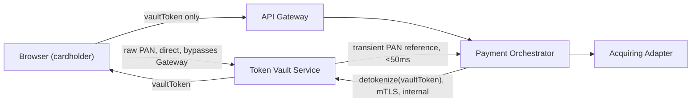

## 2.3 Why Payment Gateways Separate Vaults from Payment Processing
This separation is standard industry practice (used by Stripe, Adyen,
Razorpay, and every PCI-DSS-scoped processor) for three concrete
reasons this platform's architecture depends on:

1. **PCI scope reduction.** PCI-DSS's cardholder-data-environment
   requirements (network segmentation, restricted access, enhanced
   logging/monitoring, quarterly scans) apply to every system that
   stores, processes, or transmits cardholder data. By confining raw
   PAN handling to one small, purpose-built service, the Payment
   Orchestrator, Merchant Service, Webhook Service, Settlement Service,
   and API Gateway are all kept entirely out of CDE scope — this is a
   direct, load-bearing architectural decision, not an afterthought.
2. **Blast-radius containment.** A vulnerability in the Payment
   Orchestrator's business logic (a considerably larger, faster-moving
   codebase than the Vault) can never leak cardholder data, because
   that codebase never has cardholder data to leak — it only ever holds
   opaque tokens.
3. **Independent security hardening cadence.** The Vault can apply a
   far stricter change-management, access-control, and audit posture
   than the rest of the platform without slowing down feature velocity
   elsewhere — payment feature development iterates on tokens; only
   Vault-team changes require the heaviest security review.

---

# 3. Responsibilities

## 3.1 Tokenization
- Accept a raw PAN (and, transiently, CVV where applicable — CVV is
  **never persisted** at all, per PCI-DSS Requirement 3.2, and exists in
  memory only for the duration of the initial authorization data
  capture) directly from the Browser SDK over its own dedicated,
  publicly reachable TLS endpoint.
- Generate a cryptographically non-guessable, format-preserving-or-
  opaque token (a `vaultToken`) with no mathematical derivability back
  to the PAN.
- Persist only the encrypted PAN (via envelope encryption, §10) keyed
  by the token — never the PAN in any recoverable plaintext form at
  rest.
- Example: a cardholder enters `4111 1111 1111 1111` into the Browser
  SDK's hosted card field; the SDK posts it directly to the Vault; the
  Vault returns `vt_9f3a...` (a `vaultToken`), which is the only value
  the merchant's page, the API Gateway, and the Payment Orchestrator
  will ever see for this card, permanently.

## 3.2 Detokenization
- Accept a `vaultToken` from an explicitly authorized internal caller
  (the Payment Orchestrator, exclusively, for the authorization/capture
  workflow) over mTLS.
- Decrypt and return the underlying PAN reference for **in-memory use
  only**, for a strictly bounded duration (system-wide 50ms budget per
  `SYSTEM_DESIGN.md`), never written to any log, any Kafka event, any
  database row outside the Vault's own encrypted storage, or any
  response body reaching an external caller.
- Example: the Payment Orchestrator, immediately before calling the
  Acquiring Adapter to authorize a payment, calls
  `POST /internal/v1/tokens/{vaultToken}/detokenize`; the Vault returns
  a PAN reference scoped to that single call; the Orchestrator forwards
  it directly into the Acquiring Adapter call and discards it
  immediately after.

## 3.3 Vault Encryption & Key Lifecycle
- Own and enforce envelope encryption (§10) for all stored cardholder
  data: Data Encryption Keys (DEKs) wrapped by Key Encryption Keys
  (KEKs), which are themselves protected by a Master Key held in an
  HSM/KMS the Vault never has direct plaintext access to.
- Own key rotation scheduling, key versioning, and key retirement —
  ensuring old encrypted data remains decryptable against its
  originating key version while new data is always encrypted under the
  current key version.

## 3.4 Access Control & Auditability
- Enforce the platform's strictest internal-service allow-list: only
  the Payment Orchestrator may call the detokenize path; no other
  internal service (not even Merchant Service or Settlement Service) is
  ever permitted to reach it.
- Record an immutable audit entry for every tokenization,
  detokenization, key rotation, and access-denial event — this audit
  log is treated as equally critical infrastructure to the encryption
  itself, since PCI-DSS Requirement 10 mandates comprehensive,
  tamper-evident logging of all access to cardholder data.

## 3.5 Token Lifecycle Management
- Own token state (`ACTIVE`, `EXPIRED`, `REVOKED`) and the transitions
  between them (§11), independent of the Payment Orchestrator's own
  payment state machine — a token's lifecycle and a payment's lifecycle
  are related but distinct concepts, deliberately modeled separately.

## 3.6 High Availability & Low-Latency Operation
- Serve tokenization and detokenization requests with strict latency
  budgets (§7) since the Vault sits directly in the payment
  authorization critical path — a slow Vault directly becomes a slow
  payment platform, regardless of how fast the Payment Orchestrator or
  Acquiring Adapter are individually.

---

# 4. Non-Responsibilities

- **Never makes a payment authorization decision.** The Vault has no
  concept of amount, merchant, currency, or approval/decline — that is
  entirely the Payment Orchestrator's and Acquiring Adapter's domain.
  Conflating the two would reintroduce cardholder data into the
  Orchestrator's decision path, defeating the entire purpose of scope
  separation (§2.3).
- **Never persists CVV under any circumstance, for any duration beyond
  the single initial tokenization call.** This is a hard PCI-DSS
  Requirement 3.2 rule with zero exceptions — no "temporary" CVV
  storage, no CVV in any cache, no CVV in any audit log (even encrypted).
- **Never logs, caches, or transmits raw PAN in plaintext, anywhere,
  under any circumstance** — not in application logs, not in
  OpenTelemetry span attributes, not in Kafka event payloads, not in
  error messages returned to any caller. Every logging and observability
  standard defined in `SYSTEM_DESIGN.md` and the API Gateway/Merchant
  Service specs' logging sections applies here with zero exceptions and
  additional Vault-specific enforcement (§21).
- **Never exposes a detokenize capability to any external-facing route.**
  There is no path — direct, indirect, via the API Gateway, or otherwise
  — by which an external caller (a merchant, a browser, any non-
  Payment-Orchestrator internal service) can retrieve a raw PAN.
- **Never accepts tokenization requests routed through the API
  Gateway.** The Browser SDK's direct-to-Vault call is not a convenience
  optimization; it is a hard architectural boundary established in
  `SYSTEM_DESIGN.md` §10 and `API-Gateway-Part-01.md` §8, and this
  document does not revisit or weaken it.
- **Never stores merchant business data, payment amounts, ledger
  entries, or settlement data.** Those remain owned respectively by
  Merchant Service, Payment Orchestrator, and Settlement Service; the
  Vault's schema contains only token-to-encrypted-PAN mappings, key
  metadata, and its own audit trail.
- **Never participates as a SAGA orchestrator or compensating-action
  target.** Detokenization is a synchronous, read-only-in-effect
  operation with no compensatable side effect; the Vault has no
  "undo detokenize" concept, mirroring the Merchant Service's
  established non-participation in the payment SAGA
  (`Merchant-Service-Part-03.md` §70) for analogous reasons.

---

# 5. Business Goals

| Goal | Why it matters | How the Vault serves it |
|---|---|---|
| PCI compliance (aligned, not certified) | Confines the platform's certifiable CDE scope to one auditable service | Sole holder of cardholder data; every other service structurally cannot violate PCI-DSS cardholder-data rules because they never receive the data |
| Secure tokenization | The core value the Vault provides to the rest of the platform | Cryptographically strong, non-reversible-without-authorization token generation |
| Data protection | Cardholder data is the platform's highest-liability asset | Envelope encryption, HSM/KMS-backed key hierarchy, zero plaintext-at-rest |
| Scalability | Tokenization sits on the payment-initiation hot path at 10,000+ TPS | Stateless request handling above a horizontally-scalable encrypted store, aggressive token-side caching (never PAN-side) |
| Low latency | A slow Vault directly delays every payment on the platform | Sub-50ms raw-PAN-in-memory budget, sub-20ms p99 tokenize/detokenize service latency target |
| High availability | Vault downtime halts all new tokenization platform-wide | Multi-replica, multi-zone deployment; no single HSM/KMS instance as a single point of failure |
| Fault tolerance | Partial infrastructure failure must degrade, not corrupt | Circuit breakers on HSM/KMS calls, fail-closed (never fail-open to plaintext) on any encryption dependency failure |
| Auditability | PCI-DSS Requirement 10; forensic and compliance necessity | Immutable, tamper-evident audit log of every access to cardholder data, independent of business logs |

---

# 6. Functional Requirements

## FR-1 Tokenization
FR-1.1 The service shall accept a raw PAN (and transient CVV, if
present) via a dedicated public endpoint reachable directly by the
Browser SDK, independent of the API Gateway's route table.

FR-1.2 The service shall generate a `vaultToken` that has no
mathematical or structural derivability back to the original PAN.

FR-1.3 The service shall persist the PAN only in envelope-encrypted
form (§10), never in plaintext, and shall never persist CVV in any
form.

FR-1.4 The service shall return the `vaultToken` to the caller within
the tokenization latency budget (§7) and shall never return the raw PAN
back to the caller in the tokenization response beyond what is
structurally necessary for the caller's own display purposes (e.g. a
masked "•••• 1111" representation, never the full PAN).

## FR-2 Detokenization
FR-2.1 The service shall accept detokenization requests exclusively
from the Payment Orchestrator, authenticated via mTLS internal-service
identity, on the internal-only API surface.

FR-2.2 The service shall reject any detokenization request from any
caller identity other than the Payment Orchestrator's allow-listed
workload identity, regardless of any other credential presented.

FR-2.3 The service shall return the PAN reference for in-memory use
only, structurally preventing (via the internal API contract, detailed
in Part 2) accidental logging or persistence by the caller.

FR-2.4 The service shall enforce the platform-wide 50ms raw-PAN-
in-memory lifetime budget on its own side of the detokenization
operation, independent of what the calling service does after receipt.

## FR-3 Token Lifecycle
FR-3.1 The service shall support explicit token states: `ACTIVE`,
`EXPIRED`, `REVOKED` (§11).

FR-3.2 The service shall support token rotation — issuing a new token
for the same underlying PAN without requiring the cardholder to
re-enter card data — for cases such as periodic security rotation
policies or merchant-initiated re-tokenization.

FR-3.3 The service shall support token revocation, immediately and
permanently preventing further detokenization of a revoked token.

## FR-4 Key Management
FR-4.1 The service shall support Data Encryption Key (DEK) generation
per envelope-encryption operation, DEKs wrapped by a Key Encryption Key
(KEK) sourced from an HSM/KMS.

FR-4.2 The service shall support scheduled and on-demand KEK rotation
without requiring re-encryption of all existing DEK-wrapped data at
rotation time (§10.5).

FR-4.3 The service shall never expose a plaintext Master Key or KEK to
any application-layer code path — all Master Key/KEK operations occur
exclusively within the HSM/KMS boundary.

## FR-5 Audit
FR-5.1 The service shall record an immutable audit entry for every
tokenization, detokenization, key-rotation, and access-denial event,
including timestamp, caller identity, and outcome — never including the
raw PAN or CVV itself in the audit entry.

FR-5.2 The service shall make its audit trail queryable for compliance
and forensic purposes independent of its operational database, per the
isolation model in §13.

## FR-6 Health & Resilience
FR-6.1 The service shall expose liveness/readiness endpoints reflecting
both its own process health and its HSM/KMS dependency's reachability.

FR-6.2 The service shall fail closed (reject the operation) rather than
fail open (fall back to a less secure path) on any encryption-dependency
failure.

---

# 7. Non-Functional Requirements

## NFR-1 Performance & Latency
- Tokenization: p99 ≤ 30ms end-to-end (Browser SDK → Vault → response).
- Detokenization: p99 ≤ 20ms, since this call sits directly in the
  synchronous payment-authorization path and directly consumes budget
  from the platform-wide 50ms raw-PAN-lifetime constraint.
- These budgets are stricter than the API Gateway's own 5ms/15ms
  self-overhead budget (`API-Gateway-Part-01.md` NFR-1) precisely
  because the Vault's operations include actual cryptographic work, not
  just routing/policy decisions.

## NFR-2 Availability
- Target 99.95%, matching the API Gateway's tier (`API-Gateway-Part-01.md`
  NFR-2) — a Vault outage is exactly as platform-halting as a Gateway
  outage, since no tokenization can occur without it, and no payment can
  be authorized without a token to detokenize.

## NFR-3 Security
- All cardholder data encrypted at rest via envelope encryption, no
  exceptions, no legacy/compatibility carve-outs.
- All access authenticated via mTLS at minimum, with the detokenize
  path additionally gated by workload-identity allow-listing (FR-2.2).
- Zero plaintext key material ever resident in application memory
  beyond the unavoidable, HSM/KMS-internal cryptographic operation
  itself.

## NFR-4 Consistency
- Token-to-encrypted-PAN mapping writes are strongly consistent
  (synchronous, single-database-transaction) — there is no eventual-
  consistency tolerance for "does this token exist and map correctly,"
  since an inconsistent mapping here is a direct payment-processing or
  security failure, not a tolerable staleness window.

## NFR-5 Scalability
- Horizontally scalable stateless application tier; the persistence
  layer (§ Part 3) scales via read replicas for the (rare) lookup-by-
  token-metadata path and partitioning strategies appropriate to a
  write-heavy, point-lookup-dominant access pattern.

## NFR-6 Reliability
- Circuit breakers and bounded retries on every HSM/KMS call, consistent
  with the platform's Resilience4j standard (`SYSTEM_DESIGN.md`
  Mandatory Architecture Rules) — but tuned to **fail closed**: an open
  circuit against the HSM/KMS means tokenization/detokenization
  requests are rejected with a clear retryable error, never silently
  degraded to an insecure fallback.

## NFR-7 Maintainability
- Strict Clean Architecture layering (§14) specifically so that
  cryptographic/HSM implementation details can evolve (e.g. switching
  KMS providers) without touching domain or application logic — a
  higher-stakes version of the same principle applied more loosely
  elsewhere on the platform.

## NFR-8 Disaster Recovery
- Cross-region key material availability (via the HSM/KMS provider's
  own multi-region replication capability) is a hard requirement — a
  regional outage must not render previously tokenized data
  permanently undecryptable, since that would be equivalent to
  permanent data loss for every stored card on the platform.
- Full disaster-recovery specifics (RPO/RTO, backup strategy) are
  detailed in Part 4, but the architectural requirement — key
  material must never have a single-region single point of failure —
  is established here as a foundational constraint on HSM/KMS provider
  selection.

---

# 8. Service Boundaries

## 8.1 Inputs
- Raw PAN + transient CVV (Browser SDK → Vault, direct, public
  endpoint, tokenization only).
- `vaultToken` (Payment Orchestrator → Vault, internal, mTLS,
  detokenization/lifecycle operations only).
- Key-rotation triggers (internal scheduler or operator-initiated,
  §17 Key Rotation workflow).

## 8.2 Outputs
- `vaultToken` (returned to Browser SDK/merchant page at tokenization
  time).
- Masked PAN representation (e.g. "•••• 1111") for display purposes
  only — never the full PAN.
- Transient, in-memory-only PAN reference (returned to Payment
  Orchestrator at detokenization time, never persisted by either side
  beyond the 50ms budget).
- Domain events (`TokenCreated`, `TokenRevoked`, `TokenExpired`, `KeyRotated`
  — §16) published to Kafka, containing zero cardholder data.
- Audit log entries (§13, §5).

## 8.3 Dependencies
| Dependency | Type | Purpose |
|---|---|---|
| HSM/KMS provider | External, critical | Master Key custody, KEK operations |
| PostgreSQL (vault schema) | Internal, owned | Encrypted PAN storage, token metadata, key-version metadata |
| Redis | Internal, owned | Token-existence/status cache (never PAN-side caching) |
| Kafka | External, platform | `vault.events` publication only (no PAN-bearing payloads) |
| Audit Log Store | Internal, owned, isolated | Immutable, tamper-evident audit trail, physically/logically separated from the operational database (§13) |

## 8.4 External Systems
- HSM/KMS provider (e.g. a cloud KMS with HSM-backed key custody, or a
  dedicated on-prem HSM appliance — provider selection is an ADR-gated
  decision, not fixed by this document).

## 8.5 Internal Systems (Platform Services That Interact With the Vault)
| Service | Interaction | Trust Boundary |
|---|---|---|
| Browser SDK | Tokenization, direct | Public TLS endpoint, no prior authentication required (rate-limited, structurally validated) |
| Payment Orchestrator | Detokenization, token lifecycle queries | mTLS + workload-identity allow-list, the **only** service permitted on the detokenize path |
| API Gateway | None (structural non-interaction, §4) | N/A by design |
| Merchant Service, Webhook Service, Settlement Service | None | N/A by design — none of these services have any legitimate reason to reference cardholder data |

---

# 9. Domain-Driven Design

## 9.1 Ubiquitous Language
| Term | Meaning |
|---|---|
| PAN | Primary Account Number — the raw card number; the platform's single most sensitive data element |
| Vault Token | The opaque identifier issued in place of a PAN; the only card reference any other service ever holds |
| Envelope Encryption | A layered encryption scheme where data is encrypted by a DEK, and the DEK itself is encrypted by a KEK |
| DEK (Data Encryption Key) | A key used to directly encrypt/decrypt the stored PAN ciphertext |
| KEK (Key Encryption Key) | A key used to encrypt/decrypt DEKs; itself protected by the Master Key within the HSM/KMS |
| Master Key | The root key, custodied entirely within the HSM/KMS boundary, never exposed in plaintext to application code |
| Detokenization | The bounded, audited operation of resolving a vault token back to a usable PAN reference for a single authorization call |
| Key Rotation | The scheduled or triggered replacement of an active key version with a new one, without invalidating previously encrypted data |
| Token Lifecycle | The set of states (`ACTIVE`, `EXPIRED`, `REVOKED`) and transitions a vault token can undergo independent of any payment's own state |

## 9.2 Bounded Context
The Token Vault represents the **Cardholder Data Custody** bounded
context — the narrowest, most tightly access-controlled bounded context
on the entire platform.

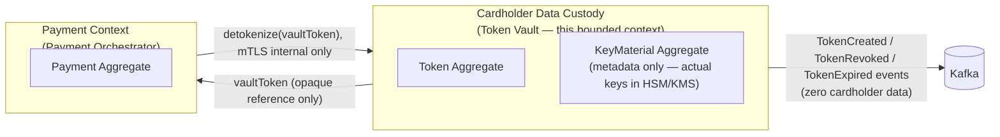

Context mapping relationship: **Conformist** from the Payment
Orchestrator's perspective — the Orchestrator has no influence over the
Vault's internal token format or encryption scheme and simply conforms
to whatever opaque contract the Vault exposes (a `vaultToken` string and
a detokenize call), reinforcing that the Vault's internals are
completely opaque to, and independent of, every consumer.

## 9.3 Domain Services
- `TokenizationService` — orchestrates PAN validation, DEK generation,
  encryption, and token issuance as one atomic domain operation.
- `DetokenizationService` — orchestrates token-state validation,
  authorization-identity check, decryption, and bounded-lifetime PAN
  reference issuance.
- `KeyRotationService` — orchestrates KEK rotation coordination with the
  HSM/KMS without requiring synchronous re-encryption of all existing
  DEKs (§10.5).

## 9.4 Factories
- `VaultTokenFactory` — the sole construction path for a new `Token`
  aggregate instance, ensuring a token's identifier is always generated
  via the platform's approved cryptographically-secure random-generation
  scheme (§11.1) and never constructed ad hoc elsewhere in the codebase.

## 9.5 Repositories
- `TokenRepository` — persists/retrieves `Token` aggregates (token
  identifier, encrypted PAN reference, key-version metadata, lifecycle
  state) — never exposes a query capability that returns decrypted PAN
  data; decryption is only ever performed by the `DetokenizationService`
  domain service, never by a repository directly.
- `KeyMaterialRepository` — persists/retrieves KEK **version metadata**
  (version identifier, creation timestamp, rotation status) only — it
  never persists actual key bytes, which remain exclusively within the
  HSM/KMS.

## 9.6 Specifications
- `TokenIsDetokenizableSpecification` — encapsulates the business rule
  "a token may be detokenized only if its state is `ACTIVE` and the
  requesting identity is the allow-listed Payment Orchestrator identity"
  as a single, testable, reusable predicate object, rather than scattered
  conditional logic across use cases.
- `KeyVersionIsActiveSpecification` — encapsulates "is this key version
  the current one to use for new encryption operations," used by the
  `TokenizationService` to always select the correct current KEK
  version.

## 9.7 Domain Events
Covered fully in §16; summarized here as part of the DDD building-block
inventory: `TokenCreated`, `TokenRevoked`, `TokenExpired`, `TokenRotated`,
`KeyRotationInitiated`, `KeyRotationCompleted`.

---

# 10. Domain Model

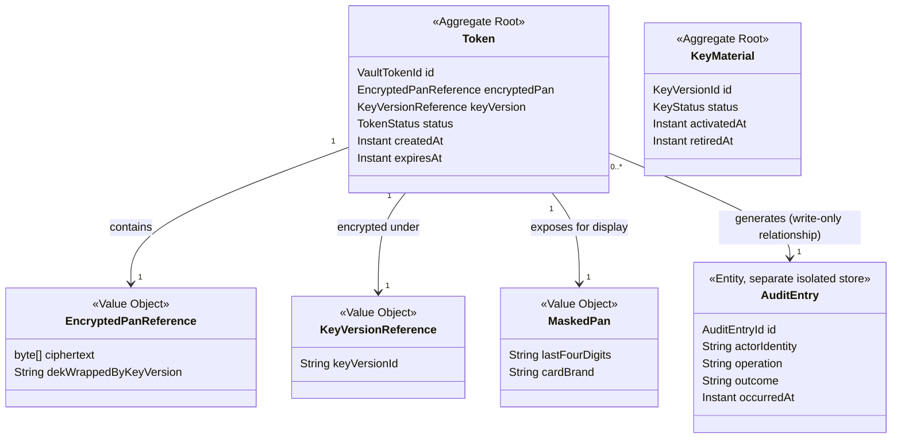

**Explanation of relationships and ownership:**
- `Token` is the aggregate root for cardholder-data custody — it is the
  only aggregate that ever references encrypted PAN material. No other
  aggregate on the platform holds a foreign key or reference into this
  aggregate's internals; every other service holds only the opaque
  `VaultTokenId` string.
- `KeyMaterial` is modeled as a **separate aggregate** from `Token`
  specifically because key lifecycle (rotation, retirement) must be
  independently manageable at a completely different cadence and by a
  completely different actor (a security/key-management process) than
  individual token issuance — coupling them would force every token
  operation to contend on key-aggregate locks, which is both a
  performance and a security-blast-radius problem.
- `EncryptedPanReference` and `KeyVersionReference` are value objects —
  neither has identity of its own; they are pure data, replaced wholesale
  whenever a token is rotated (a rotation produces a **new** `Token`
  aggregate instance with new `EncryptedPanReference`/`KeyVersionReference`
  values, never a mutation of the ciphertext bytes in place).
- `MaskedPan` is a value object computed once at tokenization time and
  stored alongside the token specifically so that display purposes
  (showing a merchant "•••• 1111") never require a decrypt operation —
  this is a deliberate performance and security optimization: the vast
  majority of "look at this card" needs are satisfied without ever
  touching the encrypted PAN or the HSM/KMS.
- `AuditEntry` is explicitly modeled as a write-only relationship from
  `Token` — the Vault's business logic only ever appends audit entries;
  it structurally has no code path that queries or reads its own audit
  trail back (that capability exists only via the isolated audit-store
  query surface, §13), preventing any tokenization/detokenization logic
  from ever being influenced by, or accidentally leaking, audit content.

---

# 11. Token Lifecycle

## 11.1 Token Generation
- Triggered exclusively by a successful tokenization request (§17.1).
- The `VaultTokenId` is generated using a cryptographically secure
  random-number source (never a sequential ID, never derived
  deterministically from the PAN itself — deterministic tokenization,
  while used by some vault designs for specific reconciliation use
  cases, is deliberately not used here, since it would allow an
  attacker who obtains the token-generation algorithm to narrow the
  PAN-guessing search space, which a purely random token does not
  permit).
- Format: opaque string, no embedded card-brand or PAN-derived
  structure (avoiding any information leakage through the token's shape
  itself).

## 11.2 Storage
- The `Token` aggregate, containing only the `EncryptedPanReference`
  (ciphertext) and `KeyVersionReference` metadata, is persisted in a
  single atomic transaction alongside the audit entry recording the
  tokenization event (§13 isolation model details how the audit store,
  while logically separate, is still written within the same logical
  operation's guarantees).

## 11.3 Activation
- A token is `ACTIVE` immediately upon successful storage — there is no
  separate "pending activation" state, since tokenization is a single,
  atomic, synchronous operation with no multi-step external dependency
  that would warrant an intermediate state (unlike, for example, the
  Merchant Service's `PENDING_VERIFICATION` state, which exists because
  KYC is inherently multi-step and asynchronous).

## 11.4 Usage (Detokenization)
- Every detokenization request checks `TokenIsDetokenizableSpecification`
  (§9.6) before any decryption is attempted — an `EXPIRED` or `REVOKED`
  token is rejected before the HSM/KMS is ever invoked, both for
  performance (avoiding an unnecessary cryptographic operation) and for
  security (a rejected-state check is cheaper to reason about and audit
  than a decrypt-then-discard pattern).

## 11.5 Rotation
- Rotation issues a **new** `Token` aggregate (new `VaultTokenId`, freshly
  encrypted under the current active `KeyVersionReference`) referencing
  the same underlying cardholder data, and marks the old token
  `REVOKED` — mirroring the grace-window-free-but-explicit-supersession
  pattern (a direct old→new cutover, since, unlike a merchant API
  credential, a card token rotation has no "grace window" business need
  — the caller simply receives and starts using the new token
  immediately).

## 11.6 Expiration
- Tokens may carry an optional `expiresAt` — used for cases such as a
  one-time-use tokenization flow (e.g. tokenizing a card solely for a
  single checkout session that must not be reusable afterward) as
  distinct from a stored, reusable token (e.g. a saved card for
  recurring billing). Expiration is a passive, time-based transition,
  enforced at the `TokenIsDetokenizableSpecification` check (§9.6)
  rather than requiring an active background sweep for correctness
  (though an operational cleanup job still exists, per §17, for storage
  hygiene, not for security enforcement).

## 11.7 Revocation
- Explicit, immediate, terminal — triggered by rotation (§11.5), by
  merchant-initiated card removal, or by a security/fraud-response
  action. Once `REVOKED`, a token can never be reactivated — a business
  need to "use this card again" always issues a fresh tokenization
  request, never a resurrection of a revoked token, keeping the audit
  trail unambiguous.

## 11.8 Deletion
- The `Token` aggregate row (and its `EncryptedPanReference`) may be
  hard-deleted from the operational store after a `REVOKED` token passes
  a configured retention window (subject to any regulatory data-retention
  requirement that might mandate a minimum retention period, layered in
  per jurisdiction as an operational configuration, not fixed by this
  document). The **audit entry** referencing that token's lifecycle,
  however, is never deleted — the audit trail's retention is independent
  of and outlives the underlying token data itself.

## 11.9 Recovery
- Recovery refers here to **key-material recovery** (restoring HSM/KMS
  access after an outage, §Part 4 Disaster Recovery) rather than
  token-level recovery — a deleted token is never "recovered" (that
  would imply the deleted encrypted PAN data still existed somewhere
  outside the intended deletion boundary, which is explicitly not the
  design). If a cardholder's saved card needs to be used again after
  their token was deleted per retention policy, this requires a fresh
  tokenization, not a recovery operation.

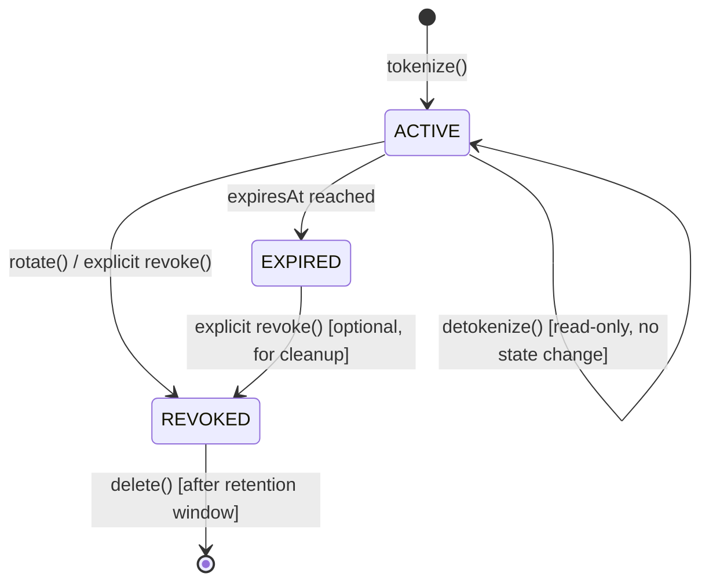

---

# 12. Encryption Model

## 12.1 Envelope Encryption
The Vault uses a two-layer (envelope) encryption scheme rather than
encrypting each PAN directly with the Master Key, for a standard,
well-justified reason: the Master Key never leaves the HSM/KMS boundary
and cannot be invoked at the volume/latency the payment hot path
requires. Envelope encryption solves this by using a fast, local
symmetric key (the DEK) for the actual data encryption, with only the
much smaller, much less frequent DEK-wrapping operation requiring an
HSM/KMS round-trip.

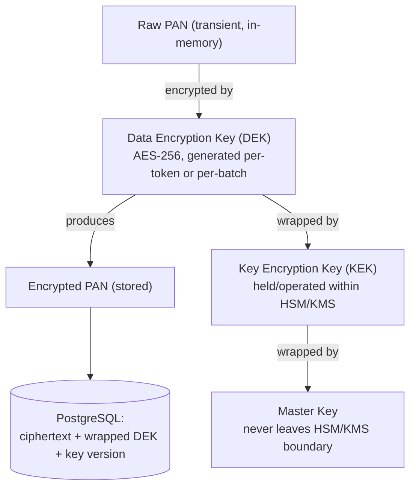

## 12.2 Key Hierarchy
| Layer | Key | Where It Lives | Rotates |
|---|---|---|---|
| 1 (root) | Master Key | Exclusively inside HSM/KMS, never exported | Rarely (HSM/KMS-provider-managed cadence) |
| 2 | KEK (Key Encryption Key) | Exists only as an HSM/KMS-operated key reference; application never sees plaintext KEK bytes | Scheduled (e.g. quarterly) or on-demand (§12.5) |
| 3 | DEK (Data Encryption Key) | Generated per tokenization operation (or per small batch), used briefly in application memory for the encrypt operation, then immediately wrapped by the current KEK and only the **wrapped (encrypted) DEK** is persisted — the plaintext DEK itself is never stored | Effectively per-operation; there is no "DEK rotation" concept distinct from issuing a new token |
| 4 | AES-256 ciphertext | The actual encrypted PAN bytes, stored in PostgreSQL alongside its wrapped DEK and KEK version reference | N/A — re-encrypted only if the underlying token itself is rotated (§11.5) |

## 12.3 AES-256 and RSA
- **AES-256** (symmetric): used for the DEK's actual PAN encryption
  operation — chosen for its combination of strong security margin and
  the performance the Vault's latency budget (§7) requires for
  high-frequency tokenization operations.
- **RSA** (asymmetric): used, where the specific HSM/KMS provider's key-
  wrapping scheme calls for it, for KEK-to-Master-Key or cross-boundary
  key-exchange operations rather than for bulk PAN encryption itself —
  RSA's computational cost makes it unsuitable for the high-frequency,
  large-payload PAN encryption path, which is exactly why the envelope
  scheme exists: expensive asymmetric operations are confined to the
  infrequent key-wrapping layer, never the per-request data-encryption
  layer.

## 12.4 KMS / HSM Integration
- The Vault's application code never calls "encrypt this PAN with the
  Master Key" directly — it always calls the HSM/KMS's key-wrapping API
  (wrap/unwrap a DEK) and performs the actual AES-256 PAN encryption
  itself, locally, using the unwrapped DEK held only transiently in
  memory for the duration of that single operation.
- This split (HSM/KMS wraps/unwraps DEKs; application does bulk AES
  encryption locally) is the standard, latency-appropriate integration
  pattern for a service under the Vault's throughput requirements — a
  design that instead sent every PAN byte-for-byte through the HSM/KMS
  directly would not meet the NFR-1 latency budget at 10,000+ TPS scale.

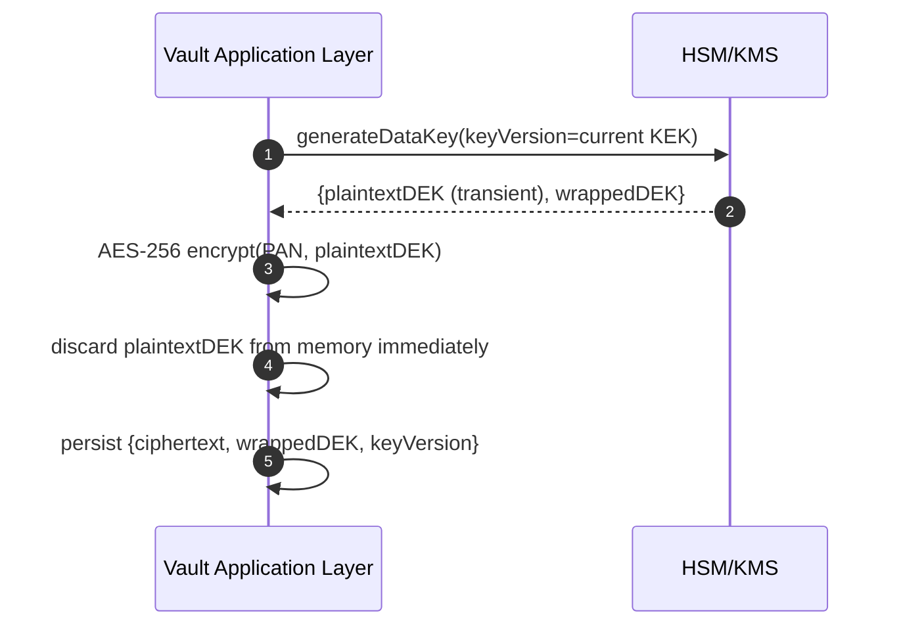

## 12.5 Key Rotation
- KEK rotation is initiated on a scheduled cadence (security policy-
  driven, e.g. quarterly) or on-demand (suspected compromise).
- Rotation does **not** require re-encrypting every existing DEK/PAN
  immediately — existing `wrappedDEK` values remain valid against their
  originating KEK version (the HSM/KMS retains the ability to unwrap
  against retired-but-not-destroyed key versions for a defined overlap
  period), while all **new** tokenization operations use the newly
  active KEK version going forward. This is the standard "rotate
  forward, re-wrap lazily or on next access" pattern that avoids a
  disruptive, latency-spiking mass re-encryption event.
- A background re-wrapping process (§Part 3) may optionally migrate
  older tokens' wrapped DEKs to the current KEK version over time,
  ahead of the old KEK version's eventual destruction (§12.7).

## 12.6 Key Expiration
- A KEK version transitions `ACTIVE` → `RETIRED` (no longer used for
  new operations, but still valid for unwrapping existing data) →
  eventually eligible for `DESTROYED` (§12.7), gated by ensuring zero
  remaining DEKs are wrapped under that version.

## 12.7 Key Archival & Destruction
- A retired KEK version is archived (kept available for unwrapping) for
  a defined period sufficient to allow the background re-wrapping
  process to migrate all referencing tokens forward.
- Destruction is only permitted once monitoring confirms zero active
  `Token` aggregates reference that key version — destroying a key
  version still in use would render the corresponding cardholder data
  permanently unrecoverable, which is treated as an unacceptable data-
  loss event; the destruction workflow therefore includes a hard,
  automated pre-check, not merely an operational precaution.

## 12.8 Threat Protection
- Plaintext DEKs exist in application memory only for the microseconds
  spanning a single encrypt/decrypt operation and are never logged,
  serialized, or written to any store.
- The Master Key is never retrievable by any application-layer
  credential under any circumstance — even a fully compromised Vault
  application process cannot exfiltrate the Master Key, since it never
  possesses it; this is the core threat-model property envelope
  encryption via HSM/KMS is chosen to guarantee.
- Key-wrapping operations are themselves access-controlled and audited
  by the HSM/KMS provider independently of the Vault's own audit log,
  providing a second, independent audit trail outside the Vault
  application's own control (relevant if the Vault application itself
  were ever compromised).

---

# 13. Vault Design

## 13.1 Logical Architecture

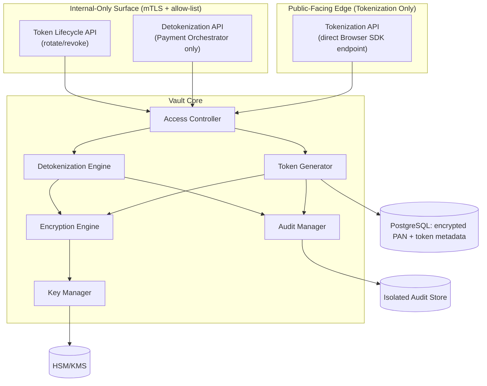

## 13.2 Physical / Deployment-Level Architecture
- The Vault's public tokenization endpoint and internal detokenization
  endpoint are deployed as logically distinct network listeners (even
  within the same service process/container) with separate ingress
  paths — the public listener is reachable from the internet (TLS,
  rate-limited, structurally validated only), while the internal
  listener is reachable exclusively from within the platform's private
  network segment, over mTLS, with network-policy-level enforcement
  (Kubernetes `NetworkPolicy` or equivalent) as an additional layer
  beyond application-level identity checks.
- This dual-listener separation is a deliberate reinforcement of FR-2.2
  — even if an application-level authorization check were somehow
  bypassed, network-layer segmentation independently prevents any
  non-Orchestrator caller from ever reaching the detokenize path at all.

## 13.3 Secure Storage & Encryption Boundaries
- PostgreSQL stores only: `vaultTokenId`, `ciphertext` (AES-256 encrypted
  PAN), `wrappedDek`, `keyVersion`, `status`, `maskedPan`,
  `createdAt`/`expiresAt` — never plaintext PAN, never CVV in any form,
  never a plaintext or unwrapped DEK.
- The encryption boundary is drawn at the application layer's
  `EncryptionEngine` component (§15) — everything on the far side of
  that boundary (the database, backups, replication streams) sees only
  ciphertext.

## 13.4 Token Lookup vs PAN Lookup
- **Token lookup** (does this `vaultToken` exist, what is its status,
  what is its masked-PAN display value) is a frequent, cache-friendly,
  low-sensitivity operation — served via the Redis cache (§Part 3) with
  no cryptographic operation required.
- **PAN lookup** (the actual decrypt-to-plaintext operation) is a rare,
  strictly-gated, always-audited, always-fresh (never cached) operation
  — there is no PAN-side cache anywhere in this architecture, under any
  circumstance, since caching decrypted cardholder data would directly
  violate the entire premise of bounding raw-PAN lifetime to a single
  request.

## 13.5 Isolation
- The audit store is logically and access-control-isolated from the
  operational vault database — a compromise of operational database
  credentials does not, by itself, grant read or write access to the
  audit trail, and vice versa, ensuring the audit log retains integrity
  as an independent forensic source even in a partial-compromise
  scenario.
- The Vault's own application containers run with no outbound network
  access to any destination other than its own database, Redis, Kafka,
  and the HSM/KMS endpoint — no general internet egress, further
  shrinking the exfiltration surface for any cardholder data that might
  transiently exist in memory.

## 13.6 Access Layers
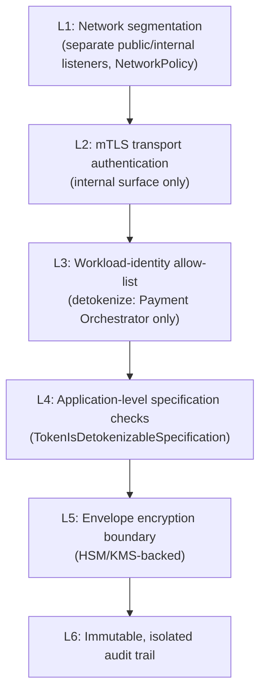

## 13.7 Internal APIs & Trust Boundaries
- The only two trust boundaries the Vault ever crosses are: (1) Browser
  SDK → Vault (untrusted-caller-identity, public, rate-limited,
  structurally validated, tokenize-only), and (2) Payment Orchestrator →
  Vault (fully trusted, mTLS + workload-identity, detokenize/lifecycle
  operations). No third trust boundary exists in this design — this
  minimalism is itself a security property, since every additional
  trust boundary is an additional attack surface to reason about.

## 13.8 Data Flow (End-to-End Summary)
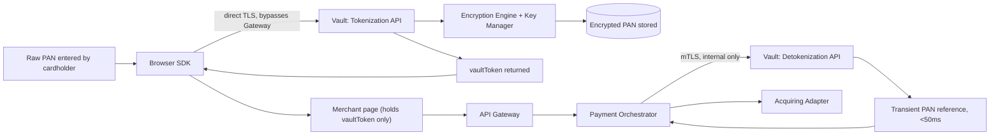

---

# 14. Clean Architecture

## 14.1 Layers
**Domain Layer (innermost):** `Token`, `KeyMaterial` aggregates, value
objects (`EncryptedPanReference`, `MaskedPan`, `KeyVersionReference`),
domain services (`TokenizationService`, `DetokenizationService`,
`KeyRotationService`), specifications (§9.6). Pure Java 21, zero
dependency on Spring, HSM/KMS SDKs, or persistence frameworks — this is
the layer where "a token can only be detokenized if `ACTIVE`" lives,
completely independent of which database or which HSM vendor is behind
it.

**Application Layer:** Use cases (`TokenizePanUseCase`,
`DetokenizeTokenUseCase`, `RotateTokenUseCase`, `RevokeTokenUseCase`,
`InitiateKeyRotationUseCase`) orchestrating domain services and calling
out to ports for anything external (HSM/KMS, persistence, audit
writing, event publishing).

**Adapter Layer:** `HsmKmsClientAdapter` (implements the
`KeyWrappingPort`), `TokenRepositoryAdapter` (Postgres-backed),
`AuditWriterAdapter` (writes to the isolated audit store),
`OutboxWriterAdapter`, `RedisTokenCacheAdapter`.

**Framework/Infrastructure Layer (outermost):** Spring Boot controllers
for the public tokenization endpoint and the internal detokenization/
lifecycle endpoints, Spring Security/mTLS configuration, Flyway
migrations, Actuator health endpoints.

## 14.2 Dependency Rule
Dependencies point strictly inward: the Framework layer depends on
Application, which depends on Domain; Domain depends on nothing outside
itself. Critically, **the domain layer has no knowledge of AES-256,
RSA, or any specific HSM/KMS vendor API** — those are adapter-layer
concerns behind the `KeyWrappingPort`/`EncryptionPort` interfaces,
meaning a future HSM/KMS provider migration touches only the adapter
layer, never the domain logic that enforces token-lifecycle and
detokenization-eligibility rules.

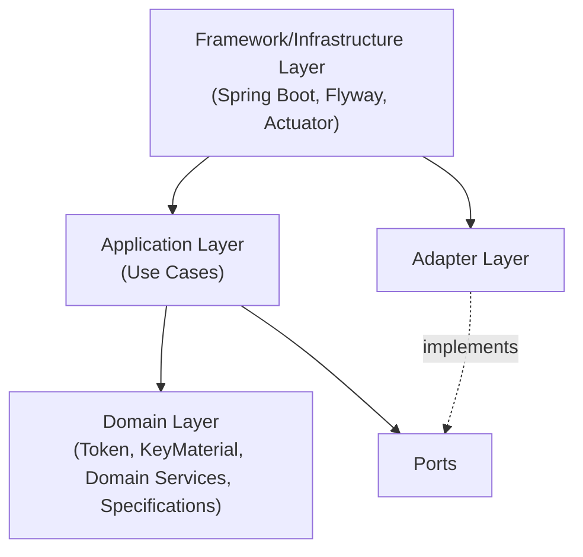

## 14.3 Package Structure

```
token-vault-service/
└── src/main/java/.../vault/
    ├── config/
    │   ├── SecurityConfig.java
    │   ├── MtlsAllowListConfig.java
    │   └── EncryptionConfig.java
    ├── controller/
    │   ├── public_/
    │   │   └── TokenizationController.java
    │   └── internal/
    │       ├── DetokenizationController.java
    │       └── TokenLifecycleController.java
    ├── application/
    │   ├── TokenizePanUseCase.java
    │   ├── DetokenizeTokenUseCase.java
    │   ├── RotateTokenUseCase.java
    │   ├── RevokeTokenUseCase.java
    │   └── InitiateKeyRotationUseCase.java
    ├── domain/
    │   ├── token/
    │   │   ├── Token.java
    │   │   ├── TokenStatus.java             # sealed
    │   │   └── VaultTokenFactory.java
    │   ├── key/
    │   │   ├── KeyMaterial.java
    │   │   └── KeyStatus.java               # sealed
    │   ├── service/
    │   │   ├── TokenizationService.java
    │   │   ├── DetokenizationService.java
    │   │   └── KeyRotationService.java
    │   ├── specification/
    │   │   ├── TokenIsDetokenizableSpecification.java
    │   │   └── KeyVersionIsActiveSpecification.java
    │   ├── event/
    │   │   ├── TokenCreated.java
    │   │   ├── TokenRevoked.java
    │   │   ├── TokenExpired.java
    │   │   ├── TokenRotated.java
    │   │   ├── KeyRotationInitiated.java
    │   │   └── KeyRotationCompleted.java
    │   └── vo/
    │       ├── VaultTokenId.java
    │       ├── EncryptedPanReference.java
    │       ├── MaskedPan.java
    │       └── KeyVersionReference.java
    ├── port/
    │   ├── KeyWrappingPort.java
    │   ├── TokenRepositoryPort.java
    │   ├── KeyMaterialRepositoryPort.java
    │   ├── AuditWriterPort.java
    │   └── OutboxWriterPort.java
    ├── adapter/
    │   ├── hsmkms/
    │   │   └── HsmKmsClientAdapter.java
    │   ├── persistence/
    │   │   ├── TokenRepositoryAdapter.java
    │   │   └── KeyMaterialRepositoryAdapter.java
    │   ├── audit/
    │   │   └── AuditWriterAdapter.java
    │   ├── cache/
    │   │   └── RedisTokenCacheAdapter.java
    │   └── outbox/
    │       └── OutboxWriterAdapter.java
    ├── entity/            # persistence entities, distinct from domain aggregates
    ├── dto/
    │   ├── request/
    │   └── response/
    ├── mapper/
    ├── exception/
    ├── security/
    ├── validation/
    ├── event/
    │   └── producer/
    ├── scheduler/          # key-rotation scheduling, token-expiry cleanup
    ├── client/
    └── constant/
```

Note the split `controller/public_/` vs `controller/internal/` packages
— mirroring the dual-listener architectural boundary (§13.2) directly in
the code structure, so the physical trust-boundary separation is
visually and structurally obvious to any engineer reading the codebase,
not merely enforced by configuration alone.

---

# 15. Components

## 15.1 Token Generator
- **Purpose:** Produce cryptographically secure, non-derivable
  `VaultTokenId` values.
- **Responsibilities:** Random ID generation using a CSPRNG; format
  validation (opaque, no embedded structure).
- **Inputs:** Tokenization request trigger.
- **Outputs:** A new `VaultTokenId`.
- **Dependencies:** Platform CSPRNG facility.
- **Failure scenarios:** Entropy source unavailable — fails closed,
  rejecting the tokenization request rather than falling back to a
  weaker generation method.

## 15.2 Vault Manager
- **Purpose:** Coordinates the overall tokenization/detokenization use
  case flow across the other components.
- **Responsibilities:** Sequencing calls to Token Generator, Encryption
  Engine, Audit Manager, and the repository ports within a single
  transactional boundary.
- **Inputs:** Use-case-level requests (tokenize, detokenize, rotate,
  revoke).
- **Outputs:** Completed domain operation results, raised domain events.
- **Dependencies:** All other core components.
- **Failure scenarios:** Any downstream component failure causes the
  Vault Manager to abort the entire operation atomically — there is no
  partial-completion state (e.g. a token is never persisted without its
  corresponding audit entry).

## 15.3 Encryption Engine
- **Purpose:** Perform the actual AES-256 encrypt/decrypt operations
  using an unwrapped DEK.
- **Responsibilities:** Local symmetric encryption/decryption; immediate
  in-memory discard of plaintext DEKs and plaintext PAN after use.
- **Inputs:** Plaintext PAN + DEK (tokenize) or ciphertext + DEK
  (detokenize).
- **Outputs:** Ciphertext (tokenize) or plaintext PAN reference,
  bounded-lifetime (detokenize).
- **Dependencies:** Key Manager (for DEK wrap/unwrap coordination).
- **Failure scenarios:** Cryptographic operation failure (e.g.
  corrupted ciphertext) surfaces as a rejected operation with an audit
  entry recorded — never a silent fallback to an unencrypted path.

## 15.4 Key Manager
- **Purpose:** Coordinate with the HSM/KMS for DEK generation/wrapping/
  unwrapping and KEK rotation lifecycle.
- **Responsibilities:** Maintains current active `KeyVersionReference`;
  requests new DEKs per tokenization operation; requests unwrap
  operations per detokenization operation; orchestrates rotation
  scheduling.
- **Inputs:** Encryption Engine requests; scheduled/on-demand rotation
  triggers.
- **Outputs:** Wrapped DEKs, unwrapped (transient) DEKs, key-version
  metadata.
- **Dependencies:** HSM/KMS provider (external).
- **Failure scenarios:** HSM/KMS unreachable — circuit breaker opens,
  all tokenize/detokenize operations fail closed with a retryable error
  (NFR-6).

## 15.5 Detokenization Engine
- **Purpose:** The single, narrow code path capable of producing a
  usable PAN reference from a token.
- **Responsibilities:** Enforces `TokenIsDetokenizableSpecification`
  before invoking the Encryption Engine; enforces the 50ms in-memory
  lifetime budget; ensures the returned reference is structurally
  incapable of being logged by the calling convention used.
- **Inputs:** `vaultToken`, caller identity.
- **Outputs:** Transient PAN reference.
- **Dependencies:** Encryption Engine, Access Controller, Audit Manager.
- **Failure scenarios:** Specification check fails (expired/revoked
  token, or unauthorized caller) — rejected immediately, audited as a
  denial, never attempted against the Encryption Engine.

## 15.6 Audit Manager
- **Purpose:** Write immutable audit entries for every cardholder-data-
  adjacent operation.
- **Responsibilities:** Constructs `AuditEntry` records containing actor
  identity, operation type, outcome, and timestamp — explicitly
  excluding PAN/CVV content by construction (the audit entry's own type
  signature has no field capable of holding such data, making this a
  structural, not just a procedural, guarantee).
- **Inputs:** Every tokenize/detokenize/rotate/revoke/access-denial
  event from Vault Manager.
- **Outputs:** Persisted audit records in the isolated audit store.
- **Dependencies:** Isolated Audit Store (§13.5).
- **Failure scenarios:** Audit write failure **aborts the entire
  originating operation** — a tokenization or detokenization is never
  considered successful if its corresponding audit entry could not be
  written, since an un-audited cardholder-data access is treated as
  equivalent in severity to an unauthorized one.

## 15.7 Access Controller
- **Purpose:** Enforce caller-identity and route-level access rules
  before any core operation proceeds.
- **Responsibilities:** Validates mTLS identity + workload allow-list
  for internal routes (FR-2.2); applies public-route rate limiting and
  structural validation for the tokenization endpoint.
- **Inputs:** Inbound request + transport-layer identity.
- **Outputs:** Allow/deny decision.
- **Dependencies:** mTLS certificate validation infrastructure, allow-
  list configuration.
- **Failure scenarios:** Any ambiguity in identity resolution (e.g. a
  certificate that doesn't cleanly map to an allow-listed workload)
  resolves to **deny**, never to a permissive default.

## 15.8 Policy Engine
- **Purpose:** Centralize configurable security policy decisions (key
  rotation cadence, token expiration defaults, retention windows)
  separate from hardcoded business logic.
- **Responsibilities:** Supplies policy values to domain services
  (`KeyRotationService` reads rotation cadence from here rather than a
  hardcoded constant).
- **Inputs:** Externalized configuration.
- **Outputs:** Policy decisions/values.
- **Dependencies:** Configuration source (§Part 4).
- **Failure scenarios:** Missing/invalid policy configuration at
  startup fails the service's readiness check rather than silently
  falling back to an undocumented default.

## 15.9 Metadata Manager
- **Purpose:** Manage non-sensitive token metadata (masked PAN, card
  brand, creation timestamp) independent of the encrypted-PAN path.
- **Responsibilities:** Serves the fast, cache-friendly token-lookup
  path (§13.4) without ever touching the Encryption Engine.
- **Inputs:** Token metadata queries.
- **Outputs:** `MaskedPan` and related display-safe metadata.
- **Dependencies:** Redis cache, PostgreSQL (metadata columns only).
- **Failure scenarios:** Cache miss falls through to PostgreSQL; a
  PostgreSQL read failure here (metadata-only) is treated as a lower-
  severity failure than an Encryption Engine failure, since no
  cardholder-data-sensitive operation is at risk.

## 15.10 Health Monitor
- **Purpose:** Continuously assess the health of the Vault's own
  process and its critical dependencies (HSM/KMS reachability,
  database reachability).
- **Responsibilities:** Feeds the liveness/readiness endpoints (FR-6.1).
- **Inputs:** Periodic dependency health probes.
- **Outputs:** Health status consumed by Kubernetes.
- **Dependencies:** HSM/KMS, PostgreSQL, Redis.
- **Failure scenarios:** HSM/KMS unreachable → readiness fails
  (tokenize/detokenize cannot function without it, unlike the Merchant
  Service's Redis, which is a non-critical accelerator there — here the
  equivalent external dependency is on the critical path).

## 15.11 Metrics Collector
- **Purpose:** Emit Micrometer/Prometheus metrics for latency,
  throughput, and error rates per operation type.
- **Responsibilities:** Records tokenize/detokenize latency histograms,
  key-rotation event counters, access-denial counters — never records
  any cardholder-data-derived value as a metric label or value.
- **Inputs:** Every core-component operation outcome.
- **Outputs:** Metrics exposed to Prometheus (§Part 3/4 observability
  sections).
- **Dependencies:** Micrometer registry.
- **Failure scenarios:** Metrics emission failure never blocks the
  underlying business operation — this is a strictly best-effort,
  fire-and-forget concern, unlike the Audit Manager, which is
  intentionally blocking.

## 15.12 Event Publisher
- **Purpose:** Publish domain events (`TokenCreated`, `TokenRevoked`,
  etc.) via the platform's standard Transactional Outbox pattern.
- **Responsibilities:** Writes the outbox row within the same local
  transaction as the aggregate state change; the platform's Outbox
  Relay (per `SYSTEM_DESIGN.md` §7) handles actual Kafka publication.
- **Inputs:** Domain events raised by Vault Manager/domain services.
- **Outputs:** Outbox rows, eventually published to `vault.events`.
- **Dependencies:** PostgreSQL (outbox table), platform Outbox Relay.
- **Failure scenarios:** Identical guarantee to every other service on
  the platform — event publication failure never loses the underlying
  state change (Outbox guarantees eventual publish), and conversely, no
  event is ever published for a state change that didn't actually
  commit.

---

# 16. Domain Events

| Event | Published When | Consumed By | Contains Cardholder Data? |
|---|---|---|---|
| `TokenCreated` | New token successfully issued | Internal audit/analytics only (no other service has a legitimate reason to consume raw token-creation events) | No — contains only `vaultTokenId`, `maskedPan`, `keyVersion`, timestamps |
| `TokenRevoked` | Token explicitly revoked or superseded by rotation | Internal audit; potentially Payment Orchestrator if it needs to know a stored/saved card reference is no longer usable | No |
| `TokenExpired` | Token's `expiresAt` passed | Internal cleanup scheduler | No |
| `TokenRotated` | Rotation completes (old revoked, new created) | Internal audit | No |
| `KeyRotationInitiated` | KEK rotation begins | Internal audit, security monitoring | No |
| `KeyRotationCompleted` | KEK rotation fully propagated | Internal audit, security monitoring | No |

All events follow the platform-standard envelope from `SYSTEM_DESIGN.md`
§5. Every payload in this table is independently verified, by design and
by the `AuditEntry`/event type-signature construction described in
§15.6, to structurally exclude any PAN, CVV, or other cardholder-data
field — this is enforced at the type level (the event classes simply
have no such fields available to populate), not merely by convention or
code review.

---

# 17. Workflows

## 17.1 PAN Tokenization

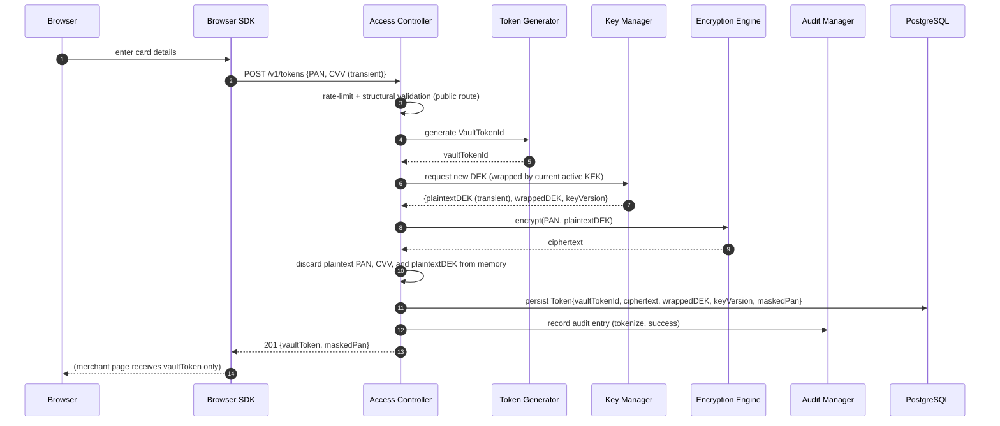

## 17.2 Token Retrieval (Metadata Only)

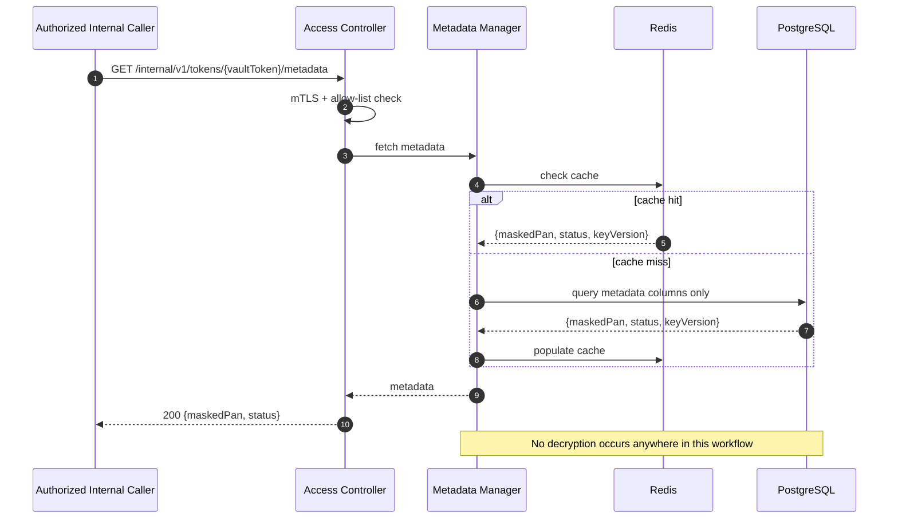

## 17.3 Detokenization

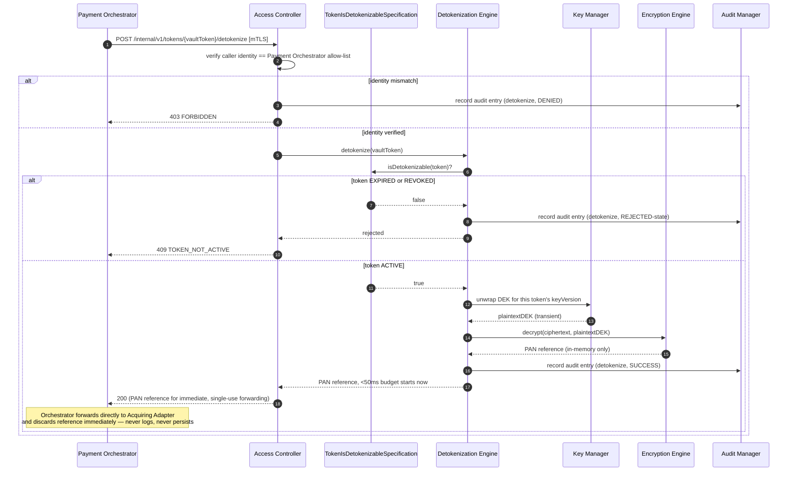

## 17.4 Key Rotation

```mermaid
sequenceDiagram
    autonumber
    participant Scheduler
    participant KRS as KeyRotationService
    participant KM as Key Manager
    participant KMS as HSM/KMS
    participant AM as Audit Manager
    participant Kafka

    Scheduler->>KRS: initiate scheduled rotation
    KRS->>KMS: request new KEK version activation
    KMS-->>KRS: new keyVersionId (ACTIVE)
    KRS->>KRS: mark previous keyVersion RETIRED (still valid for unwrap)
    KRS->>AM: record audit entry (KeyRotationInitiated)
    KRS->>Kafka: outbox → KeyRotationInitiated
    Note over KRS: All NEW tokenization operations now use the new KEK version.<br/>Existing tokens remain valid; optional background re-wrap process<br/>may migrate them over time (Part 3).
    KRS->>AM: record audit entry (KeyRotationCompleted) [once propagation verified]
    KRS->>Kafka: outbox → KeyRotationCompleted
```

## 17.5 Vault Initialization

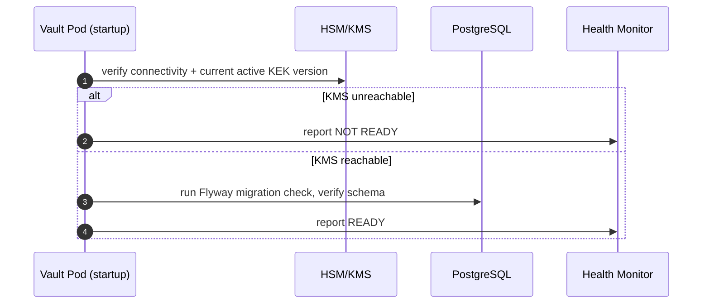

## 17.6 Vault Recovery

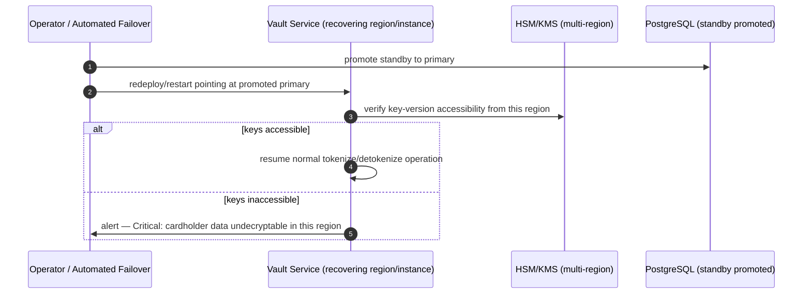

## 17.7 Audit Logging

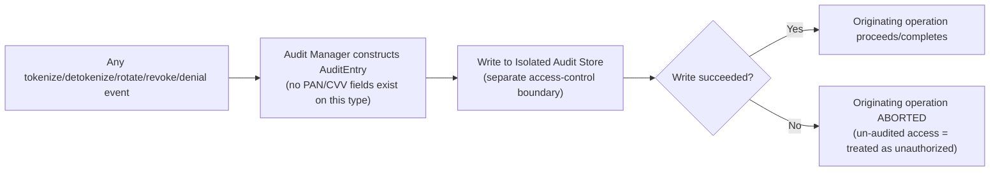

## 17.8 Unauthorized Access Attempt

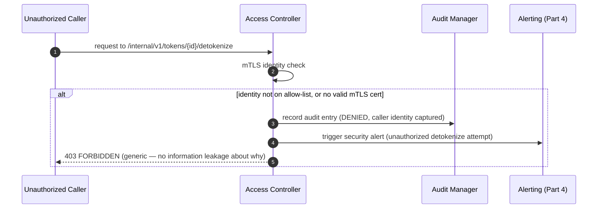

## 17.9 Token Expiration (Passive Enforcement + Cleanup Sweep)

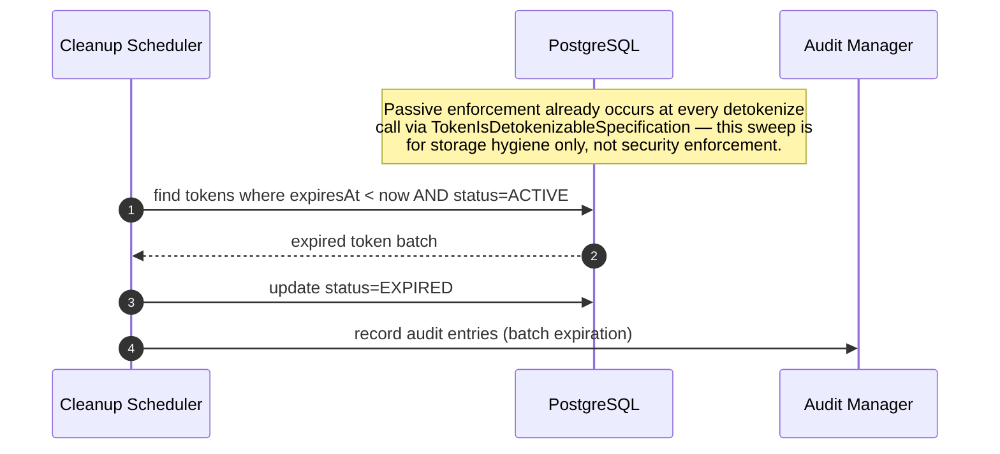

## 17.10 Service Startup

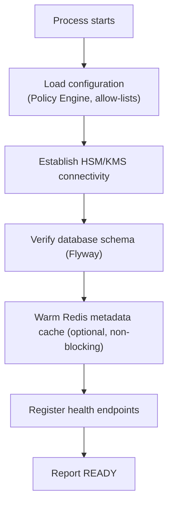

## 17.11 Service Shutdown

```mermaid
flowchart TB
    A["SIGTERM received"] --> B["Readiness → false immediately"]
    B --> C["Stop accepting new tokenize/detokenize requests"]
    C --> D["Drain in-flight requests<br/>(bounded grace period)"]
    D --> E["Ensure no plaintext PAN/DEK remains in any buffer<br/>(explicit memory-clearing step)"]
    E --> F["Close HSM/KMS, DB, Redis, Kafka connections"]
    F --> G["Process exits"]
```

Note the explicit memory-clearing step in shutdown (§17.11) — this is a
deliberate addition beyond the generic graceful-shutdown pattern used by
the API Gateway and Merchant Service, reflecting the Vault's unique
requirement that no residual plaintext cardholder-data-adjacent material
survive even a routine, planned process termination.